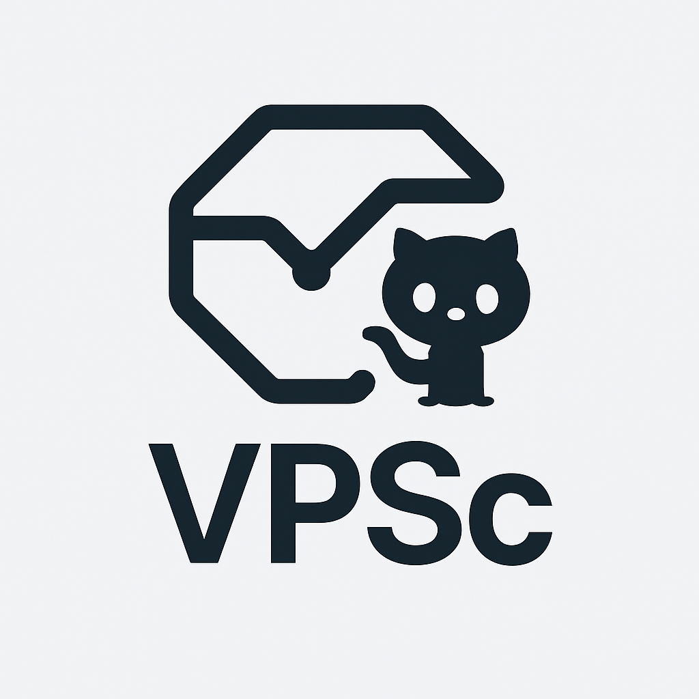

# VPN Server Manager

Приложение для удобного управления VPN-серверами с шифрованием данных и поддержкой офлайн режима.



## ⬇️ Скачать

- Последний релиз: [Latest Release](https://github.com/kureinmaxim/vpn-server-manager/releases/latest)
- Прямая ссылка (v3.6.9, macOS DMG): [VPNServerManager-Clean_Installer.dmg](https://github.com/kureinmaxim/vpn-server-manager/releases/download/v3.6.9/VPNServerManager-Clean_Installer.dmg)
- SHA256(DMG): `b57abf517b112ed7956126c5fc3b5c48eeb457f5c48056fbe491ad0b976fb9ba`

## 🚀 Возможности

- Хранение данных о VPN-серверах в зашифрованном виде
- Удобный веб-интерфейс на Flask с PyWebView
- Поддержка офлайн режима работы
- Многоязычный интерфейс (русский, английский, китайский)
- Система подсказок и шпаргалок
- Экспорт/импорт данных с шифрованием
- Защита PIN-кодом
- **🌐 IP-анализ**: Интеграция с IP2Location для определения владельца IP-адресов
- **📚 Шпаргалка**: Комплексная шпаргалка с командами NGINX, Docker, Systemd и содержанием

## 📋 Документация

### Основная документация

- [Структура проекта](docs/project_info/PROJECT_STRUCTURE.md)
- [Инструкция по сборке](docs/project_info/BUILD.md)
- [Руководство по сборке и релизу](docs/release_guide.md)
- [Инструменты резервного копирования](docs/project_info/BACKUP_TOOLS.md)
- [Управление ключами шифрования](docs/project_info/SECRET_KEY.md)

### Учебные материалы

- [Уроки по GitHub](docs/lessons/github_tutorials/)
- [Документация GitHub](docs/lessons/github_docs/)
- [Локализация (i18n)](docs/lessons/i18n/)
- [GitHub Actions](docs/lessons/github-actions/)

## 🛠 Установка

### Требования

- Python 3.8 или выше
- Установленный pip
- Виртуальное окружение Python (рекомендуется)

### Шаги установки

1. Клонируйте репозиторий:
   ```bash
   git clone https://github.com/kureinmaxim/vpn-server-manager.git
   cd vpn-server-manager
   ```

2. Создайте и активируйте виртуальное окружение:
   ```bash
   # macOS/Linux
   python3 -m venv venv
   source venv/bin/activate
   
   # Windows
   python -m venv venv
   venv\Scripts\activate
   ```

3. Установите зависимости:
   ```bash
   pip install -r requirements.txt
   ```

4. Сгенерируйте ключ шифрования (при первом запуске):
   ```bash
   python generate_key.py
   ```

5. Запустите приложение:
   ```bash
   python app.py
   ```

## 🔒 Безопасность

- Все пароли и чувствительные данные хранятся в зашифрованном виде
- Используется алгоритм Fernet (AES-128 + HMAC-SHA256)
- Ключ шифрования хранится отдельно от данных
- Защита PIN-кодом от несанкционированного доступа

## 🌐 Многоязычность

Приложение поддерживает следующие языки:
- Русский (по умолчанию)
- Английский
- Китайский

Язык определяется автоматически по настройкам системы или может быть выбран вручную.

## 📝 История изменений

См. [CHANGELOG.md](CHANGELOG.md) для информации о всех изменениях.

## 📜 Лицензия

Распространяется под лицензией MIT. См. [LICENSE](LICENSE) для получения дополнительной информации. 