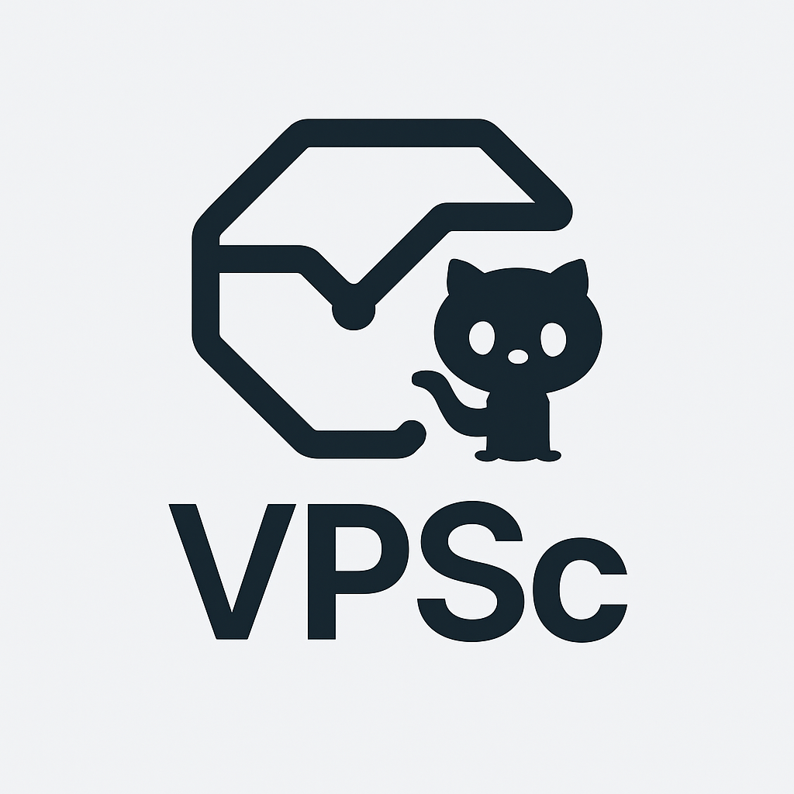

# VPN Server Manager v4.2.1

Приложение для управления VPN-серверами с шифрованием данных и поддержкой офлайн режима.



## 🚀 Возможности

- 🔐 **Шифрование данных** - Fernet (AES-128 + HMAC-SHA256)
- 🖥️ **Desktop и Web режимы** - Flask + PyWebView
- 🌐 **Офлайн работа** - не требует интернета
- 🌍 **Многоязычность** - русский, английский, китайский
- 📊 **Мониторинг серверов** - SSH подключение, статистика
- 🔒 **PIN защита** - защита от несанкционированного доступа
- 📦 **Экспорт/импорт** - резервное копирование данных

## 📋 Требования

- Python 3.8+
- pip

## 🛠 Установка

### Windows (автоматическая)

```cmd
setup_windows.bat
start_windows.bat
```

### Ручная установка

```bash
# 1. Клонировать репозиторий
git clone https://github.com/kureinmaxim/vpn-server-manager.git
cd vpn-server-manager

# 2. Создать виртуальное окружение
python -m venv venv

# Windows
venv\Scripts\activate

# macOS/Linux
source venv/bin/activate

# 3. Установить зависимости
python -m pip install -r requirements.txt
OR
pip install -r requirements.txt

# 4. Сгенерировать ключ шифрования
python generate_key.py

# 5. Создать конфигурацию
copy config\config.json.template config.json

# 6. Скомпилировать переводы
python -m babel.messages.frontend compile -d translations
```

## ▶️ Запуск

```bash
# Web режим (браузер)
python run.py

# Desktop режим (отдельное окно)
python run.py --desktop

# Debug режим
python run.py --debug
```

## 🐳 Docker

```bash
docker-compose up
```

## 🌍 Переводы

Для работы переключения языков необходимо скомпилировать `.po` файлы:

```bash
# Компиляция переводов (.po → .mo)
python -m babel.messages.frontend compile -d translations
```

Поддерживаемые языки: русский (по умолчанию), английский, китайский.

## 📚 Документация

Вся документация находится в папке `docs/`:

- [Индекс документации](docs/INDEX.md)
- [Руководство по сборке](BUILD.md)
- [Управление версиями](VERSION_MANAGEMENT.md)
- [Windows proxy troubleshooting](docs/WINDOWS_PROXY_TROUBLESHOOTING.md)
- [Docker Guide](docs/DOCKER_GUIDE.md)
- [Мониторинг](docs/README_MONITORING.md)

## 📝 Changelog

См. [CHANGELOG.md](CHANGELOG.md)

## 📜 Лицензия

MIT License - см. [LICENSE](LICENSE)
