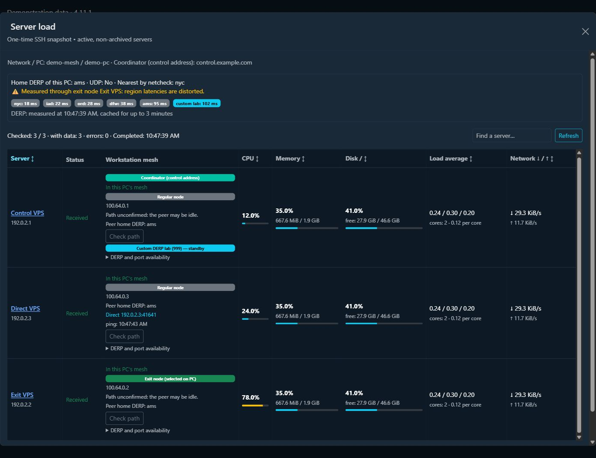
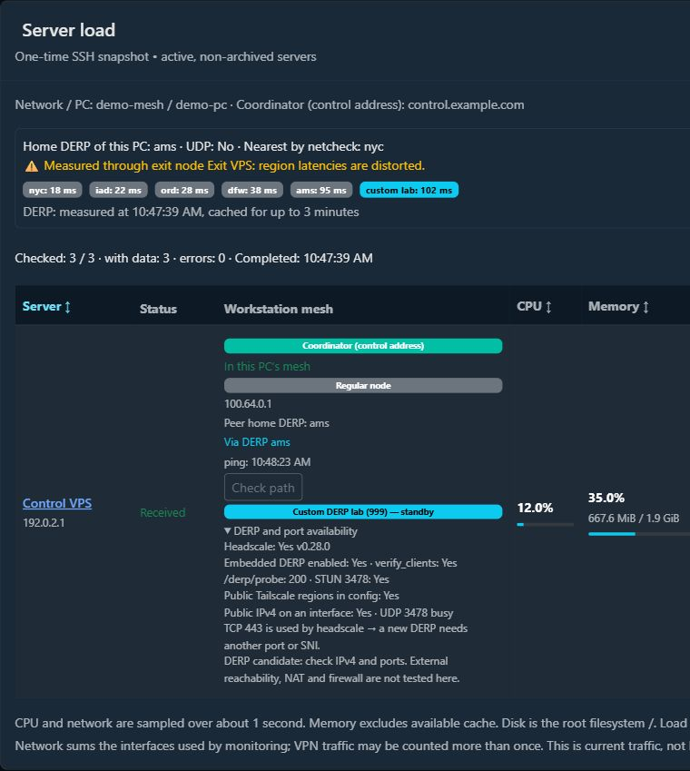
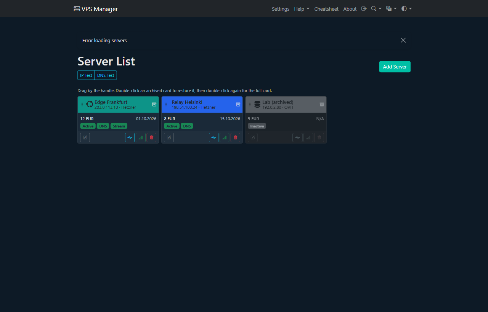
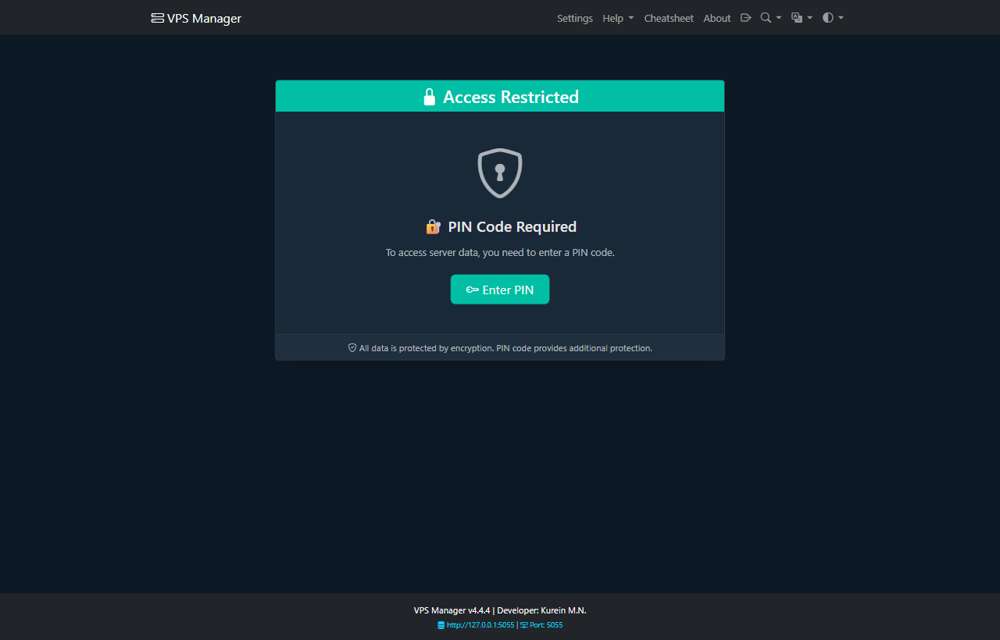
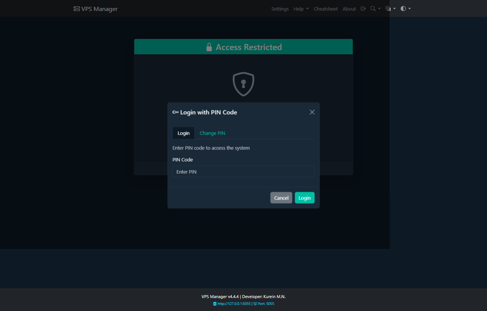
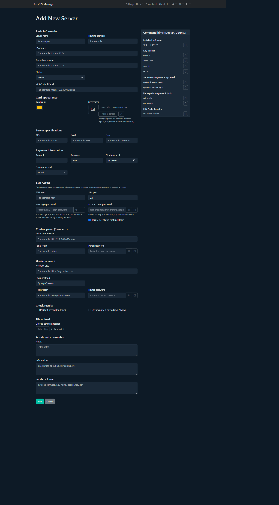
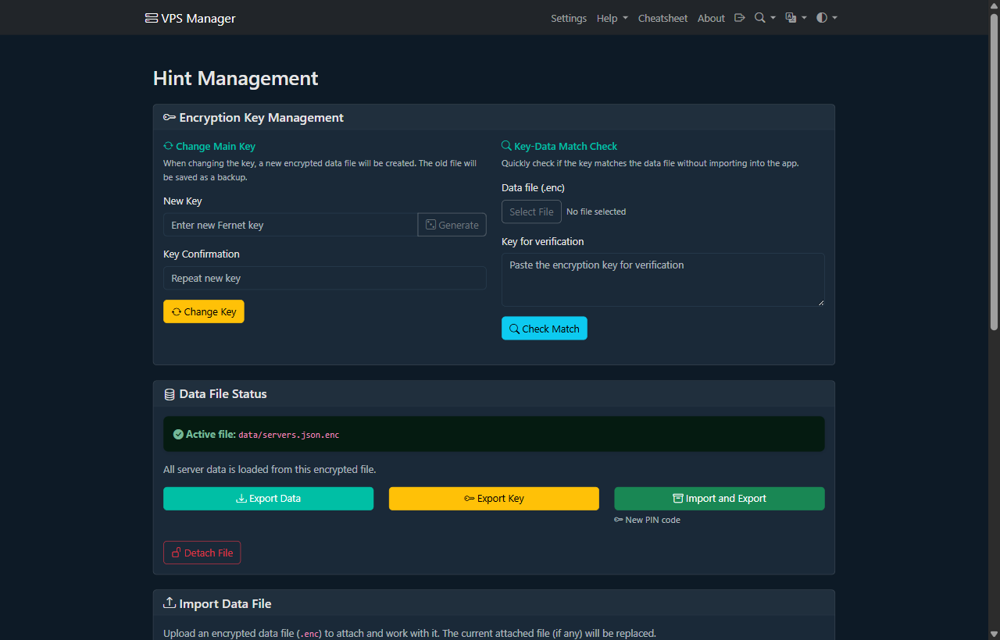

# VPN Server Manager v4.11.2

<p align="center">
  
</p>

<p align="center">
  <strong>Your servers, their health, and how they connect — in one desktop app.</strong><br>
  Encrypted inventory · SSH management · Tailscale &amp; DERP diagnostics
</p>

<p align="center">
  <a href="https://github.com/kureinmaxim/vpn-server-manager/releases"></a>
  <a href="https://github.com/kureinmaxim/vpn-server-manager/actions/workflows/ci.yml"></a>
  <a href="LICENSE"></a>
  <a href="#quick-start"></a>
  
</p>

<p align="center">
  <a href="https://github.com/kureinmaxim/vpn-server-manager/releases/latest"><strong>Download for Windows</strong></a>
  &nbsp; · &nbsp; <a href="#quick-start">Run from source</a>
  &nbsp; · &nbsp; <a href="docs/INDEX_ru.md">Russian documentation</a>
  &nbsp; · &nbsp; <a href="CHANGELOG.md">What's new</a>
</p>

VPN Server Manager keeps server logins, panel credentials, domains and provider details in an encrypted local vault. Compare server load, inspect services over SSH, and see which machines belong to the Tailscale network of the PC running the app. Open it as a native desktop window or in a browser; a Telegram bot is optional.

**Latest patch · 4.11.2:** Tailscale detection on macOS now also works when the app is launched from Finder or the Dock with a limited PATH. [Release notes →](https://github.com/kureinmaxim/vpn-server-manager/releases/tag/v4.11.2)

## See your fleet at a glance

Open **Server load** next to DNS to compare CPU, memory, disk space, load averages and network traffic across active servers. Filter by name or address and sort by the metric that matters.

<p align="center">
  
  <br><sub>v4.11.1 · English interface · demonstration servers and addresses</sub>
</p>

| What you want to know | Where to look |
|---|---|
| **Which server is under pressure?** | CPU, memory and disk meters; sortable load and traffic columns. |
| **Is it in this PC's mesh?** | The mesh column matches visible Tailscale peers and shows regular nodes, available exits and the exit selected on the PC. |
| **Where is the coordinator?** | The control endpoint is named above the table and marked on matching server cards. |
| **Which relay is closest?** | The DERP summary shows measured region latencies, highlights custom regions and warns when netcheck runs through an exit node. |

## Understand the connection, not just the status

An idle peer can have an empty direct address. Its home DERP region alone does **not** prove that traffic is being relayed. Click **Check path** to send up to three Tailscale pings and see the last confirmed direct or DERP path with its check time.

<p align="center">
  
  <br><sub>Read-only diagnostics · demonstration data, no private infrastructure details</sub>
</p>

Expand **DERP and port availability** to inspect an existing Headscale relay or assess a possible relay host: embedded DERP configuration, local HTTPS probe, STUN listener, public interface IPv4 and port occupancy. A successful local probe does not establish internet reachability; firewall and NAT still matter. [How the checks work →](docs/README_MONITORING_ru.md#derp-в-обзоре-загрузки-4111)

## Keep everyday operations together

<p align="center">
  
</p>

## What you get

| | |
|---|---|
| **Encrypted vault** | Fernet encryption for server data. Import / export full backups. Lose the key, lose the data — by design. |
| **Desktop or browser** | Native window on Windows, macOS, and Linux, or `python run.py` for web mode. |
| **PIN lock** | Quick lock on the local app so a shared machine is not an open notebook. |
| **SSH monitoring** | Live traffic, firewall, systemd services, Docker, security events, CPU/RAM history. Knows TelegramOnly, Reticulum, and web panels (Dockhand, Headplane) over an SSH tunnel. |
| **Server management** | Inspect Docker and systemd services, control their lifecycle, and use supported protocol settings and client operations. [Supported configurations and limits](CHANGELOG.md). |
| **DNS & network tools** | Keep domains, providers, renewal dates and notes together. Run network checks and use terminal examples, including DNS queries with `dig`. |
| **Mesh & DERP** | Local Tailscale membership, coordinator and exit roles, custom relay diagnostics and an explicit path check. No Tailscale configuration changes. |
| **Works offline** | The inventory stays usable without internet. Network-only actions disable themselves cleanly. |
| **Languages** | Russian, English, and Chinese. `.po` catalogs compile on first launch. |

<details>
<summary>More screenshots: PIN protection, server editing and settings</summary>

<p align="center">
  
  &nbsp;
  
</p>

<p align="center">
  
</p>

<p align="center">
  
</p>

</details>

## Quick start

**Requires Python 3.13+.**

### Windows

```cmd
setup_windows.bat
start_windows.bat
```

Or in PowerShell:

```powershell
git clone https://github.com/kureinmaxim/vpn-server-manager.git
cd vpn-server-manager

python -m venv venv
.\venv\Scripts\Activate.ps1
python -m pip install -r requirements.txt

copy env.example .env
python generate_key.py
copy config\config.json.template config.json

python -m babel.messages.frontend compile -d translations
python run.py
```

### macOS / Linux

```bash
git clone https://github.com/kureinmaxim/vpn-server-manager.git
cd vpn-server-manager

python3 -m venv venv
source venv/bin/activate
python -m pip install -r requirements.txt

cp env.example .env
python3 generate_key.py
cp config/config.json.template config.json

python -m babel.messages.frontend compile -d translations
python3 run.py
```

### Run

```text
Web:     python run.py
Desktop: python run_desktop.py
Debug:   python run.py --debug
```

The current [release](https://github.com/kureinmaxim/vpn-server-manager/releases/latest) includes a Windows installer and SHA256 checksum. macOS and Linux users can run from source; see [BUILD.md](BUILD.md) for packaging.

For the load overview, save working SSH credentials in each server card. Mesh and DERP diagnostics also require Tailscale on the **application host**. Remote DERP inspection uses existing Python 3 and standard Linux tools; unavailable dependencies are reported without installing anything.

## Backup and restore

Servers (with their passwords) and the DNS card (providers, domains, records) are stored in **one encrypted `.enc` file**. It can only be decrypted with `SECRET_KEY` from `.env`, so a backup is always **data file + key**.

**Back up:** Settings → **Full export** creates `vpn_servers_backup_<date>.zip` in Downloads:

| File | Contents |
|---|---|
| `servers_<date>.enc` | All servers and the whole DNS card |
| `SECRET_KEY.env` | The key for that `.enc` file |
| `PIN.txt` | Login PIN of the source install (a reminder; the PIN is per install and is not restored) |
| `uploads/` | Server icons |

The archive holds data, key and PIN together: anyone with it can read every password. Keep it in a password manager or on an encrypted drive, never in chats or git.

**Restore**, depending on the target computer:

- **Fresh install (or full replacement):** close the app, put `SECRET_KEY.env` into the app data folder as `.env`, copy `uploads/`, start the app, then Settings → **Import Data File** → `servers_<date>.enc` → **Import and Attach**.
- **The computer already has its own servers:** keep its `.env`. Settings → **Import servers from another installation** → choose `servers_<date>.enc`, paste the value after `SECRET_KEY=` → **Import and merge servers**. Duplicates (same name or IP) and existing domains are skipped; passwords are re-encrypted with the local key.

App data folder: macOS `~/Library/Application Support/VPNServerManager-Clean/`, Windows `%APPDATA%\VPNServerManager-Clean\`, Linux `~/.local/share/VPNServerManager-Clean/`.

Files with DNS data need version 4.6.0 or newer. Step-by-step guide with troubleshooting: [docs/BACKUP_RESTORE_ru.md](docs/BACKUP_RESTORE_ru.md) (Russian).

## Safety notes

- Default PIN in the template is `1234`. Change it before real use.
- Keep `.env` (`SECRET_KEY`) and encrypted exports off shared drives and out of git.
- There is no password recovery. A full export is the backup.

## Docs

- [Documentation index](docs/INDEX_ru.md) (Russian)
- [Build guide](BUILD.md) · [RU](BUILD_ru.md)
- [Terminal help](TERMINAL_HELP.md) · [RU](TERMINAL_HELP_ru.md)
- [Version management](VERSION_MANAGEMENT.md)
- [Release process](docs/release_guide_ru.md) (Russian)
- [Monitoring](docs/README_MONITORING_ru.md) (Russian)
- [Docker](docs/DOCKER_GUIDE_ru.md) (Russian)
- [Changelog](CHANGELOG.md)
- [Lessons](lessons/README.md) (Russian: app + Git)

Questions: [Discussions](https://github.com/kureinmaxim/vpn-server-manager/discussions). Bugs: [Issues](https://github.com/kureinmaxim/vpn-server-manager/issues).

## License

[MIT](LICENSE)
