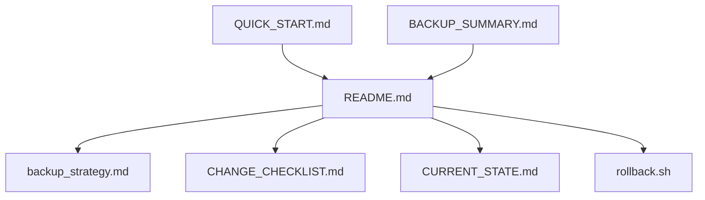

# 📁 Индекс инструментов резервного копирования

## 📋 Содержимое папки `backup_tools/`

### 🚀 Быстрый старт
- **[QUICK_START.md](QUICK_START.md)** - Краткая инструкция для немедленного использования

### 📖 Подробная документация
- **[README.md](README.md)** - Полная инструкция с примерами и сценариями
- **[backup_strategy.md](backup_strategy.md)** - Стратегия резервного копирования
- **[CURRENT_STATE.md](CURRENT_STATE.md)** - Документация текущего состояния проекта

### ✅ Контроль и мониторинг
- **[CHANGE_CHECKLIST.md](CHANGE_CHECKLIST.md)** - Чек-лист для безопасного внесения изменений
- **[BACKUP_SUMMARY.md](BACKUP_SUMMARY.md)** - Итоговый отчет о созданной системе

### 🔧 Инструменты
- **[rollback.sh](rollback.sh)** - Скрипт для быстрого отката к резервному состоянию

## 🎯 Рекомендуемый порядок изучения

### Для быстрого старта:
1. **QUICK_START.md** - основные команды за 2 минуты
2. **rollback.sh** - как использовать скрипт отката

### Для глубокого понимания:
1. **README.md** - полная инструкция
2. **backup_strategy.md** - принципы работы
3. **CHANGE_CHECKLIST.md** - контроль процесса
4. **CURRENT_STATE.md** - текущее состояние

## 📊 Статистика файлов

| Файл | Размер | Назначение |
|------|--------|------------|
| QUICK_START.md | 2.2 KB | Быстрый старт |
| README.md | 12.7 KB | Полная инструкция |
| backup_strategy.md | 2.2 KB | Стратегия |
| CURRENT_STATE.md | 3.4 KB | Текущее состояние |
| CHANGE_CHECKLIST.md | 4.1 KB | Чек-лист |
| BACKUP_SUMMARY.md | 3.3 KB | Итоговый отчет |
| rollback.sh | 2.4 KB | Скрипт отката |

**Общий размер**: ~30 KB документации

## 🔗 Связи между файлами

## 🎯 Ключевые точки доступа

### Экстренные ситуации:
- **Быстрый откат**: `./rollback.sh`
- **Резервная ветка**: `backup/current-state-20250805-103439`
- **Тег**: `v1.0-backup-20250805`

### Обычная работа:
- **Рабочая ветка**: `feature/major-changes-20250805-103534`
- **Чек-лист**: `CHANGE_CHECKLIST.md`
- **Мониторинг**: `git status`, `git log --oneline -5`

## 💡 Советы по использованию

1. **Начните с QUICK_START.md** - получите базовое понимание за 2 минуты
2. **Изучите README.md** - для полного понимания системы
3. **Используйте CHANGE_CHECKLIST.md** - для контроля процесса
4. **Держите rollback.sh под рукой** - для экстренных ситуаций

## 🎉 Готово к использованию!

Все инструменты созданы и готовы к работе. Система обеспечивает полную безопасность при внесении изменений в проект. 