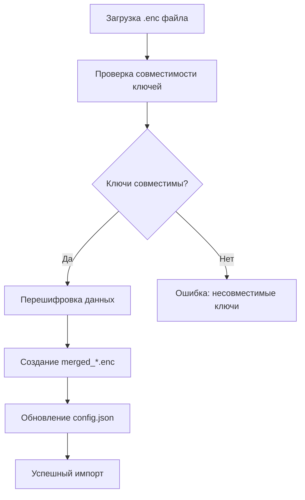

# 📁 Руководство по хранению данных VPN Server Manager

## 🎯 Обзор

VPN Server Manager использует **зашифрованное хранение данных** для обеспечения безопасности информации о серверах, паролях и настройках. Все данные защищены криптографическим шифрованием и хранятся в специальных директориях в зависимости от операционной системы.

---

## 🏠 Структура хранения данных

### 📂 В режиме разработки (текущий проект)

```
/Users/olgazaharova/Project/ProjectPython/VPNserverManage/
├── data/                          # 📊 Локальные данные разработки
│   ├── servers.json.enc          # 🔐 Основной файл с серверами (зашифрован)
│   ├── hints.json                # 📝 Шпаргалка команд
│   └── merged_*.enc              # 📦 Временные файлы импорта
├── uploads/                       # 📎 Пользовательские файлы
│   ├── icon_*.png                # 🖼️ Иконки серверов
│   └── *_Invoice-*.pdf           # 📄 Чеки об оплате
├── config.json                   # ⚙️ Настройки приложения
├── .env                          # 🔑 Секретный ключ шифрования
└── memory-bank/                  # 🧠 Система управления задачами
    ├── tasks.md
    ├── activeContext.md
    └── archive/
```

### 📂 В установленном приложении

#### macOS
```
~/Library/Application Support/VPNServerManager/
├── data/                          # 🔐 Основные данные
│   ├── servers.json.enc          # 📊 Все серверы (зашифрованы)
│   ├── hints.json                # 📝 Шпаргалка команд
│   └── merged_*.enc              # 📦 Файлы импорта/слияния
├── uploads/                       # 📎 Пользовательские файлы
│   ├── icon_*.png                # 🖼️ Иконки серверов
│   └── *_Invoice-*.pdf           # 📄 Документы
├── config.json                   # ⚙️ Настройки приложения
└── .env                          # 🔑 Секретный ключ шифрования
```

#### Windows
```
%APPDATA%\VPNServerManager\
├── data\
├── uploads\
├── config.json
└── .env
```

#### Linux
```
~/.local/share/VPNServerManager/
├── data\
├── uploads\
├── config.json
└── .env
```

---

## 🔐 Критически важные файлы

### 1. `servers.json.enc` - Главная база данных

**Назначение:** Содержит всю информацию о серверах в зашифрованном виде

**Содержимое:**
- IP-адреса серверов
- Логины и пароли (зашифрованы)
- Порт SSH
- Информация о хостере
- Docker информация
- Установленное ПО
- Заметки пользователя
- Данные для входа в панель хостера

**Безопасность:**
- Зашифрован алгоритмом Fernet (AES 128)
- Ключ шифрования хранится в `.env`
- Без ключа данные недоступны

**Пример структуры:**
```json
[
  {
    "id": "server_001",
    "name": "Production Server",
    "ip_address": "192.168.1.100",
    "username": "root",
    "password": "gAAAAABh...", // зашифрованный пароль
    "port": 22,
    "hoster": "DigitalOcean",
    "docker_info": "Docker version 20.10.21",
    "software_info": "nginx, docker, certbot",
    "hoster_credentials": {
      "user": "gAAAAABh...", // зашифрованный пользователь
      "password": "gAAAAABh..." // зашифрованный пароль
    },
    "notes": "Основной сервер для продакшена"
  }
]
```

### 2. `.env` - Секретный ключ шифрования

**Назначение:** Содержит ключ для расшифровки данных

**Содержимое:**
```
SECRET_KEY=gAAAAABh...32-байтовый_base64_ключ
```

**Критичность:** 
- ⚠️ **КРИТИЧЕСКИ ВАЖЕН** - без этого файла данные НЕ расшифруются
- Никогда не должен попадать в Git или публичные места
- Обязательно делать резервные копии

### 3. `config.json` - Настройки приложения

**Назначение:** Содержит конфигурацию приложения

**Содержимое:**
```json
{
  "app_info": {
    "version": "3.5.4",
    "release_date": "28.09.2025",
    "developer": "Куреин М.Н.",
    "last_updated": "2025-09-28"
  },
  "service_urls": {
    "ip_check_api": "https://ipinfo.io/{ip}/json",
    "general_ip_test": "https://browserleaks.com/ip",
    "general_dns_test": "https://dnsleaktest.com/",
    "ip2location_demo": "https://www.ip2location.com/demo/{ip}"
  },
  "active_data_file": "data/servers.json.enc"
}
```

### 4. `hints.json` - Шпаргалка команд

**Назначение:** Содержит команды для быстрого доступа

**Содержимое:**
```json
{
  "commands": [
    "sudo systemctl status nginx",
    "docker ps -a",
    "df -h"
  ]
}
```

---

## 📊 Структура данных серверов

### Полная схема данных сервера

```json
{
  "id": "уникальный_идентификатор",
  "name": "Название сервера",
  "ip_address": "192.168.1.1",
  "username": "root",
  "password": "зашифрованный_пароль",
  "port": 22,
  "hoster": "DigitalOcean",
  "hoster_credentials": {
    "user": "зашифрованный_пользователь",
    "password": "зашифрованный_пароль"
  },
  "docker_info": "Информация о Docker контейнерах",
  "software_info": "Список установленного ПО",
  "notes": "Заметки пользователя",
  "created_at": "2025-09-28T10:00:00Z",
  "updated_at": "2025-09-28T15:30:00Z"
}
```

### Поля данных

| Поле | Тип | Описание | Шифрование |
|------|-----|----------|------------|
| `id` | String | Уникальный идентификатор | ❌ |
| `name` | String | Название сервера | ❌ |
| `ip_address` | String | IP-адрес сервера | ❌ |
| `username` | String | SSH пользователь | ❌ |
| `password` | String | SSH пароль | ✅ |
| `port` | Number | SSH порт | ❌ |
| `hoster` | String | Провайдер хостинга | ❌ |
| `hoster_credentials.user` | String | Пользователь панели хостера | ✅ |
| `hoster_credentials.password` | String | Пароль панели хостера | ✅ |
| `docker_info` | String | Информация о Docker | ❌ |
| `software_info` | String | Установленное ПО | ❌ |
| `notes` | String | Заметки пользователя | ❌ |

---

## 🔄 Процесс импорта данных

### 1. Импорт из другого приложения



**Шаги импорта:**
1. Загружается `.enc` файл через веб-интерфейс
2. Проверяется возможность расшифровки с текущим ключом
3. Если ключи несовместимы - файл удаляется
4. Данные перешифровываются новым ключом
5. Создается файл `merged_YYYYMMDD_HHMMSS.enc`
6. Обновляется `config.json` для использования нового файла

### 2. Слияние данных

**Процесс:**
- Текущие серверы + импортированные серверы
- Автоматическое разрешение конфликтов ID
- Перешифровка всех паролей новым ключом
- Сохранение в новый файл с временной меткой

---

## 🛡️ Безопасность данных

### Алгоритм шифрования

**Fernet (AES 128 в режиме CBC)**
- **Ключ:** 32-байтовый base64-кодированный ключ
- **Аутентификация:** HMAC-SHA256
- **Случайность:** Использует криптографически стойкий генератор

### Уровни защиты

1. **Файловое шифрование:** Весь файл `servers.json.enc` зашифрован
2. **Полевое шифрование:** Пароли зашифрованы дополнительно
3. **Двойное шифрование:** Пароли хостера шифруются отдельно

### Защита ключей

- Ключ шифрования в отдельном файле `.env`
- Файл `.env` не попадает в систему контроля версий
- Автоматическая генерация криптографически стойких ключей

---

## 📍 Расположение на разных ОС

| Операционная система | Путь к данным | Переменная окружения |
|---------------------|---------------|---------------------|
| **macOS** | `~/Library/Application Support/VPNServerManager/` | `$HOME` |
| **Windows** | `%APPDATA%\VPNServerManager\` | `%APPDATA%` |
| **Linux** | `~/.local/share/VPNServerManager/` | `$HOME` |

### Автоматическое определение

Приложение автоматически определяет ОС и создает соответствующие директории:

```python
def get_app_data_dir():
    if sys.platform == 'darwin':  # macOS
        return os.path.join(os.path.expanduser("~"), 
                           "Library", "Application Support", 
                           "VPNServerManager")
    elif sys.platform == 'win32':  # Windows
        return os.path.join(os.environ.get('APPDATA', 
                           os.path.expanduser("~")), 
                           "VPNServerManager")
    else:  # Linux
        return os.path.join(os.path.expanduser("~"),
                           ".local", "share", 
                           "VPNServerManager")
```

---

## 🔧 Утилиты для работы с данными

### 1. `tools/decrypt_tool.py` - Просмотр данных

**Назначение:** Просмотр расшифрованных данных без запуска GUI

**Использование:**
```bash
cd /path/to/project
python3 tools/decrypt_tool.py
```

**Функции:**
- Расшифровка и отображение данных серверов
- Просмотр структуры данных
- Проверка целостности файлов

### 2. `tools/generate_key.py` - Создание нового ключа

**Назначение:** Генерация нового SECRET_KEY

**Использование:**
```bash
cd /path/to/project
python3 tools/generate_key.py
```

**Функции:**
- Генерация криптографически стойкого ключа
- Сохранение в файл `.env`
- Проверка совместимости

### 3. Встроенные функции приложения

**Экспорт данных:**
- Веб-интерфейс: Настройки → Экспорт данных
- Создание `.enc` файла для переноса

**Импорт данных:**
- Веб-интерфейс: Настройки → Импорт данных
- Автоматическая проверка совместимости

---

## ⚠️ Важные моменты и рекомендации

### Резервное копирование

**Критически важные файлы для резервирования:**
1. `servers.json.enc` - основная база данных
2. `.env` - ключ шифрования
3. `config.json` - настройки приложения
4. `uploads/` - пользовательские файлы

**Рекомендации:**
- Делайте резервные копии перед обновлениями
- Храните копии в безопасном месте
- Проверяйте целостность резервных копий

### Синхронизация между устройствами

**При переносе приложения:**
1. Скопируйте всю директорию данных
2. Убедитесь, что скопирован файл `.env`
3. Проверьте права доступа к файлам
4. Запустите приложение для проверки

### Безопасность

**Никогда не делайте:**
- ❌ Не делитесь файлом `.env`
- ❌ Не загружайте `.env` в Git
- ❌ Не передавайте ключи по незащищенным каналам
- ❌ Не храните незашифрованные пароли

**Всегда делайте:**
- ✅ Регулярные резервные копии
- ✅ Проверку целостности данных
- ✅ Обновления приложения
- ✅ Безопасное хранение ключей

---

## 🚨 Устранение неполадок

### Проблема: "Не удается расшифровать данные"

**Причины:**
- Отсутствует файл `.env`
- Поврежден файл `servers.json.enc`
- Несовместимые ключи шифрования

**Решение:**
1. Проверьте наличие файла `.env`
2. Восстановите из резервной копии
3. Пересоздайте ключ (потеряете данные!)

### Проблема: "Файл данных не найден"

**Причины:**
- Неправильный путь к данным
- Отсутствуют права доступа
- Повреждена структура директорий

**Решение:**
1. Проверьте права доступа к директории
2. Пересоздайте структуру директорий
3. Восстановите файлы из резерва

### Проблема: "Ошибка импорта данных"

**Причины:**
- Несовместимые ключи шифрования
- Поврежденный файл импорта
- Недостаточно места на диске

**Решение:**
1. Проверьте совместимость ключей
2. Попробуйте другой файл импорта
3. Освободите место на диске

---

## 📈 Мониторинг и обслуживание

### Проверка целостности данных

**Регулярные проверки:**
- Запуск `tools/decrypt_tool.py` для проверки данных
- Проверка размера файлов данных
- Мониторинг свободного места

### Очистка временных файлов

**Файлы для удаления:**
- `merged_*.enc` - старые файлы импорта
- Временные файлы в `uploads/`
- Логи приложения

### Обновление данных

**При обновлении приложения:**
1. Сделайте резервную копию данных
2. Обновите приложение
3. Проверьте совместимость данных
4. Восстановите данные при необходимости

---

## 🎯 Заключение

VPN Server Manager использует **многоуровневую систему защиты данных** с зашифрованным хранением, автоматическим управлением ключами и безопасным импортом/экспортом. Все данные защищены криптографическим шифрованием и хранятся в специальных директориях операционной системы.

**Ключевые принципы:**
- 🔐 **Безопасность** - все пароли зашифрованы
- 🏠 **Портативность** - данные легко переносятся
- 🔄 **Совместимость** - поддержка импорта/экспорта
- 🛡️ **Надежность** - резервное копирование и восстановление

Следуйте рекомендациям по безопасности и регулярно делайте резервные копии для обеспечения сохранности ваших данных! 🚀
