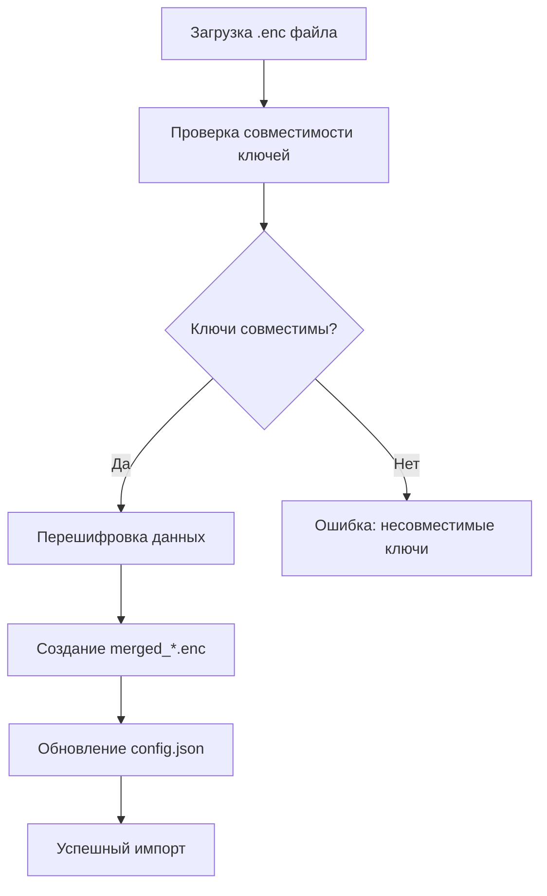

# 📁 Руководство по хранению данных VPN Server Manager

> Резервная копия, перенос на другой компьютер и восстановление (серверы + DNS) — пошагово в [BACKUP_RESTORE_ru.md](BACKUP_RESTORE_ru.md).

## 🎯 Обзор

VPN Server Manager хранит серверы и DNS-карточку в **одном зашифрованном файле**, а ключ к нему — отдельно, в `.env`. Шифрование — Fernet, в два слоя: сначала каждый пароль, потом файл целиком.

Что важно понимать с самого начала:

- **Зашифровано:** серверы, DNS, все пароли и логины — внутри `data/servers.json.enc`.
- **Не зашифровано:** PIN в `config.json`, заметки в `data/hints.json`, файлы в `uploads/`.
- **PIN и `SECRET_KEY` — разные вещи.** PIN запирает интерфейс и хранится открытым текстом; данные защищает только ключ.
- **Восстановления ключа нет.** Потеря `.env` означает потерю данных, поэтому резервная копия — это всегда файл **и** ключ.

---

## 🏠 Структура хранения данных

Всё пользовательское лежит в одном каталоге данных (`APP_DATA_DIR`). В режиме разработки это корень проекта, у собранного приложения — системный каталог. Структура в обоих случаях одна и та же.

```
<APP_DATA_DIR>/
├── data/                          # 📊 Данные
│   ├── servers.json.enc          # 🔐 Серверы И DNS-карточка (зашифровано)
│   ├── hints.json                # 📝 Шпаргалка команд (открытый текст)
│   └── merged_*.enc              # 📦 Файлы импорта/слияния
├── uploads/                       # 📎 Иконки серверов и чеки (создаётся при первой загрузке)
├── config.json                   # ⚙️ Настройки приложения и PIN
└── .env                          # 🔑 Секретный ключ шифрования
```

### 📂 Где именно этот каталог

| Режим | `APP_DATA_DIR` |
|---|---|
| Разработка | корень проекта |
| macOS (собранное) | `~/Library/Application Support/VPNServerManager-Clean/` |
| Windows (собранное) | `%APPDATA%\VPNServerManager-Clean\` |
| Linux (собранное) | `~/.local/share/VPNServerManager-Clean/` |

Каталог называется `VPNServerManager-Clean` — с суффиксом.

В корне репозитория есть ещё `memory-bank/` и `lessons/` — это рабочие заметки проекта, пользовательских данных там нет.

---

## 🔐 Критически важные файлы

### 1. `servers.json.enc` — главная база данных

**Назначение:** серверы **и** DNS-карточка в зашифрованном виде.

**Безопасность — два слоя Fernet:**

1. **Поля.** Каждый пароль и логин шифруется отдельно и хранится как токен `gAAAAA...`.
2. **Файл.** Получившийся JSON шифруется целиком.

Поэтому после расшифровки файла пароли внутри всё ещё остаются токенами — их расшифровывает второй вызов. Без ключа из `.env` не читается ничего.

**Формат (версии 4.x):**

```json
{
  "servers": [ ... ],
  "dns": { "domains": [ ... ] }
}
```

Старый формат — просто список `[ ... ]` без DNS — по-прежнему читается.

**Пример записи сервера:**

```json
{
  "id": 1,
  "name": "Production Server",
  "provider": "DigitalOcean",
  "ip_address": "192.168.1.100",
  "os": "Ubuntu 24.04",
  "status": "Active",
  "archived": false,
  "notes": "Основной сервер для продакшена",
  "docker_info": "Docker version 20.10.21",
  "software_info": "nginx, docker, certbot",
  "panel_url": "https://panel.example.com",
  "hoster_url": "https://cloud.digitalocean.com",
  "card_color": "#ffc107",
  "os_icon": "bi-ubuntu",
  "icon_filename": "icon_1.png",
  "specs":        { "cpu": "2 vCPU", "ram": "4 GB", "disk": "80 GB" },
  "payment_info": { "amount": 24.0, "currency": "USD", "next_due_date": "2026-11-01",
                    "payment_period": "Monthly", "receipts": [] },
  "ssh_credentials":    { "user": "root", "port": 22, "root_login_allowed": false,
                          "password": "gAAAAA...", "root_password": "gAAAAA..." },
  "panel_credentials":  { "user": "gAAAAA...", "password": "gAAAAA..." },
  "hoster_credentials": { "user": "gAAAAA...", "password": "gAAAAA...",
                          "login_method": "password" },
  "geolocation":  { "city": "Amsterdam", "country": "NL", "region": "NH", "ip": "192.168.1.100" },
  "checks":       { "dns_ok": true, "streaming_ok": false },
  "hosting_analysis": { "text": "N/A", "quality": "secondary" }
}
```

### 2. `.env` — секретный ключ шифрования

**Содержимое:**
```
SECRET_KEY=44-символьный_base64_ключ
```

Ключ Fernet — это **не** токен: он не начинается с `gAAAAA`. Генерируется `tools/generate_key.py`, а у собранного приложения создаётся автоматически при первом запуске, если файла ещё нет.

**Критичность:**
- ⚠️ **КРИТИЧЕСКИ ВАЖЕН** — без этого файла данные НЕ расшифруются.
- Никогда не должен попадать в Git или публичные места.
- Обязательно делать резервные копии.
- Менять его вручную нельзя — только через `scripts/rotate_secret_key.py`, иначе доступ к данным будет потерян.

### 3. `config.json` — настройки и PIN

**Назначение:** локальные настройки пользователя и PIN. Лежит в `APP_DATA_DIR`, в Git не попадает.

**Содержимое:**
```json
{
  "SECRET_KEY_FILE": ".env",
  "app_info": {
    "version": "4.9.1",
    "release_date": "30.09.2026",
    "last_updated": "2026-09-30",
    "developer": "Куреин М.Н.",
    "description": "VPN Server Manager - Менеджер VPN серверов"
  },
  "service_urls": {
    "ip_check_api": "https://ipinfo.io/{ip}/json",
    "general_ip_test": "https://browserleaks.com/ip",
    "general_dns_test": "https://dnsleaktest.com/",
    "ip2location_demo": "https://www.ip2location.com/demo/{ip}"
  },
  "active_data_file": "data/servers.json.enc",
  "secret_pin": {
    "default_pin": "1234",
    "current_pin": "1234",
    "last_changed": "",
    "setup_completed": false
  }
}
```

**Про `secret_pin`:**

| Поле | Смысл |
|---|---|
| `current_pin` | Действующий PIN, **в открытом виде** — не хешируется |
| `default_pin` | Значение по умолчанию (`1234`), для первого запуска |
| `last_changed` | Дата последней смены |
| `setup_completed` | Пройден ли первичный мастер настройки |

PIN блокирует интерфейс, но **ничего не шифрует**: доступ к данным даёт только `SECRET_KEY`. Подбор ограничен — 3 неверные попытки дают блокировку на 30 секунд, счётчик хранится в сессии.

Первичный мастер настройки предлагается, только если PIN ещё не настроен (`setup_completed: false`) **и** файла с серверами ещё нет — иначе его не показать, чтобы нельзя было переназначить PIN поверх существующих данных.

Если `config.json` в каталоге данных отсутствует, значения берутся из шаблона репозитория `config/config.json.template`.

Релизную версию из локального `config.json` брать не следует — источник версии репозитория — `config/config.json.template` и `tools/update_version.py`.

### 4. `hints.json` — шпаргалка команд

**Назначение:** пользовательские заметки и команды. Хранится в `data/` **в открытом виде** — секретов туда класть не стоит.

**Содержимое** — JSON-список; пустая заготовка выглядит так:
```json
[]
```

---

## 📊 Структура данных серверов

Полный пример записи — выше, в разделе про `servers.json.enc`. Схему задаёт `normalize_server_data()` в `app/services/data_manager_service.py`: недостающие поля дописываются значениями по умолчанию, поэтому старые файлы читаются без миграции.

### Поля данных

Колонка «Шифрование» — про **полевой** слой. Всё остальное закрыто вторым слоем — шифрованием файла целиком, — поэтому без ключа не видно и его.

| Поле | Тип | Описание | Шифрование поля |
|------|-----|----------|------------|
| `id` | Number/String | Уникальный идентификатор | ❌ |
| `name` | String | Название сервера | ❌ |
| `provider` | String | Провайдер хостинга | ❌ |
| `ip_address` | String | IP-адрес сервера | ❌ |
| `os` | String | Операционная система | ❌ |
| `status` | String | Состояние (`Active` по умолчанию) | ❌ |
| `archived` | Bool | Перенесён ли в архив | ❌ |
| `notes` | String | Заметки пользователя | ❌ |
| `docker_info` | String | Информация о Docker | ❌ |
| `software_info` | String | Установленное ПО | ❌ |
| `panel_url`, `hoster_url` | String | Ссылки на панели | ❌ |
| `card_color`, `os_icon`, `icon_filename` | String | Оформление карточки | ❌ |
| `specs.cpu` / `.ram` / `.disk` | String | Характеристики | ❌ |
| `payment_info.*` | Mixed | Оплата, период, чеки | ❌ |
| `ssh_credentials.user` | String | SSH-пользователь | ❌ |
| `ssh_credentials.port` | Number | SSH-порт | ❌ |
| `ssh_credentials.root_login_allowed` | Bool | Разрешён ли вход root | ❌ |
| `ssh_credentials.password` | String | SSH-пароль | ✅ |
| `ssh_credentials.root_password` | String | Пароль root | ✅ |
| `panel_credentials.user` | String | Пользователь панели | ✅ |
| `panel_credentials.password` | String | Пароль панели | ✅ |
| `hoster_credentials.user` | String | Пользователь хостера | ✅ |
| `hoster_credentials.password` | String | Пароль хостера | ✅ |
| `hoster_credentials.login_method` | String | Способ входа | ❌ |
| `geolocation.*` | String | Город, страна, регион, IP | ❌ |
| `checks.dns_ok` / `.streaming_ok` | Bool | Результаты проверок | ❌ |
| `hosting_analysis.*` | String | Оценка хостинга | ❌ |

### Поля `*_decrypted` — только в памяти

При загрузке рядом с зашифрованными полями появляются открытые копии:

```
ssh_credentials.password_decrypted
ssh_credentials.root_password_decrypted
panel_credentials.user_decrypted / password_decrypted
hoster_credentials.user_decrypted / password_decrypted
```

Они нужны интерфейсу для показа и копирования. Перед записью на диск их снимает `_strip_runtime_secrets()` — **в файл открытые пароли не попадают**. Если вы видите `_decrypted` в дампе, этот дамп снят из памяти, а не из файла.

Значения проходят через `sanitize_secret()` (`app/utils/credentials.py`): удаляются CR/LF, zero-width-символы, BOM, soft hyphen и bidi-метки, выполняется нормализация Unicode NFC и обрезка пробелов.

В HTML-атрибут пароль уходит в base64 (фильтр `secret_attr`, атрибут `data-enc="b64"`), а обратно его раскодирует `static/js/credentials.js`. Так WebView не искажает `%`, `&` и `#` в пароле.

---

## 🔄 Процесс импорта данных

### 1. Импорт из другого приложения



**Шаги импорта:**
1. Загружается `.enc` файл через веб-интерфейс
2. Проверяется возможность расшифровки с текущим ключом
3. Если ключи несовместимы - файл удаляется
4. Данные перешифровываются новым ключом
5. Создается файл `merged_YYYYMMDD_HHMMSS.enc`
6. Обновляется `config.json` для использования нового файла

### 2. Слияние данных

**Процесс:**
- Текущие серверы + импортированные серверы
- Автоматическое разрешение конфликтов ID
- Перешифровка всех паролей новым ключом
- Сохранение в новый файл с временной меткой

---

## 🛡️ Безопасность данных

### Алгоритм шифрования

**Fernet (AES 128 в режиме CBC)**
- **Ключ:** 32-байтовый base64-кодированный ключ
- **Аутентификация:** HMAC-SHA256
- **Случайность:** Использует криптографически стойкий генератор

### Уровни защиты

1. **Файловое шифрование:** Весь файл `servers.json.enc` зашифрован
2. **Полевое шифрование:** каждый пароль и логин зашифрован отдельно, внутри уже зашифрованного файла

Поля шифруются одинаково — и SSH, и панель, и хостер. Отдельного «третьего» уровня для хостера нет.

Что шифрование **не** закрывает: PIN в `config.json`, заметки в `data/hints.json` и файлы в `uploads/` хранятся в открытом виде.

### Защита ключей

- Ключ шифрования в отдельном файле `.env`
- Файл `.env` не попадает в систему контроля версий
- Автоматическая генерация криптографически стойких ключей при первом запуске собранного приложения
- Смена ключа — только через `scripts/rotate_secret_key.py` (перешифровывает оба слоя и делает резервные копии)

---

## 📍 Расположение на разных ОС

| Операционная система | Путь к данным | Переменная окружения |
|---------------------|---------------|---------------------|
| **macOS** | `~/Library/Application Support/VPNServerManager-Clean/` | `$HOME` |
| **Windows** | `%APPDATA%\VPNServerManager-Clean\` | `%APPDATA%` |
| **Linux** | `~/.local/share/VPNServerManager-Clean/` | `$HOME` |

В режиме разработки каталогом данных служит корень проекта.

### Автоматическое определение

`get_app_data_dir()` в `app/config.py` определяет ОС и создаёт каталог:

```python
def get_app_data_dir():
    is_frozen = getattr(sys, 'frozen', False)
    app_name = "VPNServerManager-Clean"

    if is_frozen:
        if sys.platform == 'darwin':        # macOS
            app_data_dir = os.path.join(os.path.expanduser("~"),
                                        "Library", "Application Support", app_name)
        elif sys.platform == 'win32':       # Windows
            app_data_dir = os.path.join(os.getenv('APPDATA', os.path.expanduser("~")),
                                        app_name)
        else:                               # Linux
            app_data_dir = os.path.join(os.path.expanduser("~"),
                                        ".local", "share", app_name)
    else:                                   # разработка — корень проекта
        app_data_dir = os.path.dirname(os.path.dirname(os.path.abspath(__file__)))

    os.makedirs(app_data_dir, exist_ok=True)
    return app_data_dir
```

---

## 🔧 Утилиты для работы с данными

### 1. `tools/decrypt_tool.py` - Просмотр данных

**Назначение:** Просмотр расшифрованных данных без запуска GUI

**Использование:**
```bash
cd /path/to/project
python3 tools/decrypt_tool.py
```

**Функции:**
- Расшифровка и отображение данных серверов
- Просмотр структуры данных
- Проверка целостности файлов

### 2. `tools/generate_key.py` - Создание нового ключа

**Назначение:** Генерация нового SECRET_KEY

**Использование:**
```bash
cd /path/to/project
python3 tools/generate_key.py
```

**Функции:**
- Генерация криптографически стойкого ключа
- Сохранение в файл `.env`
- Проверка совместимости

### 3. Встроенные функции приложения

**Экспорт данных:**
- Веб-интерфейс: Настройки → Экспорт данных
- Создание `.enc` файла для переноса

**Импорт данных:**
- Веб-интерфейс: Настройки → Импорт данных
- Автоматическая проверка совместимости

---

## ⚠️ Важные моменты и рекомендации

### Резервное копирование

**Критически важные файлы для резервирования:**
1. `data/servers.json.enc` — основная база данных (серверы + DNS)
2. `.env` — ключ шифрования; **без него копия бесполезна**
3. `config.json` — настройки и PIN
4. `uploads/` — иконки и чеки
5. `data/hints.json` — заметки, если они вам нужны

Встроенный «Полный экспорт» собирает ZIP, в котором уже лежат `servers_<дата>.enc`, `SECRET_KEY.env`, `PIN.txt` и `uploads/`.

**Рекомендации:**
- Делайте резервные копии перед обновлениями
- Храните копии в безопасном месте
- Проверяйте целостность резервных копий

⚠️ Этот ZIP содержит данные, ключ и PIN вместе — любой, у кого он есть, читает все пароли. Храните его в менеджере паролей или на зашифрованном диске, но не в чатах и не в Git. Пошаговый перенос — в [BACKUP_RESTORE_ru.md](BACKUP_RESTORE_ru.md).

### Синхронизация между устройствами

**При переносе приложения:**
1. Скопируйте всю директорию данных
2. Убедитесь, что скопирован файл `.env`
3. Проверьте права доступа к файлам
4. Запустите приложение для проверки

### Безопасность

**Никогда не делайте:**
- ❌ Не делитесь файлом `.env`
- ❌ Не загружайте `.env` в Git
- ❌ Не передавайте ключи по незащищенным каналам
- ❌ Не храните незашифрованные пароли

**Всегда делайте:**
- ✅ Регулярные резервные копии
- ✅ Проверку целостности данных
- ✅ Обновления приложения
- ✅ Безопасное хранение ключей

---

## 🚨 Устранение неполадок

### Проблема: "Не удается расшифровать данные"

**Причины:**
- Отсутствует файл `.env`
- Поврежден файл `servers.json.enc`
- Несовместимые ключи шифрования

**Решение:**
1. Проверьте наличие файла `.env` и то, что это каталог данных, который использует приложение
2. Проверьте соответствие ключа файлу — в настройках приложения или через `tools/decrypt_tool.py`
3. Восстановите `.env` из резервной копии — именно тот ключ, которым файл шифровали
4. Если нужно сменить ключ, не правьте `.env` вручную: `python scripts/rotate_secret_key.py --dry-run`, затем без флага. Замена строки в `.env` без перешифровки навсегда закрывает доступ к данным.

### Проблема: "Файл данных не найден"

**Причины:**
- Неправильный путь к данным
- Отсутствуют права доступа
- Повреждена структура директорий

**Решение:**
1. Проверьте права доступа к директории
2. Пересоздайте структуру директорий
3. Восстановите файлы из резерва

### Проблема: "Ошибка импорта данных"

**Причины:**
- Несовместимые ключи шифрования
- Поврежденный файл импорта
- Недостаточно места на диске

**Решение:**
1. Проверьте совместимость ключей
2. Попробуйте другой файл импорта
3. Освободите место на диске

---

## 📈 Мониторинг и обслуживание

### Проверка целостности данных

**Регулярные проверки:**
- Запуск `tools/decrypt_tool.py` для проверки данных
- Проверка размера файлов данных
- Мониторинг свободного места

### Очистка временных файлов

**Файлы для удаления:**
- `merged_*.enc` - старые файлы импорта
- Временные файлы в `uploads/`
- Логи приложения

### Обновление данных

**При обновлении приложения:**
1. Сделайте резервную копию данных
2. Обновите приложение
3. Проверьте совместимость данных
4. Восстановите данные при необходимости

---

## 🎯 Заключение

VPN Server Manager использует **многоуровневую систему защиты данных** с зашифрованным хранением, автоматическим управлением ключами и безопасным импортом/экспортом. Все данные защищены криптографическим шифрованием и хранятся в специальных директориях операционной системы.

**Ключевые принципы:**
- 🔐 **Безопасность** - все пароли зашифрованы
- 🏠 **Портативность** - данные легко переносятся
- 🔄 **Совместимость** - поддержка импорта/экспорта
- 🛡️ **Надежность** - резервное копирование и восстановление

Следуйте рекомендациям по безопасности и регулярно делайте резервные копии для обеспечения сохранности ваших данных! 🚀
