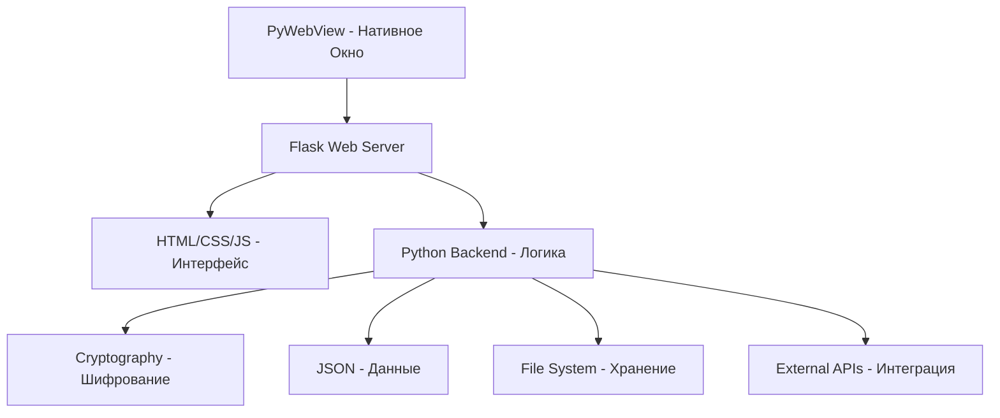

# VPN Server Manager: Учебное Пособие по Архитектуре и Принципам Разработки

## Введение

VPN Server Manager — это десктопное приложение для управления VPN-серверами, построенное на принципе гибридной архитектуры: веб-интерфейс (Flask) внутри нативного окна приложения (PyWebView). Это пособие покажет, как создавать современные кроссплатформенные приложения, используя веб-технологии для интерфейса и Python для бизнес-логики.

## Архитектурный Обзор

### Основная Концепция: Гибридное Приложение



**Принцип работы:**
1. **PyWebView** создает нативное окно приложения
2. **Flask** запускается в отдельном потоке как локальный веб-сервер
3. **HTML-интерфейс** загружается в окне PyWebView с адреса localhost
4. **Python-код** обрабатывает всю бизнес-логику и работу с данными
5. **Внешние API** обогащают функциональность приложения

### Ключевые Технологии и Библиотеки

| Библиотека | Назначение | Принципы использования |
|------------|------------|------------------------|
| **Flask** | Веб-сервер и роутинг | MVC-архитектура, RESTful API |
| **PyWebView** | Нативное GUI | Эмуляция браузера в десктопном окне |
| **Cryptography (Fernet)** | Шифрование данных | Симметричное шифрование AES-128 |
| **Threading** | Многопоточность | Разделение UI и бизнес-логики |
| **Jinja2** | Шаблонизация | Динамическое создание HTML |
| **Requests** | HTTP-клиент | API-запросы к внешним сервисам |
| **JSON** | Формат данных | Структурированное хранение |
| **Pathlib** | Работа с путями | Кроссплатформенная работа с файлами |

---

## Учебный План: От Простого к Сложному

### Урок 1: Основы Flask и Веб-Серверов

**Концепции:** 
- Что такое веб-сервер
- Роутинг в Flask
- Шаблоны HTML
- Статические файлы

**Исторический контекст:**
- Эволюция веб-технологий от 1989 года
- Появление Python веб-фреймворков
- Философия Flask: простота и гибкость

**Практика:**
- Создание базового Flask приложения
- Анализ главной страницы VPN Manager
- Понимание структуры URL роутов

**Файлы для изучения:**
- `app.py` (базовые роуты)
- `templates/layout.html`
- `static/css/style.css`

---

### Урок 2: Шаблонизация с Jinja2

**Концепции:**
- Движок шаблонов Jinja2
- Наследование шаблонов
- Переменные и фильтры
- Циклы и условия

**Исторический контекст:**
- Развитие систем шаблонизации
- От SSI до современных движков
- Принципы разделения логики и представления

**Практика:**
- Изучение базового шаблона `layout.html`
- Понимание наследования в `index.html`
- Использование фильтров для отображения данных

**Файлы для изучения:**
- `templates/layout.html` (базовый шаблон)
- `templates/index.html` (наследование)
- `templates/edit_server.html` (формы)

---

### Урок 3: Формы и Обработка Данных

**Концепции:**
- HTML формы и их обработка
- Валидация данных на клиенте и сервере
- Загрузка файлов
- AJAX запросы

**Исторический контекст:**
- Эволюция веб-форм от HTML 2.0
- Появление AJAX и интерактивности
- Современные подходы к валидации

**Практика:**
- Анализ формы добавления сервера
- Обработка загрузки файлов (иконки, чеки)
- JavaScript валидация и AJAX

**Файлы для изучения:**
- `templates/add_server.html`
- `templates/edit_server.html`
- JavaScript код в шаблонах

---

### Урок 4: Криптография и Безопасность

**Концепции:**
- Симметричное шифрование
- Библиотека Cryptography
- Управление ключами
- Целостность данных

**Исторический контекст:**
- История криптографии от древности до наших дней
- Развитие компьютерной криптографии
- Современные стандарты шифрования

**Практика:**
- Изучение функций шифрования/дешифрования
- Анализ структуры зашифрованных файлов
- Понимание генерации и хранения ключей

**Файлы для изучения:**
- `app.py` (функции encrypt/decrypt)
- `generate_key.py`
- `.env` (хранение ключа)
- `data/servers.json.enc`

---

### Урок 5: Многопоточность и Параллельная Обработка

**Концепции:**
- Threading в Python
- GIL и его ограничения
- Daemon потоки
- Синхронизация потоков

**Исторический контекст:**
- Эволюция многопоточности в вычислениях
- Особенности Python GIL
- Паттерны параллельного программирования

**Практика:**
- Анализ запуска Flask в отдельном потоке
- Понимание daemon потоков в PyWebView
- Безопасная передача данных между потоками

**Файлы для изучения:**
- `app.py` (main функция, threading)
- Логика shutdown и cleanup
- Обработка сигналов завершения

---

### Урок 6: Конфигурация и Управление Данными

**Концепции:**
- Конфигурационные файлы
- Управление путями
- Версионирование данных
- Кроссплатформенность

**Исторический контекст:**
- Эволюция систем конфигурации
- Принципы 12-Factor App
- Лучшие практики управления настройками

**Практика:**
- Изучение структуры `config.json`
- Понимание работы с путями файлов
- Анализ миграции и резервного копирования

**Файлы для изучения:**
- `config.json`
- `app.py` (загрузка конфигурации)
- Логика работы с путями данных

---

### Урок 7: PyWebView и Desktop Интеграция

**Концепции:**
- Hybrid desktop приложения
- PyWebView архитектура
- Нативные возможности ОС
- Упаковка приложения

**Исторический контекст:**
- Эволюция desktop приложений
- От нативных к веб-технологиям
- Сравнение с Electron и другими решениями

**Практика:**
- Анализ создания окна приложения
- Понимание взаимодействия с ОС
- Изучение процесса сборки для macOS

**Файлы для изучения:**
- `app.py` (функция main)
- `build_macos.py`
- `qt.conf`
- `VPNserverManage.spec`

---

### Урок 8: Интеграция с Внешними API и Продвинутые Функции

**Концепции:**
- HTTP-запросы к внешним сервисам
- Обработка таймаутов и ошибок
- JSON API и RESTful принципы
- Асинхронные операции
- Кэширование и производительность

**Исторический контекст:**
- Эволюция веб-API от XML-RPC до GraphQL
- Развитие REST архитектуры
- Современные паттерны интеграции

**Практика:**
- Изучение геолокации по IP (ipinfo.io)
- Анализ обработки ошибок сети
- Понимание конфигурируемых URL API
- Паттерны повторных попыток

**Файлы для изучения:**
- `app.py` (API интеграции)
- `config.json` (service_urls)
- Requests библиотека и обработка исключений

**Темы урока:**
```python
import requests
from requests.adapters import HTTPAdapter
from urllib3.util.retry import Retry

# Продвинутая работа с внешними API
def get_server_geolocation(ip_address):
    session = requests.Session()
    retry_strategy = Retry(
        total=3,
        backoff_factor=1,
        status_forcelist=[429, 500, 502, 503, 504]
    )
    adapter = HTTPAdapter(max_retries=retry_strategy)
    session.mount("http://", adapter)
    session.mount("https://", adapter)
    
    response = session.get(f"https://ipinfo.io/{ip_address}/json", timeout=5)
    return response.json()
```

---

### Заключительная Лекция: Полный Обзор и Будущее Развитие

**Концепции:**
- Архитектурный анализ всей системы
- Сильные и слабые стороны решения
- Альтернативные подходы и технологии
- Планы развития и улучшения

**Анализ архитектуры:**
- Паттерны проектирования в проекте
- Принципы SOLID и их применение
- Компромиссы и архитектурные решения

**Области для улучшения:**
- Производительность и масштабируемость
- Современные UI/UX паттерны
- Облачная интеграция и синхронизация
- Machine Learning возможности

**Практические рекомендации:**
- Как применить изученные принципы в других проектах
- Эволюционное развитие архитектуры
- Лучшие практики для гибридных приложений

**Будущее развитие:**
- Переход к микросервисной архитектуре
- Интеграция с современными фронтенд фреймворками
- Добавление аналитики и машинного обучения
- Расширение возможностей интеграции

---

## Структура Проекта

```
VPNserverManage/
├── app.py                  # Основное приложение Flask + PyWebView
├── config.json             # Конфигурация приложения
├── requirements.txt        # Зависимости Python
├── build_macos.py         # Скрипт сборки для macOS
├── qt.conf                # Конфигурация Qt
├── generate_key.py        # Генерация ключей шифрования
├── decrypt_tool.py        # Утилита расшифровки
│
├── data/
│   ├── servers.json.enc   # Зашифрованные данные серверов
│   └── hints.json         # Подсказки команд
│
├── templates/             # HTML шаблоны Jinja2
│   ├── layout.html        # Базовый шаблон
│   ├── index.html         # Главная страница
│   ├── add_server.html    # Добавление сервера
│   ├── edit_server.html   # Редактирование сервера
│   ├── settings.html      # Настройки
│   ├── about.html         # О программе
│   ├── help.html          # Справка
│   ├── cheatsheet.html    # Шпаргалка команд
│   └── manage_hints.html  # Управление подсказками
│
├── static/               # Статические ресурсы
│   ├── css/style.css     # Основные стили
│   ├── images/           # Изображения и иконки
│   └── favicon.ico       # Иконка приложения
│
├── uploads/              # Загруженные файлы
│   ├── *.png            # Иконки серверов
│   └── *                # Чеки об оплате
│
└── lessons/              # Учебные материалы
    ├── lesson-01-flask-basics.md
    ├── lesson-02-templating.md
    ├── lesson-03-forms-data.md
    ├── lesson-04-cryptography.md
    ├── lesson-05-multithreading.md
    ├── lesson-06-configuration.md
    ├── lesson-07-pywebview-gui.md
    ├── lesson-08-external-api-integration.md
    └── lesson-09-comprehensive-review-and-conclusions.md
```

## Технологический Стек

### Backend
- **Python 3.8+**: Основной язык программирования
- **Flask 2.x**: Легковесный веб-фреймворк
- **Cryptography**: Библиотека для шифрования (Fernet)
- **Requests**: HTTP-клиент для внешних API
- **Threading**: Многопоточность для неблокирующего UI

### Frontend
- **HTML5**: Семантическая разметка
- **CSS3**: Современные стили и responsive design
- **JavaScript**: Интерактивность и AJAX
- **Jinja2**: Серверная шаблонизация

### Desktop Integration
- **PyWebView**: Гибридный подход к desktop UI
- **WebKit/Chromium**: Рендеринг движок (зависит от ОС)

### Data & Security
- **JSON**: Формат хранения данных
- **AES-128**: Алгоритм шифрования
- **HMAC-SHA256**: Проверка целостности
- **PBKDF2**: Деривация ключей

### External Services
- **ipinfo.io**: Геолокация по IP
- **DNSLeakTest**: Проверка DNS утечек
- **BrowserLeaks**: Проверка IP утечек

## Принципы Архитектуры

### 1. Разделение Ответственности
- **Presentation Layer**: HTML/CSS/JS шаблоны
- **Application Layer**: Flask роуты и контроллеры
- **Business Logic**: Python функции обработки данных
- **Data Layer**: Зашифрованное JSON хранилище

### 2. Безопасность по Умолчанию
- Все чувствительные данные зашифрованы
- Ключи отделены от данных
- Валидация пользовательского ввода
- Безопасная работа с файлами

### 3. Модульность и Расширяемость
- Независимые компоненты
- Конфигурируемые интеграции
- Плагинная архитектура (потенциал)
- Четкие API границы

### 4. Кроссплатформенность
- Единая кодовая база для всех ОС
- Адаптивный UI для разных размеров экрана
- Платформо-специфичные оптимизации

## Заключение

VPN Server Manager демонстрирует современный подход к созданию десктопных приложений:

1. **Гибридная архитектура** позволяет использовать веб-технологии для UI
2. **Python backend** обеспечивает мощную бизнес-логику
3. **Многопоточность** гарантирует отзывчивый интерфейс
4. **Криптография** защищает пользовательские данные
5. **Модульность** упрощает развитие и сопровождение
6. **API интеграция** обогащает функциональность
7. **Безопасность** встроена в каждый аспект архитектуры

Этот проект можно использовать как основу для изучения современных подходов к разработке десктопных приложений, демонстрирующую интеграцию множества технологий в единое решение.

### Рекомендуемый Порядок Изучения

1. **Начните с Flask** — поймите основы веб-разработки (Урок 1)
2. **Изучите шаблоны** — научитесь создавать динамический UI (Урок 2)
3. **Добавьте формы** — реализуйте взаимодействие с пользователем (Урок 3)
4. **Внедрите безопасность** — защитите данные шифрованием (Урок 4)
5. **Освойте многопоточность** — разделите UI и логику (Урок 5)
6. **Настройте конфигурацию** — сделайте приложение гибким (Урок 6)
7. **Создайте нативный GUI** — упакуйте в десктопное приложение (Урок 7)
8. **Интегрируйте API** — добавьте внешние сервисы (Урок 8)
9. **Проанализируйте архитектуру** — поймите принципы и планы развития (Урок 9)

Каждый урок строится на предыдущем, постепенно усложняя архитектуру и добавляя новые возможности. Завершающий урок дает полное понимание системы и пути её дальнейшего развития.

### Дополнительные Ресурсы

Для углубленного изучения рекомендуется:
- Официальная документация Flask
- Руководство по Cryptography библиотеке
- Документация PyWebView
- Лучшие практики безопасности в Python
- Паттерны проектирования для веб-приложений

**Желаем успехов в изучении современной разработки!**
