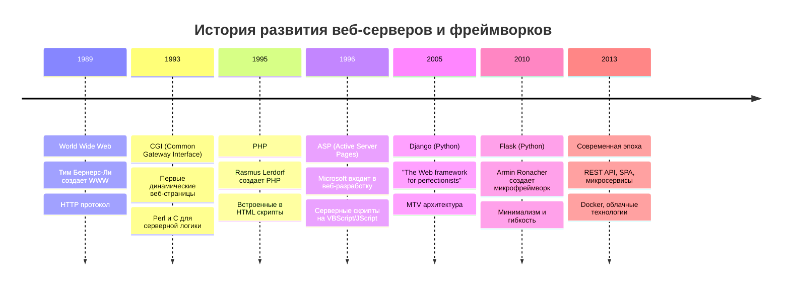
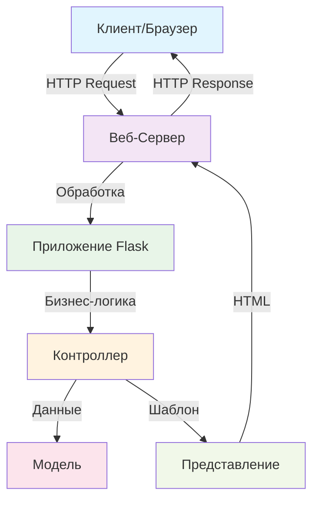
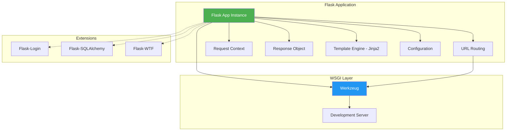
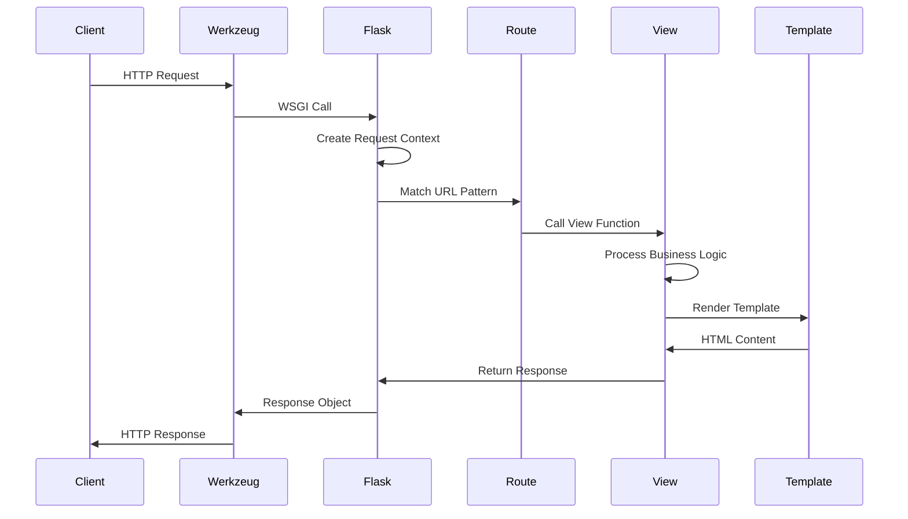
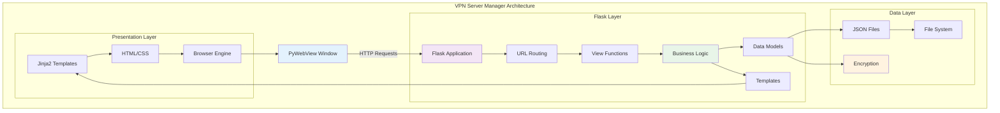

# Урок 1: Основы Flask и Веб-Серверов

## 🎯 Цели урока

К концу этого урока вы будете понимать:
- Что такое веб-сервер и как он работает
- Историю развития веб-фреймворков
- Архитектуру Flask и принципы работы
- Основы роутинга и обработки HTTP-запросов
- Как создать простое веб-приложение

## 📚 Историческая справка

### Эволюция веб-технологий



### История Flask

**Flask** был создан в 2010 году **Армином Ронахером** (Armin Ronacher) как "микрофреймворк" для Python. Основные принципы:

1. **Минимализм** — только необходимые компоненты
2. **Гибкость** — разработчик выбирает инструменты
3. **Простота** — легкий старт для новичков
4. **Расширяемость** — богатая экосистема расширений

**Философия Flask**: "Делать простые вещи легкими, а сложные — возможными"

## 🏗️ Архитектура веб-серверов

### Общая схема работы веб-сервера



### Протокол HTTP

**HTTP (HyperText Transfer Protocol)** — основа веб-коммуникации:

```
GET /servers HTTP/1.1
Host: localhost:5050
User-Agent: Mozilla/5.0...
Accept: text/html

HTTP/1.1 200 OK
Content-Type: text/html
Content-Length: 1234

<html>...</html>
```

**Основные методы HTTP:**
- `GET` — получение данных
- `POST` — отправка данных
- `PUT` — обновление данных
- `DELETE` — удаление данных

## 🔧 Архитектура Flask

### Компоненты Flask



### Жизненный цикл запроса в Flask



## 💻 Практические примеры

### Простейшее Flask-приложение

```python
from flask import Flask

# Создание экземпляра приложения
app = Flask(__name__)

# Определение маршрута
@app.route('/')
def hello_world():
    return '<h1>Hello, World!</h1>'

# Запуск приложения
if __name__ == '__main__':
    app.run(debug=True)
```

**Объяснение кода:**
1. `Flask(__name__)` — создает экземпляр приложения
2. `@app.route('/')` — декоратор для определения URL-маршрута
3. `app.run(debug=True)` — запускает сервер разработки

### Роутинг в Flask

```python
from flask import Flask

app = Flask(__name__)

# Статический маршрут
@app.route('/')
def index():
    return 'Главная страница'

# Маршрут с параметром
@app.route('/user/<username>')
def user_profile(username):
    return f'Профиль пользователя: {username}'

# Маршрут с типизированным параметром
@app.route('/post/<int:post_id>')
def show_post(post_id):
    return f'Пост № {post_id}'

# Маршрут с несколькими HTTP методами
@app.route('/login', methods=['GET', 'POST'])
def login():
    if request.method == 'POST':
        return 'Обработка логина'
    return 'Форма логина'
```

### Работа с шаблонами

```python
from flask import Flask, render_template

app = Flask(__name__)

@app.route('/servers')
def show_servers():
    servers = [
        {'name': 'Server 1', 'ip': '192.168.1.10'},
        {'name': 'Server 2', 'ip': '192.168.1.11'},
    ]
    return render_template('servers.html', servers=servers)
```

**Шаблон `templates/servers.html`:**
```html
<!DOCTYPE html>
<html>
<head>
    <title>Список серверов</title>
</head>
<body>
    <h1>Мои серверы</h1>
    <ul>
    
        <li>{{ server.name }} - {{ server.ip }}</li>
    
    </ul>
</body>
</html>
```

## 🔍 Анализ кода проекта VPN Server Manager

### Инициализация приложения

```python
# app.py, строки 1-20
import json
import os
from flask import Flask, render_template, request
from dotenv import load_dotenv

load_dotenv()
app = Flask(__name__)
```

**Ключевые моменты:**
- Загрузка переменных окружения через `python-dotenv`
- Создание экземпляра Flask-приложения
- Импорт необходимых модулей

### Конфигурация приложения

```python
# app.py, строки 150-170
app.config['SECRET_KEY'] = os.getenv("FLASK_SECRET_KEY", "default-key")
app.config['UPLOAD_FOLDER'] = os.path.join(APP_DATA_DIR, 'uploads')
app.config['ALLOWED_EXTENSIONS'] = {'txt', 'pdf', 'png', 'jpg', 'jpeg', 'enc'}
```

**Принципы конфигурации:**
- Использование переменных окружения для секретов
- Настройка путей для загрузки файлов
- Определение разрешенных типов файлов

### Основные маршруты

```python
@app.route('/')
def index():
    """Главная страница со списком серверов."""
    servers = load_servers()
    return render_template('index.html', servers=servers)

@app.route('/add_server', methods=['GET', 'POST'])
def add_server():
    """Добавление нового сервера."""
    if request.method == 'POST':
        # Обработка данных формы
        server_data = {
            'name': request.form.get('name'),
            'ip': request.form.get('ip'),
            'password': encrypt_data(request.form.get('password'))
        }
        # Сохранение и редирект
        servers = load_servers()
        servers.append(server_data)
        save_servers(servers)
        return redirect(url_for('index'))
    
    return render_template('add_server.html')
```

## 🚀 Практические упражнения

### Упражнение 1: Создание базового приложения

Создайте Flask-приложение с:
1. Главной страницей
2. Страницей "О нас"
3. Страницей контактов
4. Навигационным меню

### Упражнение 2: Динамические маршруты

Добавьте маршруты:
1. `/user/<username>` — профиль пользователя
2. `/category/<int:cat_id>` — категория товаров
3. `/search?q=<query>` — поиск

### Упражнение 3: Работа с шаблонами

Создайте:
1. Базовый шаблон `base.html`
2. Шаблон списка элементов
3. Шаблон детальной страницы

## 📊 Диаграмма архитектуры Flask в проекте



## 🔧 Инструменты разработки

### Отладка Flask-приложений

```python
# Режим отладки
app.run(debug=True, host='127.0.0.1', port=5050)

# Логирование
import logging
app.logger.setLevel(logging.DEBUG)

# Профилирование
from werkzeug.middleware.profiler import ProfilerMiddleware
app.wsgi_app = ProfilerMiddleware(app.wsgi_app)
```

### Тестирование Flask-приложений

```python
import unittest
from app import app

class FlaskTestCase(unittest.TestCase):
    def setUp(self):
        self.app = app.test_client()
        
    def test_index_page(self):
        response = self.app.get('/')
        self.assertEqual(response.status_code, 200)
        
    def test_add_server_post(self):
        response = self.app.post('/add_server', data={
            'name': 'Test Server',
            'ip': '192.168.1.1'
        })
        self.assertEqual(response.status_code, 302)  # Redirect
```

## 🌟 Лучшие практики

### 1. Структура проекта
```
my_flask_app/
├── app.py              # Основное приложение
├── config.py           # Конфигурация
├── requirements.txt    # Зависимости
├── templates/          # HTML шаблоны
├── static/            # CSS, JS, изображения
└── tests/             # Тесты
```

### 2. Безопасность
- Всегда используйте `SECRET_KEY`
- Валидируйте входные данные
- Используйте HTTPS в продакшене
- Настройте CORS для API

### 3. Производительность
- Используйте кэширование
- Оптимизируйте запросы к базе данных
- Сжимайте статические файлы
- Настройте production WSGI сервер

## 📚 Дополнительные материалы

### Полезные ссылки
- [Официальная документация Flask](https://flask.palletsprojects.com/)
- [Flask Mega-Tutorial](https://blog.miguelgrinberg.com/post/the-flask-mega-tutorial-part-i-hello-world)
- [Werkzeug documentation](https://werkzeug.palletsprojects.com/)

### Рекомендуемые расширения Flask
- **Flask-SQLAlchemy** — ORM для работы с базами данных
- **Flask-Login** — управление сессиями пользователей
- **Flask-WTF** — работа с формами и CSRF защита
- **Flask-Mail** — отправка email
- **Flask-Migrate** — миграции базы данных

## 🎯 Контрольные вопросы

1. Что такое WSGI и как Flask его использует?
2. В чем разница между Flask и Django?
3. Как работает система маршрутизации Flask?
4. Что такое контекст запроса в Flask?
5. Как правильно структурировать большое Flask-приложение?

## 🚀 Следующий урок

В следующем уроке мы изучим **систему шаблонов Jinja2**, научимся создавать динамические HTML-страницы и реализуем полноценный пользовательский интерфейс для нашего приложения.

---

*Этот урок является частью курса "VPN Server Manager: Архитектура и принципы разработки"*
