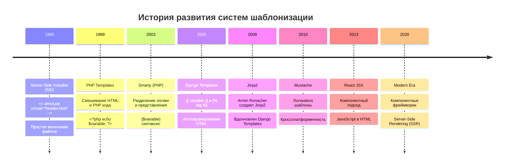
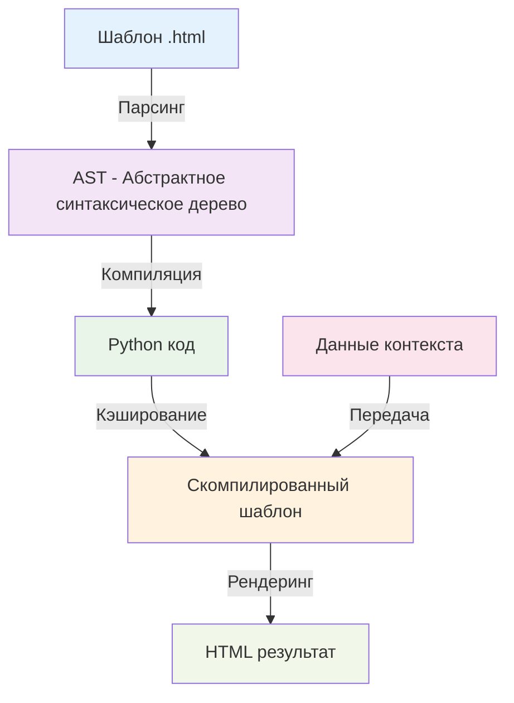
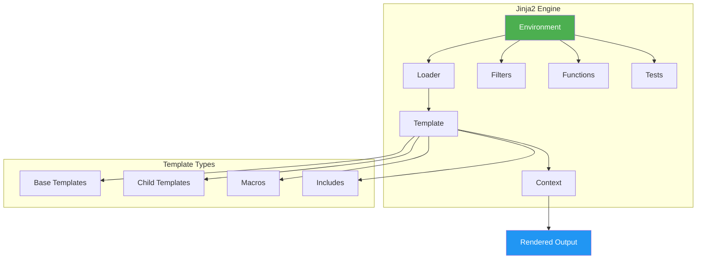
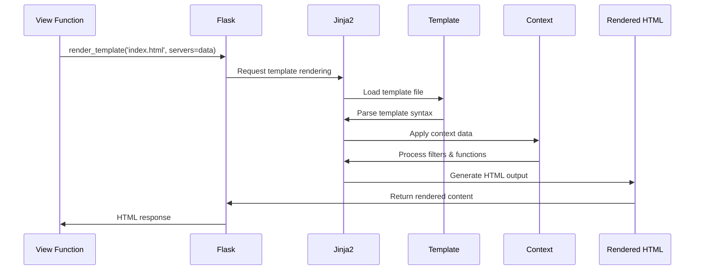

# Урок 2: Шаблонизация и Динамический Контент

## 🎯 Цели урока

К концу этого урока вы будете понимать:
- Историю развития шаблонизации в веб-разработке
- Принципы работы Jinja2
- Синтаксис шаблонов и фильтры
- Наследование шаблонов и компоненты
- Контекстные процессоры и глобальные переменные

## 📚 Историческая справка

### Эволюция шаблонизации



### История Jinja2

**Jinja2** был создан **Армином Ронахером** в 2008 году как улучшенная версия оригинального Jinja. Основные принципы:

1. **Безопасность** — автоматическое экранирование HTML
2. **Производительность** — компиляция в Python-код
3. **Гибкость** — богатая система фильтров и функций
4. **Читаемость** — понятный синтаксис

**Философия Jinja2**: "Мощность Python с безопасностью шаблонов"

## 🏗️ Архитектура шаблонизации

### Принцип работы системы шаблонов



### Компоненты Jinja2



## 💻 Синтаксис Jinja2

### Базовые конструкции

```html
<!-- Переменные -->
{{ variable_name }}
{{ user.name }}
{{ items[0] }}

<!-- Теги управления -->

    <p>Условие истинно</p>

    <p>Другое условие</p>

    <p>Все условия ложны</p>


<!-- Циклы -->

    <li>{{ item.name }}</li>


<!-- Комментарии -->
{# Это комментарий, не попадет в HTML #}
```

### Фильтры в Jinja2

```html
<!-- Встроенные фильтры -->
{{ name|upper }}                    <!-- JOHN -->
{{ price|round(2) }}               <!-- 19.99 -->
{{ content|safe }}                 <!-- Без экранирования HTML -->
{{ items|length }}                 <!-- Количество элементов -->
{{ date|strftime('%Y-%m-%d') }}    <!-- Форматирование даты -->

<!-- Цепочки фильтров -->
{{ text|lower|replace(' ', '_')|title }}
```

### Наследование шаблонов

**Базовый шаблон (`base.html`):**
```html
<!DOCTYPE html>
<html lang="ru">
<head>
    <meta charset="UTF-8">
    <title>VPN Server Manager</title>
    <link rel="stylesheet" href="{{ url_for('static', filename='css/style.css') }}">
    
</head>
<body>
    <header>
        <nav>
            
            <ul>
                <li><a href="{{ url_for('index') }}">Главная</a></li>
                <li><a href="{{ url_for('add_server') }}">Добавить</a></li>
            </ul>
            
        </nav>
    </header>
    
    <main>
        
    </main>
    
    <footer>
        
        <p>&copy; 2024 VPN Server Manager</p>
        
    </footer>
    
    
</body>
</html>
```

**Дочерний шаблон (`servers.html`):**
```html


Список серверов - {{ super() }}


<h1>Мои VPN серверы</h1>


    <div class="servers-grid">
    
        <div class="server-card">
            <h3>{{ server.name }}</h3>
            <p>IP: {{ server.ip }}</p>
            <p>Статус: 
                
                    <span class="status-active">Активен</span>
                
                    <span class="status-inactive">Неактивен</span>
                
            </p>
        </div>
    
    </div>

    <p class="no-servers">Серверы не найдены.</p>




<script>
    console.log('Загружено серверов: {{ servers|length }}');
</script>

```

## 🔧 Продвинутые возможности

### Макросы в Jinja2

```html
<!-- Определение макроса -->

<div class="server-card" data-id="{{ server.id }}">
    <div class="server-header">
        <h3>{{ server.name }}</h3>
        
            
        
    </div>
    
    <div class="server-info">
        <p><strong>IP:</strong> {{ server.ip }}</p>
        <p><strong>Провайдер:</strong> {{ server.provider or 'Неизвестно' }}</p>
        
        
            <p><strong>Последняя проверка:</strong> 
               {{ server.last_check|format_datetime }}</p>
        
    </div>
    
    <div class="server-actions">
        <a href="{{ url_for('edit_server', server_id=server.id) }}" 
           class="btn btn-primary">Редактировать</a>
        <button class="btn btn-danger" 
                onclick="deleteServer({{ server.id }})">Удалить</button>
    </div>
</div>


<!-- Использование макроса -->

    {{ render_server_card(server) }}

```

### Включения (Includes)

```html
<!-- _server_card.html -->
<div class="server-card">
    <h3>{{ server.name }}</h3>
    <p>{{ server.ip }}</p>
</div>

<!-- main.html -->

    

```

### Условные выражения

```html
<!-- Тернарный оператор -->
<span class="status {{ 'online' if server.online else 'offline' }}">
    {{ 'Онлайн' if server.online else 'Офлайн' }}
</span>

<!-- Сложные условия -->

    <span class="cloud-provider">☁️ Облачный</span>

    <span class="local-server">🏠 Локальный</span>

    <span class="dedicated-server">🖥️ Выделенный</span>

```

## 🎨 Кастомные фильтры

### Создание собственных фильтров

```python
# app.py
from datetime import datetime
import re

def format_datetime_filter(iso_str):
    """Форматирует ISO строку в читаемый формат."""
    if not iso_str:
        return "N/A"
    try:
        dt = datetime.fromisoformat(iso_str)
        return dt.strftime('%d.%m.%Y %H:%M')
    except (ValueError, TypeError):
        return iso_str

def mask_sensitive_filter(text, chars_to_show=4):
    """Маскирует чувствительную информацию."""
    if not text or len(text) <= chars_to_show:
        return text
    return text[:chars_to_show] + '*' * (len(text) - chars_to_show)

def file_size_filter(bytes_count):
    """Конвертирует байты в читаемый формат."""
    if bytes_count == 0:
        return "0 B"
    
    units = ['B', 'KB', 'MB', 'GB', 'TB']
    i = 0
    
    while bytes_count >= 1024 and i < len(units) - 1:
        bytes_count /= 1024.0
        i += 1
    
    return f"{bytes_count:.1f} {units[i]}"

# Регистрация фильтров
app.jinja_env.filters['format_datetime'] = format_datetime_filter
app.jinja_env.filters['mask_sensitive'] = mask_sensitive_filter
app.jinja_env.filters['file_size'] = file_size_filter
```

### Использование кастомных фильтров

```html
<!-- В шаблонах -->
<p>Создан: {{ server.created_at|format_datetime }}</p>
<p>Пароль: {{ server.password|mask_sensitive(3) }}</p>
<p>Размер лога: {{ log_file_size|file_size }}</p>
```

## 🌍 Контекстные процессоры

### Глобальные переменные в шаблонах

```python
# app.py
@app.context_processor
def inject_app_info():
    """Добавляет информацию о приложении во все шаблоны."""
    return {
        'app_info': app.config.get('app_info', {}),
        'current_year': datetime.now().year,
        'version': app.config.get('version', 'Unknown')
    }

@app.context_processor
def inject_service_urls():
    """Добавляет URL сервисов во все шаблоны."""
    return {
        'service_urls': app.config.get('service_urls', {}),
        'active_data_file': app.config.get('active_data_file')
    }

@app.context_processor
def inject_navigation():
    """Добавляет навигационное меню."""
    navigation_items = [
        {'url': url_for('index'), 'title': 'Серверы', 'icon': '🖥️'},
        {'url': url_for('add_server'), 'title': 'Добавить', 'icon': '➕'},
        {'url': url_for('settings'), 'title': 'Настройки', 'icon': '⚙️'},
        {'url': url_for('help'), 'title': 'Справка', 'icon': '❓'},
    ]
    return {'navigation_items': navigation_items}
```

## 📊 Анализ шаблонов в проекте

### Базовый шаблон (`layout.html`)

```html
<!-- layout.html - основа всех страниц -->
<!DOCTYPE html>
<html lang="ru">
<head>
    <meta charset="UTF-8">
    <meta name="viewport" content="width=device-width, initial-scale=1.0">
    <title>VPN Server Manager</title>
    
    <!-- Динамические мета-теги -->
    
    
    <!-- CSS -->
    <link rel="stylesheet" href="{{ url_for('static', filename='css/style.css') }}">
    
</head>
<body data-theme="{{ request.cookies.get('theme', 'light') }}">
    <!-- Навигация -->
    <nav class="navbar">
        <div class="nav-brand">
            <h1>🔐 VPN Manager</h1>
            <span class="version">v{{ app_info.version }}</span>
        </div>
        
        <ul class="nav-menu">
            
            <li class="nav-item">
                <a href="{{ item.url }}" 
                   class="nav-link {{ 'active' if request.endpoint == item.endpoint }}">
                    {{ item.icon }} {{ item.title }}
                </a>
            </li>
            
        </ul>
        
        <!-- Масштабирование UI -->
        <div class="ui-scale-control">
            <select onchange="changeUIScale(this.value)">
                <option value="80">80%</option>
                <option value="90">90%</option>
                <option value="100" selected>100%</option>
            </select>
        </div>
    </nav>
    
    <!-- Основной контент -->
    <main class="main-content">
        <!-- Flash сообщения -->
        
            
                <div class="flash-messages">
                
                    <div class="alert alert-{{ category }}">{{ message }}</div>
                
                </div>
            
        
        
        
    </main>
    
    <!-- Футер -->
    <footer class="footer">
        <p>&copy; {{ current_year }} {{ app_info.developer or 'VPN Server Manager' }}</p>
        
            <p>Обновлено: {{ app_info.last_updated|format_datetime }}</p>
        
    </footer>
    
    <!-- JavaScript -->
    <script src="{{ url_for('static', filename='js/main.js') }}"></script>
    
</body>
</html>
```

### Шаблон списка серверов (`index.html`)

```html


Список серверов


<div class="servers-container">
    <div class="servers-header">
        <h2>Мои VPN серверы ({{ servers|length }})</h2>
        <a href="{{ url_for('add_server') }}" class="btn btn-primary">
            ➕ Добавить сервер
        </a>
    </div>
    
    
        <div class="servers-grid">
        
            <div class="server-card" data-server-id="{{ server.id }}">
                <!-- Иконка сервера -->
                <div class="server-icon">
                    
                        
                    
                        <div class="default-icon">🖥️</div>
                    
                </div>
                
                <!-- Информация о сервере -->
                <div class="server-info">
                    <h3>{{ server.name }}</h3>
                    <p class="server-ip">{{ server.ip }}</p>
                    
                    
                        <p class="server-provider">{{ server.provider }}</p>
                    
                    
                    <!-- Статус подключения -->
                    <div class="server-status" id="status-{{ server.id }}">
                        <span class="status-indicator">⏳</span>
                        <span class="status-text">Проверка...</span>
                    </div>
                </div>
                
                <!-- Действия -->
                <div class="server-actions">
                    <a href="{{ url_for('edit_server', server_id=server.id) }}" 
                       class="btn btn-sm btn-outline">Редактировать</a>
                    <button class="btn btn-sm btn-danger" 
                            onclick="deleteServer('{{ server.id }}')">Удалить</button>
                </div>
            </div>
        
        </div>
    
        <div class="empty-state">
            <div class="empty-icon">📡</div>
            <h3>Серверы не найдены</h3>
            <p>Добавьте свой первый VPN сервер</p>
            <a href="{{ url_for('add_server') }}" class="btn btn-primary">
                Добавить сервер
            </a>
        </div>
    
</div>



<script>
// Проверка статуса серверов
document.addEventListener('DOMContentLoaded', function() {
    
        checkServerStatus('{{ server.ip }}', '{{ server.id }}');
    
});

function checkServerStatus(ip, serverId) {
    fetch(`/check_ip/${ip}`)
        .then(response => response.json())
        .then(data => {
            const statusElement = document.getElementById(`status-${serverId}`);
            const indicator = statusElement.querySelector('.status-indicator');
            const text = statusElement.querySelector('.status-text');
            
            if (data.error) {
                indicator.textContent = '❌';
                text.textContent = 'Недоступен';
                statusElement.className = 'server-status status-error';
            } else {
                indicator.textContent = '✅';
                text.textContent = 'Доступен';
                statusElement.className = 'server-status status-success';
                
                // Анализ хостинга
                const hostingQuality = analyzeHosting(data);
                statusElement.insertAdjacentHTML('beforeend', 
                    `<span class="hosting-quality ${hostingQuality.class}">
                        ${hostingQuality.text}
                     </span>`);
            }
        })
        .catch(error => {
            console.error('Ошибка проверки сервера:', error);
        });
}
</script>

```

## 🚀 Практические упражнения

### Упражнение 1: Базовые шаблоны

Создайте систему шаблонов:
1. Базовый шаблон с навигацией
2. Шаблон главной страницы
3. Шаблон страницы "О нас"

### Упражнение 2: Кастомные фильтры

Создайте фильтры:
1. `truncate_words(n)` — обрезание по словам
2. `plural(count, forms)` — склонение по числам
3. `highlight(query)` — подсветка текста

### Упражнение 3: Макросы

Создайте макросы:
1. Карточка товара
2. Форма с валидацией
3. Пагинация

## 📊 Диаграмма потока рендеринга



## 🔒 Безопасность в шаблонах

### Автоэкранирование HTML

```html
<!-- Безопасное отображение пользовательского контента -->
<p>{{ user_input }}</p>  <!-- Автоматически экранируется -->

<!-- Отключение экранирования (опасно!) -->
<p>{{ trusted_html|safe }}</p>

<!-- Принудительное экранирование -->
<p>{{ potentially_safe_content|e }}</p>
```

### Защита от XSS

```html
<!-- ❌ Опасно -->
<script>var userName = "{{ user.name }}";</script>

<!-- ✅ Безопасно -->
<script>var userName = {{ user.name|tojson }};</script>

<!-- ✅ Еще лучше -->
<div data-user-name="{{ user.name }}"></div>
<script>
const userName = document.querySelector('[data-user-name]').dataset.userName;
</script>
```

## 🌟 Лучшие практики

### 1. Структура шаблонов
```
templates/
├── base.html              # Базовый шаблон
├── layout/
│   ├── navbar.html        # Навигация
│   └── footer.html        # Футер
├── components/
│   ├── server_card.html   # Компонент карточки
│   └── form_field.html    # Компонент поля формы
├── pages/
│   ├── index.html         # Страницы
│   └── about.html
└── emails/                # Email шаблоны
    └── welcome.html
```

### 2. Именование переменных
```html
<!-- ✅ Хорошо -->
{{ server.name }}
{{ user.email }}
{{ config.database_url }}

<!-- ❌ Плохо -->
{{ s.n }}
{{ data[0] }}
{{ cfg['db'] }}
```

### 3. Комментирование
```html
{# Карточка сервера - компонент для отображения информации о VPN сервере #}

    {# Проверяем доступность основной информации #}
    
        <div class="server-card">
            {# ... содержимое карточки ... #}
        </div>
    

```

## 📚 Дополнительные материалы

### Полезные ссылки
- [Документация Jinja2](https://jinja.palletsprojects.com/)
- [Flask Templates Guide](https://flask.palletsprojects.com/en/2.3.x/templating/)
- [Jinja2 Extensions](https://github.com/pallets/jinja/tree/main/src/jinja2/ext)

### Расширения Jinja2
- **jinja2-time** — работа с датами и временем
- **jinja2-humanize** — человекочитаемые форматы
- **jinja2-markdown** — рендеринг Markdown

## 🎯 Контрольные вопросы

1. Как работает наследование шаблонов в Jinja2?
2. В чем разница между `` и ``?
3. Когда использовать макросы вместо включений?
4. Как создать кастомный фильтр для форматирования?
5. Что такое контекстные процессоры и зачем они нужны?

## 🚀 Следующий урок

В следующем уроке мы изучим **работу с формами и обработку данных**, научимся валидировать пользовательский ввод и реализуем безопасную загрузку файлов.

---

*Этот урок является частью курса "VPN Server Manager: Архитектура и принципы разработки"*
