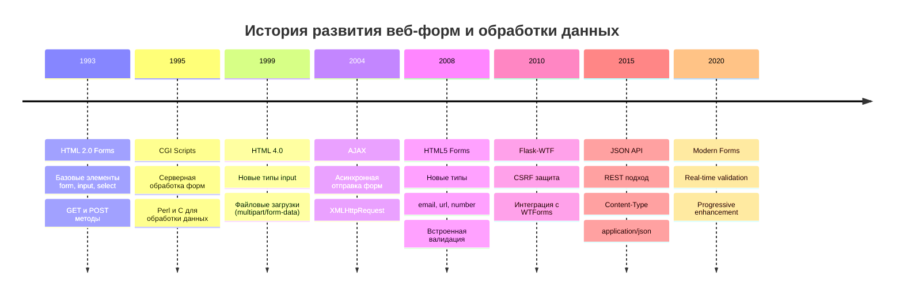
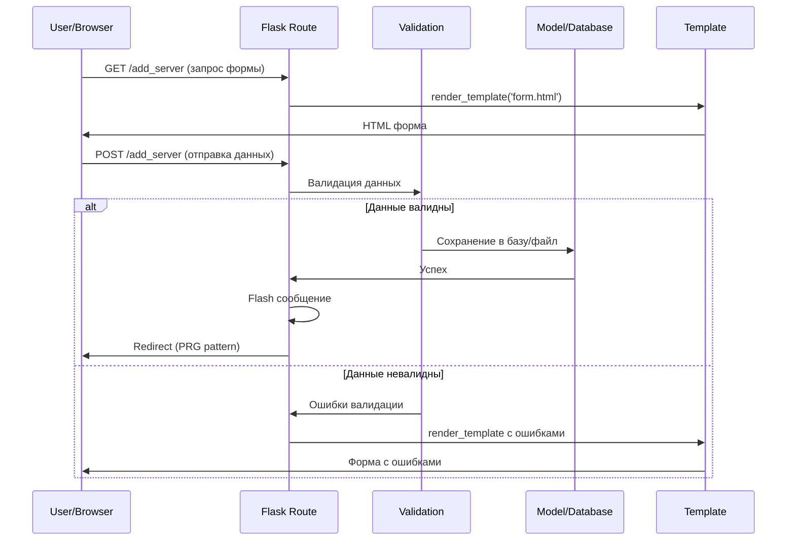
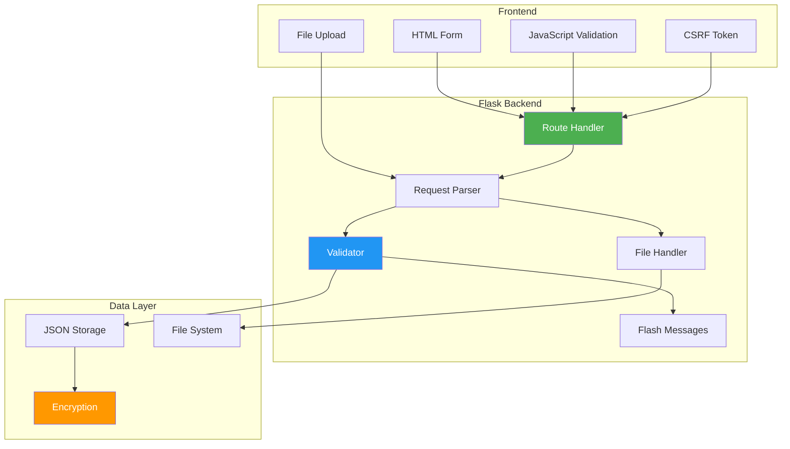
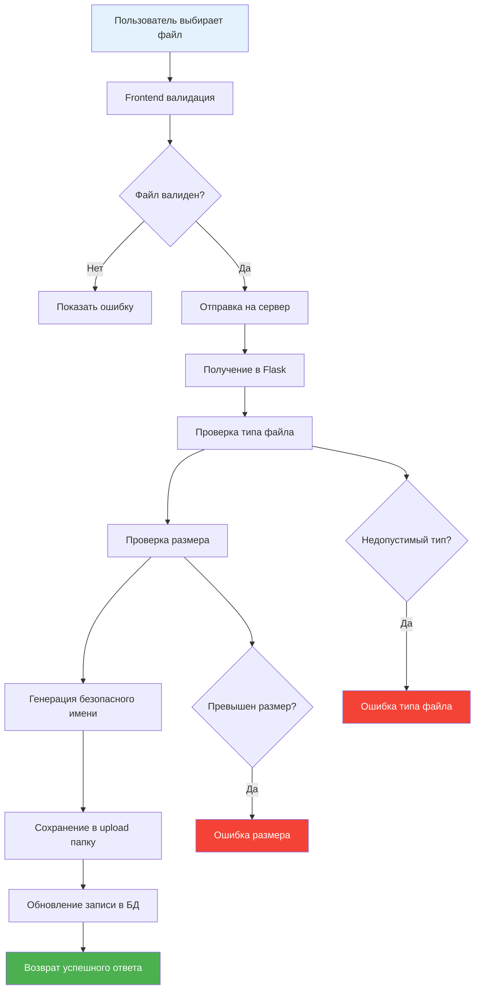

# Урок 3: Формы и Обработка Данных

## 🎯 Цели урока

К концу этого урока вы будете понимать:
- Историю развития веб-форм и обработки данных
- Принципы работы с HTML-формами в Flask
- Валидацию данных на стороне сервера
- Безопасную загрузку файлов
- Flash-сообщения и обратную связь с пользователем

## 📚 Историческая справка

### Эволюция веб-форм



### История обработки форм в Python

**Развитие библиотек:**
1. **cgi** (1990s) — стандартная библиотека Python для CGI
2. **FieldStorage** (2000s) — парсинг multipart данных
3. **WTForms** (2008) — мощная библиотека валидации форм
4. **Flask-WTF** (2010) — интеграция WTForms с Flask

**Принципы безопасности:**
- **CSRF защита** — предотвращение межсайтовых атак
- **Валидация данных** — проверка на стороне сервера
- **Санитизация** — очистка пользовательского ввода

## 🏗️ Архитектура обработки форм

### Жизненный цикл формы



### Компоненты системы форм



## 💻 HTML-формы в Flask

### Базовая форма добавления сервера

```html
<!-- add_server.html -->


Добавить сервер


<div class="form-container">
    <h2>➕ Добавить VPN сервер</h2>
    
    <form method="POST" enctype="multipart/form-data" class="server-form">
        <!-- CSRF Token (если используется Flask-WTF) -->
        <!-- {{ csrf_token() }} -->
        
        <!-- Основная информация -->
        <div class="form-section">
            <h3>Основная информация</h3>
            
            <div class="form-group">
                <label for="name" class="required">Название сервера:</label>
                <input type="text" 
                       id="name" 
                       name="name" 
                       value="{{ request.form.get('name', '') }}"
                       required 
                       maxlength="100"
                       placeholder="Например: US-VPN-01">
                <small class="form-help">Уникальное имя для идентификации сервера</small>
            </div>
            
            <div class="form-group">
                <label for="ip" class="required">IP адрес:</label>
                <input type="text" 
                       id="ip" 
                       name="ip" 
                       value="{{ request.form.get('ip', '') }}"
                       pattern="^(?:[0-9]{1,3}\.){3}[0-9]{1,3}$"
                       required 
                       placeholder="192.168.1.100">
                <small class="form-help">IPv4 адрес вашего VPN сервера</small>
            </div>
            
            <div class="form-group">
                <label for="provider">Провайдер:</label>
                <select id="provider" name="provider">
                    <option value="">Выберите провайдера</option>
                    <option value="digitalocean" 
                            {{ 'selected' if request.form.get('provider') == 'digitalocean' }}>
                        DigitalOcean
                    </option>
                    <option value="hetzner" 
                            {{ 'selected' if request.form.get('provider') == 'hetzner' }}>
                        Hetzner
                    </option>
                    <option value="aws" 
                            {{ 'selected' if request.form.get('provider') == 'aws' }}>
                        Amazon AWS
                    </option>
                    <option value="custom" 
                            {{ 'selected' if request.form.get('provider') == 'custom' }}>
                        Другой
                    </option>
                </select>
            </div>
        </div>
        
        <!-- Доступы -->
        <div class="form-section">
            <h3>Доступы</h3>
            
            <div class="form-group">
                <label for="username">Имя пользователя:</label>
                <input type="text" 
                       id="username" 
                       name="username" 
                       value="{{ request.form.get('username', 'root') }}"
                       autocomplete="username">
            </div>
            
            <div class="form-group">
                <label for="password">Пароль:</label>
                <div class="password-input">
                    <input type="password" 
                           id="password" 
                           name="password" 
                           autocomplete="new-password">
                    <button type="button" class="btn-toggle-password" 
                            onclick="togglePassword('password')">👁️</button>
                </div>
                <small class="form-help">Пароль будет зашифрован при сохранении</small>
            </div>
            
            <div class="form-group">
                <label for="panel_url">URL панели управления:</label>
                <input type="url" 
                       id="panel_url" 
                       name="panel_url" 
                       value="{{ request.form.get('panel_url', '') }}"
                       placeholder="https://panel.example.com">
            </div>
        </div>
        
        <!-- Файлы -->
        <div class="form-section">
            <h3>Файлы</h3>
            
            <div class="form-group">
                <label for="icon">Иконка сервера:</label>
                <input type="file" 
                       id="icon" 
                       name="icon" 
                       accept="image/png,image/jpeg,image/gif"
                       onchange="previewImage(this, 'icon-preview')">
                <div id="icon-preview" class="image-preview"></div>
                <small class="form-help">PNG, JPEG или GIF, максимум 2MB</small>
            </div>
            
            <div class="form-group">
                <label for="receipt">Чек об оплате:</label>
                <input type="file" 
                       id="receipt" 
                       name="receipt" 
                       accept=".pdf,.png,.jpg,.jpeg">
                <small class="form-help">PDF или изображение чека</small>
            </div>
        </div>
        
        <!-- Дополнительно -->
        <div class="form-section">
            <h3>Дополнительная информация</h3>
            
            <div class="form-group">
                <label for="notes">Заметки:</label>
                <textarea id="notes" 
                          name="notes" 
                          rows="4" 
                          placeholder="Дополнительная информация о сервере...">{{ request.form.get('notes', '') }}</textarea>
            </div>
            
            <div class="form-group">
                <label class="checkbox-label">
                    <input type="checkbox" 
                           name="auto_connect" 
                           value="1"
                           {{ 'checked' if request.form.get('auto_connect') }}>
                    Автоматически подключаться при запуске
                </label>
            </div>
        </div>
        
        <!-- Кнопки -->
        <div class="form-actions">
            <button type="submit" class="btn btn-primary">
                💾 Сохранить сервер
            </button>
            <a href="{{ url_for('index') }}" class="btn btn-secondary">
                ❌ Отмена
            </a>
        </div>
    </form>
</div>



<script>
function togglePassword(inputId) {
    const input = document.getElementById(inputId);
    const button = input.nextElementSibling;
    
    if (input.type === 'password') {
        input.type = 'text';
        button.textContent = '🙈';
    } else {
        input.type = 'password';
        button.textContent = '👁️';
    }
}

function previewImage(input, previewId) {
    const preview = document.getElementById(previewId);
    
    if (input.files && input.files[0]) {
        const reader = new FileReader();
        
        reader.onload = function(e) {
            preview.innerHTML = ``;
        };
        
        reader.readAsDataURL(input.files[0]);
    } else {
        preview.innerHTML = '';
    }
}

// Валидация на стороне клиента
document.querySelector('.server-form').addEventListener('submit', function(e) {
    const name = document.getElementById('name').value.trim();
    const ip = document.getElementById('ip').value.trim();
    
    if (!name) {
        alert('Пожалуйста, введите название сервера');
        e.preventDefault();
        return;
    }
    
    if (!ip) {
        alert('Пожалуйста, введите IP адрес');
        e.preventDefault();
        return;
    }
    
    // Валидация IP адреса
    const ipPattern = /^(?:[0-9]{1,3}\.){3}[0-9]{1,3}$/;
    if (!ipPattern.test(ip)) {
        alert('Пожалуйста, введите корректный IP адрес');
        e.preventDefault();
        return;
    }
});
</script>

```

## 🔧 Обработка форм в Flask

### Маршрут добавления сервера

```python
import os
import uuid
from datetime import datetime
from flask import Flask, request, redirect, url_for, flash, render_template
from werkzeug.utils import secure_filename

@app.route('/add_server', methods=['GET', 'POST'])
def add_server():
    """Добавление нового VPN сервера."""
    
    if request.method == 'GET':
        # Отображаем форму
        return render_template('add_server.html')
    
    # Обработка POST запроса
    try:
        # Получение данных формы
        server_data = {
            'id': str(uuid.uuid4()),
            'name': request.form.get('name', '').strip(),
            'ip': request.form.get('ip', '').strip(),
            'provider': request.form.get('provider', ''),
            'username': request.form.get('username', 'root'),
            'password': request.form.get('password', ''),
            'panel_url': request.form.get('panel_url', ''),
            'notes': request.form.get('notes', ''),
            'auto_connect': bool(request.form.get('auto_connect')),
            'created_at': datetime.now().isoformat(),
            'updated_at': datetime.now().isoformat()
        }
        
        # Валидация данных
        validation_errors = validate_server_data(server_data)
        if validation_errors:
            for error in validation_errors:
                flash(error, 'error')
            return render_template('add_server.html'), 400
        
        # Обработка загруженных файлов
        file_results = handle_uploaded_files(request.files, server_data['id'])
        if file_results['errors']:
            for error in file_results['errors']:
                flash(error, 'error')
            return render_template('add_server.html'), 400
        
        # Добавляем пути к файлам
        server_data.update(file_results['files'])
        
        # Шифрование чувствительных данных
        if server_data['password']:
            server_data['password'] = encrypt_data(server_data['password'])
        
        # Сохранение в список серверов
        servers = load_servers()
        
        # Проверка уникальности имени
        if any(s['name'].lower() == server_data['name'].lower() for s in servers):
            flash('Сервер с таким именем уже существует!', 'error')
            return render_template('add_server.html'), 400
        
        servers.append(server_data)
        save_servers(servers)
        
        flash(f'Сервер "{server_data["name"]}" успешно добавлен!', 'success')
        return redirect(url_for('index'))
        
    except Exception as e:
        app.logger.error(f'Ошибка добавления сервера: {e}')
        flash('Произошла ошибка при добавлении сервера. Попробуйте еще раз.', 'error')
        return render_template('add_server.html'), 500

def validate_server_data(data):
    """Валидация данных сервера."""
    errors = []
    
    # Обязательные поля
    if not data['name']:
        errors.append('Название сервера обязательно')
    elif len(data['name']) > 100:
        errors.append('Название сервера не должно превышать 100 символов')
    
    if not data['ip']:
        errors.append('IP адрес обязателен')
    elif not is_valid_ip(data['ip']):
        errors.append('Некорректный формат IP адреса')
    
    # Валидация URL
    if data['panel_url'] and not is_valid_url(data['panel_url']):
        errors.append('Некорректный формат URL панели управления')
    
    # Валидация длины полей
    if len(data['notes']) > 1000:
        errors.append('Заметки не должны превышать 1000 символов')
    
    return errors

def is_valid_ip(ip):
    """Проверка корректности IP адреса."""
    import re
    pattern = r'^(?:[0-9]{1,3}\.){3}[0-9]{1,3}$'
    if not re.match(pattern, ip):
        return False
    
    # Проверка диапазонов
    parts = ip.split('.')
    return all(0 <= int(part) <= 255 for part in parts)

def is_valid_url(url):
    """Проверка корректности URL."""
    from urllib.parse import urlparse
    try:
        result = urlparse(url)
        return all([result.scheme, result.netloc])
    except:
        return False

def handle_uploaded_files(files, server_id):
    """Обработка загруженных файлов."""
    result = {
        'files': {'icon': None, 'receipt': None},
        'errors': []
    }
    
    for field_name in ['icon', 'receipt']:
        if field_name in files:
            file = files[field_name]
            if file and file.filename:
                # Валидация файла
                validation_error = validate_uploaded_file(file, field_name)
                if validation_error:
                    result['errors'].append(validation_error)
                    continue
                
                # Сохранение файла
                try:
                    filename = save_uploaded_file(file, server_id, field_name)
                    result['files'][field_name] = filename
                except Exception as e:
                    result['errors'].append(f'Ошибка сохранения файла {field_name}: {str(e)}')
    
    return result

def validate_uploaded_file(file, field_name):
    """Валидация загруженного файла."""
    # Проверка размера файла
    file.seek(0, 2)  # Перейти в конец файла
    file_size = file.tell()
    file.seek(0)  # Вернуться в начало
    
    max_size = 2 * 1024 * 1024  # 2MB
    if file_size > max_size:
        return f'Размер файла {field_name} превышает 2MB'
    
    # Проверка расширения
    allowed_extensions = {
        'icon': {'png', 'jpg', 'jpeg', 'gif'},
        'receipt': {'pdf', 'png', 'jpg', 'jpeg'}
    }
    
    filename = secure_filename(file.filename)
    if '.' not in filename:
        return f'Файл {field_name} должен иметь расширение'
    
    extension = filename.rsplit('.', 1)[1].lower()
    if extension not in allowed_extensions[field_name]:
        return f'Недопустимое расширение файла {field_name}: {extension}'
    
    return None

def save_uploaded_file(file, server_id, field_name):
    """Сохранение загруженного файла."""
    filename = secure_filename(file.filename)
    extension = filename.rsplit('.', 1)[1].lower()
    
    # Генерируем уникальное имя файла
    timestamp = datetime.now().strftime('%Y%m%d_%H%M%S')
    new_filename = f'{server_id}_{timestamp}_{field_name}.{extension}'
    
    # Путь для сохранения
    filepath = os.path.join(app.config['UPLOAD_FOLDER'], new_filename)
    
    # Создаем директорию если не существует
    os.makedirs(os.path.dirname(filepath), exist_ok=True)
    
    # Сохраняем файл
    file.save(filepath)
    
    return new_filename
```

## 📝 Редактирование данных

### Маршрут редактирования сервера

```python
@app.route('/edit_server/<server_id>', methods=['GET', 'POST'])
def edit_server(server_id):
    """Редактирование существующего сервера."""
    
    servers = load_servers()
    server = next((s for s in servers if s['id'] == server_id), None)
    
    if not server:
        flash('Сервер не найден', 'error')
        return redirect(url_for('index'))
    
    if request.method == 'GET':
        # Расшифровываем пароль для отображения
        display_server = server.copy()
        if display_server.get('password'):
            display_server['password'] = decrypt_data(display_server['password'])
        
        return render_template('edit_server.html', server=display_server)
    
    # Обработка POST запроса
    try:
        # Обновляем данные сервера
        updated_data = {
            'name': request.form.get('name', '').strip(),
            'ip': request.form.get('ip', '').strip(),
            'provider': request.form.get('provider', ''),
            'username': request.form.get('username', 'root'),
            'panel_url': request.form.get('panel_url', ''),
            'notes': request.form.get('notes', ''),
            'auto_connect': bool(request.form.get('auto_connect')),
            'updated_at': datetime.now().isoformat()
        }
        
        # Обработка пароля
        new_password = request.form.get('password', '').strip()
        if new_password:
            updated_data['password'] = encrypt_data(new_password)
        else:
            # Сохраняем старый пароль если новый не введен
            updated_data['password'] = server.get('password', '')
        
        # Валидация
        validation_errors = validate_server_data(updated_data)
        if validation_errors:
            for error in validation_errors:
                flash(error, 'error')
            return render_template('edit_server.html', server=server), 400
        
        # Обработка файлов
        file_results = handle_uploaded_files(request.files, server_id)
        if file_results['errors']:
            for error in file_results['errors']:
                flash(error, 'error')
            return render_template('edit_server.html', server=server), 400
        
        # Обновляем файлы только если были загружены новые
        for field, filename in file_results['files'].items():
            if filename:
                # Удаляем старый файл
                old_filename = server.get(field)
                if old_filename:
                    old_filepath = os.path.join(app.config['UPLOAD_FOLDER'], old_filename)
                    if os.path.exists(old_filepath):
                        os.remove(old_filepath)
                
                updated_data[field] = filename
            else:
                # Сохраняем старое значение
                updated_data[field] = server.get(field)
        
        # Обновляем сервер в списке
        server_index = next(i for i, s in enumerate(servers) if s['id'] == server_id)
        servers[server_index].update(updated_data)
        
        save_servers(servers)
        
        flash(f'Сервер "{updated_data["name"]}" успешно обновлен!', 'success')
        return redirect(url_for('index'))
        
    except Exception as e:
        app.logger.error(f'Ошибка обновления сервера: {e}')
        flash('Произошла ошибка при обновлении сервера.', 'error')
        return render_template('edit_server.html', server=server), 500
```

## 🗑️ Удаление данных

### Маршрут удаления сервера

```python
@app.route('/delete_server/<server_id>', methods=['POST'])
def delete_server(server_id):
    """Удаление сервера."""
    
    try:
        servers = load_servers()
        server = next((s for s in servers if s['id'] == server_id), None)
        
        if not server:
            flash('Сервер не найден', 'error')
            return redirect(url_for('index'))
        
        # Удаляем связанные файлы
        for field in ['icon', 'receipt']:
            filename = server.get(field)
            if filename:
                filepath = os.path.join(app.config['UPLOAD_FOLDER'], filename)
                if os.path.exists(filepath):
                    os.remove(filepath)
        
        # Удаляем сервер из списка
        servers = [s for s in servers if s['id'] != server_id]
        save_servers(servers)
        
        flash(f'Сервер "{server["name"]}" успешно удален!', 'success')
        
    except Exception as e:
        app.logger.error(f'Ошибка удаления сервера: {e}')
        flash('Произошла ошибка при удалении сервера.', 'error')
    
    return redirect(url_for('index'))
```

## 💬 Flash-сообщения

### Система уведомлений

```python
# Добавление flash-сообщений
flash('Сервер успешно добавлен!', 'success')
flash('Произошла ошибка валидации', 'error')
flash('Внимание! Проверьте данные', 'warning')
flash('Информация сохранена', 'info')
```

### Отображение в шаблонах

```html
<!-- layout.html -->

    
        <div class="flash-messages">
        
            <div class="alert alert-{{ category }} alert-dismissible">
                <span class="alert-icon">
                    ✅
                    ❌
                    ⚠️
                    ℹ️
                </span>
                <span class="alert-message">{{ message }}</span>
                <button type="button" class="alert-close" onclick="this.parentElement.remove()">
                    ✕
                </button>
            </div>
        
        </div>
    

```

## 🔒 Безопасность форм

### CSRF защита

```python
# Если используется Flask-WTF
from flask_wtf.csrf import CSRFProtect

csrf = CSRFProtect(app)

# В шаблонах
# {{ csrf_token() }}
```

### Валидация на стороне сервера

```python
def validate_and_sanitize_input(data):
    """Валидация и санитизация пользовательского ввода."""
    import html
    import re
    
    sanitized = {}
    
    # Санитизация строковых полей
    for field in ['name', 'notes', 'provider']:
        value = data.get(field, '').strip()
        # Удаляем HTML теги
        value = html.escape(value)
        # Удаляем лишние пробелы
        value = re.sub(r'\s+', ' ', value)
        sanitized[field] = value
    
    # Валидация IP адреса
    ip = data.get('ip', '').strip()
    if ip and not is_valid_ip(ip):
        raise ValueError('Некорректный IP адрес')
    sanitized['ip'] = ip
    
    # Валидация URL
    panel_url = data.get('panel_url', '').strip()
    if panel_url and not is_valid_url(panel_url):
        raise ValueError('Некорректный URL')
    sanitized['panel_url'] = panel_url
    
    return sanitized
```

## 📊 Диаграмма обработки файлов



## 🚀 Практические упражнения

### Упражнение 1: Базовая форма

Создайте форму регистрации пользователя:
1. Имя, email, пароль
2. Валидация на клиенте и сервере
3. Flash-сообщения

### Упражнение 2: Загрузка файлов

Добавьте:
1. Загрузку аватара пользователя
2. Проверку типа и размера файла
3. Генерацию миниатюр

### Упражнение 3: Сложная форма

Создайте форму настроек:
1. Множественные секции
2. Условные поля
3. AJAX валидация

## 📚 Дополнительные материалы

### Полезные ссылки
- [Flask Request Documentation](https://flask.palletsprojects.com/en/2.3.x/api/#flask.Request)
- [Flask-WTF Documentation](https://flask-wtf.readthedocs.io/)
- [Werkzeug Utils](https://werkzeug.palletsprojects.com/en/2.3.x/utils/)

### Рекомендуемые библиотеки
- **Flask-WTF** — работа с формами и CSRF
- **WTForms** — мощная валидация форм
- **Pillow** — обработка изображений
- **python-magic** — определение типа файлов

## 🎯 Контрольные вопросы

1. Какие методы HTTP используются для работы с формами?
2. Как обеспечить безопасность при загрузке файлов?
3. В чем разница между валидацией на клиенте и сервере?
4. Что такое CSRF атака и как от нее защититься?
5. Как правильно обрабатывать ошибки в формах?

## 🚀 Следующий урок

В следующем уроке мы изучим **криптографию и безопасность**, научимся защищать пользовательские данные и реализуем надежную систему шифрования.

---

*Этот урок является частью курса "VPN Server Manager: Архитектура и принципы разработки"*
