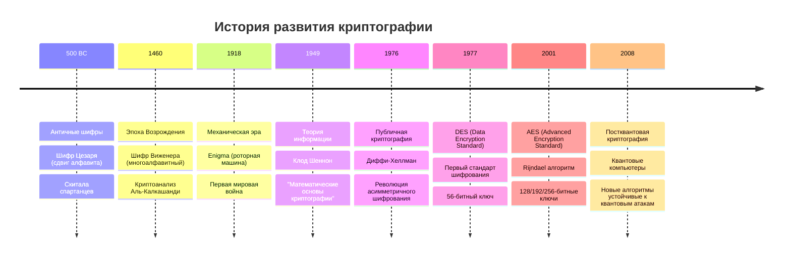
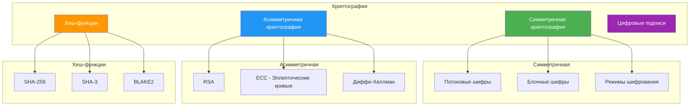
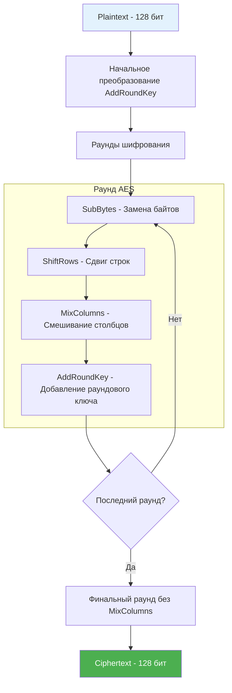
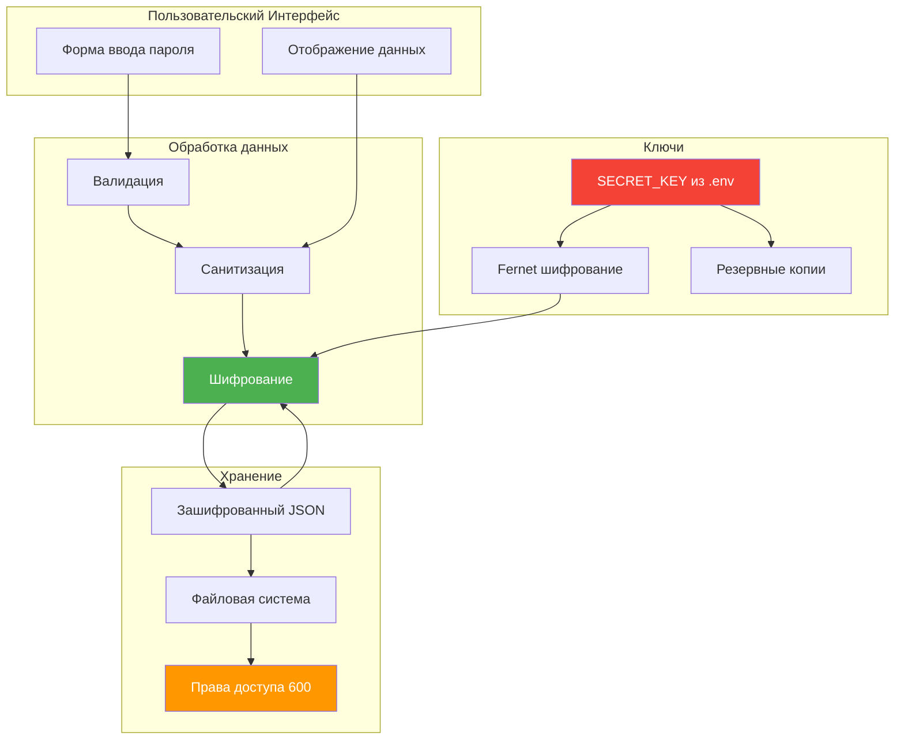

# Урок 4: Криптография и Безопасность

## 🎯 Цели урока

К концу этого урока вы будете понимать:
- Историю развития криптографии и современные стандарты
- Принципы симметричного и асимметричного шифрования
- Реализацию криптографии в Python с библиотекой Cryptography
- Безопасное хранение ключей и управление секретами
- Лучшие практики безопасности в веб-приложениях

## 📚 Историческая справка

### Эволюция криптографии



### Ключевые фигуры в истории криптографии

**Клод Шеннон (1916-2001)**
- "Отец теории информации"
- Ввел понятие энтропии в криптографию
- Доказал теоретическую стойкость шифра одноразовых блокнотов

**Уитфилд Диффи и Мартин Хеллман (1976)**
- Революционная идея публичных ключей
- Решили проблему распределения ключей
- Основа современного интернета

**Рон Ривест, Ади Шамир, Леонард Адлеман (RSA, 1977)**
- Первый практический алгоритм публичных ключей
- Основан на сложности факторизации больших чисел

## 🔐 Основы криптографии

### Типы криптографических систем



### Принципы работы AES

**Advanced Encryption Standard (AES)** - современный стандарт симметричного шифрования:



## 🛡️ Библиотека Cryptography в Python

### Установка и основы

```python
# Установка
# pip install cryptography

from cryptography.fernet import Fernet
from cryptography.hazmat.primitives import hashes
from cryptography.hazmat.primitives.kdf.pbkdf2 import PBKDF2HMAC
from cryptography.hazmat.primitives.ciphers import Cipher, algorithms, modes
import os
import base64
```

### Fernet - простое симметричное шифрование

```python
from cryptography.fernet import Fernet, InvalidToken
import base64
import os

class SecureStorage:
    """Класс для безопасного хранения данных с использованием Fernet."""
    
    def __init__(self, key=None):
        """
        Инициализация с ключом шифрования.
        
        Args:
            key: Ключ шифрования в формате bytes или base64 строка
        """
        if key is None:
            # Генерируем новый ключ
            self.key = Fernet.generate_key()
        elif isinstance(key, str):
            # Преобразуем строку в bytes
            self.key = key.encode()
        else:
            self.key = key
        
        self.fernet = Fernet(self.key)
    
    def encrypt(self, plaintext):
        """
        Шифрует текст.
        
        Args:
            plaintext: Текст для шифрования (str)
            
        Returns:
            str: Зашифрованный текст в base64
        """
        if not plaintext:
            return ""
        
        try:
            # Преобразуем в bytes и шифруем
            encrypted_bytes = self.fernet.encrypt(plaintext.encode('utf-8'))
            # Возвращаем в виде строки base64
            return encrypted_bytes.decode('utf-8')
        except Exception as e:
            raise ValueError(f"Ошибка шифрования: {e}")
    
    def decrypt(self, encrypted_text):
        """
        Расшифровывает текст.
        
        Args:
            encrypted_text: Зашифрованный текст (str)
            
        Returns:
            str: Расшифрованный текст
        """
        if not encrypted_text:
            return ""
        
        try:
            # Преобразуем в bytes и расшифровываем
            decrypted_bytes = self.fernet.decrypt(encrypted_text.encode('utf-8'))
            # Возвращаем как строку
            return decrypted_bytes.decode('utf-8')
        except InvalidToken:
            raise ValueError("Неверный ключ шифрования или поврежденные данные")
        except Exception as e:
            raise ValueError(f"Ошибка расшифровки: {e}")
    
    def get_key_string(self):
        """Возвращает ключ в виде строки для сохранения."""
        return self.key.decode('utf-8')

# Пример использования
if __name__ == "__main__":
    # Создаем экземпляр с новым ключом
    storage = SecureStorage()
    
    # Шифруем данные
    password = "super_secret_password_123"
    encrypted_password = storage.encrypt(password)
    print(f"Зашифрованный пароль: {encrypted_password}")
    
    # Расшифровываем данные
    decrypted_password = storage.decrypt(encrypted_password)
    print(f"Расшифрованный пароль: {decrypted_password}")
    
    # Сохраняем ключ для последующего использования
    key_to_save = storage.get_key_string()
    print(f"Ключ для сохранения: {key_to_save}")
```

### Генерация ключей из паролей (Key Derivation)

```python
import os
from cryptography.hazmat.primitives import hashes
from cryptography.hazmat.primitives.kdf.pbkdf2 import PBKDF2HMAC
from cryptography.fernet import Fernet
import base64

def derive_key_from_password(password, salt=None):
    """
    Генерирует криптографический ключ из пароля.
    
    Args:
        password: Пароль (str)
        salt: Соль (bytes), если None - генерируется новая
        
    Returns:
        tuple: (ключ, соль)
    """
    if salt is None:
        salt = os.urandom(16)  # 128-битная соль
    
    # Настройка функции деривации ключа
    kdf = PBKDF2HMAC(
        algorithm=hashes.SHA256(),
        length=32,  # 256 бит для Fernet
        salt=salt,
        iterations=100000,  # Рекомендуемое количество итераций
    )
    
    # Генерируем ключ
    key = base64.urlsafe_b64encode(kdf.derive(password.encode()))
    
    return key, salt

class PasswordBasedEncryption:
    """Шифрование на основе пароля."""
    
    def __init__(self, password, salt=None):
        self.password = password
        self.key, self.salt = derive_key_from_password(password, salt)
        self.fernet = Fernet(self.key)
    
    def encrypt(self, plaintext):
        """Шифрует текст."""
        if not plaintext:
            return ""
        return self.fernet.encrypt(plaintext.encode()).decode()
    
    def decrypt(self, encrypted_text):
        """Расшифровывает текст."""
        if not encrypted_text:
            return ""
        return self.fernet.decrypt(encrypted_text.encode()).decode()
    
    def get_salt(self):
        """Возвращает соль в base64 для сохранения."""
        return base64.b64encode(self.salt).decode()

# Пример использования
password = "my_master_password"
pbe = PasswordBasedEncryption(password)

# Шифруем данные
data = "Секретная информация"
encrypted = pbe.encrypt(data)
print(f"Зашифровано: {encrypted}")

# Важно сохранить соль для последующего использования
salt_to_save = pbe.get_salt()
print(f"Соль для сохранения: {salt_to_save}")
```

## 🔑 Управление ключами в приложении

### Реализация в VPN Server Manager

```python
# app.py - система управления ключами
import os
import sys
from pathlib import Path
from cryptography.fernet import Fernet, InvalidToken
from dotenv import load_dotenv

class KeyManager:
    """Менеджер криптографических ключей."""
    
    def __init__(self):
        self.secret_key = None
        self.fernet = None
        self._load_key()
    
    def _load_key(self):
        """Загружает ключ шифрования из переменных окружения."""
        is_frozen = getattr(sys, 'frozen', False)
        
        if is_frozen:
            # Если приложение собрано, ищем .env в ресурсах
            try:
                base_path = Path(sys.executable).parent.parent / 'Resources'
                dotenv_path = base_path / '.env'
                if dotenv_path.exists():
                    load_dotenv(dotenv_path=dotenv_path)
                    self.secret_key = os.getenv("SECRET_KEY")
            except Exception as e:
                print(f"Ошибка загрузки ключа из собранного приложения: {e}")
        else:
            # Для разработки, ищем .env в корне проекта
            load_dotenv()
            self.secret_key = os.getenv("SECRET_KEY")
        
        if not self.secret_key:
            raise ValueError(
                "SECRET_KEY не найден. Проверьте файл .env или сгенерируйте новый ключ."
            )
        
        try:
            self.fernet = Fernet(self.secret_key.encode())
        except Exception as e:
            raise ValueError(f"Некорректный формат SECRET_KEY: {e}")
    
    def encrypt_data(self, data):
        """
        Шифрует строку данных.
        
        Args:
            data: Строка для шифрования
            
        Returns:
            str: Зашифрованная строка в base64
        """
        if not data:
            return ""
        
        try:
            encrypted_bytes = self.fernet.encrypt(data.encode('utf-8'))
            return encrypted_bytes.decode('utf-8')
        except Exception as e:
            raise ValueError(f"Ошибка шифрования данных: {e}")
    
    def decrypt_data(self, encrypted_data):
        """
        Расшифровывает строку данных.
        
        Args:
            encrypted_data: Зашифрованная строка
            
        Returns:
            str: Расшифрованная строка
        """
        if not encrypted_data:
            return ""
        
        try:
            decrypted_bytes = self.fernet.decrypt(encrypted_data.encode('utf-8'))
            return decrypted_bytes.decode('utf-8')
        except InvalidToken:
            return "Ошибка дешифровки: неверный ключ или поврежденные данные"
        except Exception as e:
            return f"Ошибка дешифровки: {e}"
    
    def encrypt_dict(self, data_dict, fields_to_encrypt):
        """
        Шифрует указанные поля в словаре.
        
        Args:
            data_dict: Словарь с данными
            fields_to_encrypt: Список полей для шифрования
            
        Returns:
            dict: Словарь с зашифрованными полями
        """
        encrypted_dict = data_dict.copy()
        
        for field in fields_to_encrypt:
            if field in encrypted_dict and encrypted_dict[field]:
                encrypted_dict[field] = self.encrypt_data(str(encrypted_dict[field]))
        
        return encrypted_dict
    
    def decrypt_dict(self, encrypted_dict, fields_to_decrypt):
        """
        Расшифровывает указанные поля в словаре.
        
        Args:
            encrypted_dict: Словарь с зашифрованными данными
            fields_to_decrypt: Список полей для расшифровки
            
        Returns:
            dict: Словарь с расшифрованными полями
        """
        decrypted_dict = encrypted_dict.copy()
        
        for field in fields_to_decrypt:
            if field in decrypted_dict and decrypted_dict[field]:
                decrypted_dict[field] = self.decrypt_data(decrypted_dict[field])
        
        return decrypted_dict

# Глобальный экземпляр менеджера ключей
key_manager = KeyManager()

# Функции для обратной совместимости
def encrypt_data(data):
    """Шифрует данные (обертка для обратной совместимости)."""
    return key_manager.encrypt_data(data)

def decrypt_data(encrypted_data):
    """Расшифровывает данные (обертка для обратной совместимости)."""
    return key_manager.decrypt_data(encrypted_data)
```

### Генератор ключей

```python
# tools/generate_key.py - утилита для генерации ключей
import os
import secrets
from cryptography.fernet import Fernet
from pathlib import Path

def generate_secure_key():
    """
    Генерирует криптографически стойкий ключ для Fernet.
    
    Returns:
        str: Ключ в base64 формате
    """
    return Fernet.generate_key().decode()

def generate_random_password(length=32):
    """
    Генерирует случайный пароль.
    
    Args:
        length: Длина пароля
        
    Returns:
        str: Случайный пароль
    """
    alphabet = "abcdefghijklmnopqrstuvwxyzABCDEFGHIJKLMNOPQRSTUVWXYZ0123456789!@#$%^&*"
    return ''.join(secrets.choice(alphabet) for _ in range(length))

def create_env_file(project_path=None):
    """
    Создает .env файл с новым ключом шифрования.
    
    Args:
        project_path: Путь к проекту (по умолчанию - текущая директория)
    """
    if project_path is None:
        project_path = Path.cwd()
    else:
        project_path = Path(project_path)
    
    env_file = project_path / '.env'
    
    # Проверяем, существует ли уже .env файл
    if env_file.exists():
        response = input(f"Файл {env_file} уже существует. Перезаписать? (y/N): ")
        if response.lower() != 'y':
            print("Операция отменена.")
            return
    
    # Генерируем новый ключ
    secret_key = generate_secure_key()
    flask_secret = generate_random_password(64)
    
    # Создаем содержимое .env файла
    env_content = f"""# Криптографические ключи для VPN Server Manager
# НЕ ДЕЛИТЕСЬ ЭТИМИ КЛЮЧАМИ И НЕ ДОБАВЛЯЙТЕ В GIT!

# Основной ключ шифрования для данных пользователя
SECRET_KEY={secret_key}

# Секретный ключ Flask для сессий и CSRF защиты
FLASK_SECRET_KEY={flask_secret}

# Дополнительные настройки (опционально)
# DEBUG=False
# LOG_LEVEL=INFO
"""
    
    # Записываем файл
    with open(env_file, 'w', encoding='utf-8') as f:
        f.write(env_content)
    
    # Устанавливаем права доступа только для владельца (Unix)
    if os.name != 'nt':  # Не Windows
        os.chmod(env_file, 0o600)
    
    print(f"✅ Файл {env_file} успешно создан!")
    print("⚠️  ВАЖНО: Сохраните резервную копию ключа в безопасном месте!")
    print("📁 Добавьте .env в .gitignore, чтобы не попал в систему контроля версий")
    
    return secret_key

def backup_key(key, backup_path=None):
    """
    Создает резервную копию ключа.
    
    Args:
        key: Ключ для резервного копирования
        backup_path: Путь для сохранения резервной копии
    """
    if backup_path is None:
        backup_path = Path.home() / 'vpn_manager_key_backup.txt'
    else:
        backup_path = Path(backup_path)
    
    with open(backup_path, 'w', encoding='utf-8') as f:
        f.write(f"# Резервная копия ключа VPN Server Manager\n")
        f.write(f"# Создано: {datetime.now().isoformat()}\n")
        f.write(f"SECRET_KEY={key}\n")
    
    # Устанавливаем права доступа только для владельца
    if os.name != 'nt':
        os.chmod(backup_path, 0o600)
    
    print(f"💾 Резервная копия ключа сохранена: {backup_path}")

if __name__ == "__main__":
    import sys
    from datetime import datetime
    
    print("🔐 Генератор ключей VPN Server Manager")
    print("=" * 50)
    
    if len(sys.argv) > 1:
        project_path = sys.argv[1]
    else:
        project_path = None
    
    try:
        key = create_env_file(project_path)
        
        # Предлагаем создать резервную копию
        response = input("Создать резервную копию ключа? (Y/n): ")
        if response.lower() != 'n':
            backup_key(key)
        
        print("\n✅ Настройка завершена успешно!")
        print("🚀 Теперь можно запускать приложение")
        
    except Exception as e:
        print(f"❌ Ошибка: {e}")
        sys.exit(1)
```

## 🔒 Безопасное хранение данных

### Структура зашифрованного файла

```python
import json
import os
from datetime import datetime

class SecureDataStorage:
    """Класс для безопасного хранения данных в зашифрованном виде."""
    
    def __init__(self, key_manager, file_path):
        self.key_manager = key_manager
        self.file_path = file_path
        self.sensitive_fields = ['password', 'api_key', 'secret', 'token']
    
    def save_data(self, data):
        """
        Сохраняет данные с шифрованием чувствительных полей.
        
        Args:
            data: Данные для сохранения (dict или list)
        """
        try:
            # Создаем копию данных для шифрования
            encrypted_data = self._encrypt_sensitive_data(data)
            
            # Добавляем метаданные
            file_data = {
                'version': '1.0',
                'encrypted_at': datetime.now().isoformat(),
                'data': encrypted_data
            }
            
            # Сериализуем в JSON
            json_data = json.dumps(file_data, ensure_ascii=False, indent=2)
            
            # Шифруем весь JSON
            encrypted_json = self.key_manager.encrypt_data(json_data)
            
            # Создаем директорию если не существует
            os.makedirs(os.path.dirname(self.file_path), exist_ok=True)
            
            # Сохраняем в файл
            with open(self.file_path, 'w', encoding='utf-8') as f:
                f.write(encrypted_json)
            
            # Устанавливаем права доступа
            if os.name != 'nt':
                os.chmod(self.file_path, 0o600)
                
        except Exception as e:
            raise ValueError(f"Ошибка сохранения данных: {e}")
    
    def load_data(self):
        """
        Загружает и расшифровывает данные из файла.
        
        Returns:
            Расшифрованные данные
        """
        try:
            if not os.path.exists(self.file_path):
                return []
            
            # Читаем зашифрованный файл
            with open(self.file_path, 'r', encoding='utf-8') as f:
                encrypted_json = f.read().strip()
            
            if not encrypted_json:
                return []
            
            # Расшифровываем JSON
            json_data = self.key_manager.decrypt_data(encrypted_json)
            
            # Парсим JSON
            file_data = json.loads(json_data)
            
            # Извлекаем данные
            encrypted_data = file_data.get('data', [])
            
            # Расшифровываем чувствительные поля
            decrypted_data = self._decrypt_sensitive_data(encrypted_data)
            
            return decrypted_data
            
        except Exception as e:
            raise ValueError(f"Ошибка загрузки данных: {e}")
    
    def _encrypt_sensitive_data(self, data):
        """Рекурсивно шифрует чувствительные поля."""
        if isinstance(data, dict):
            encrypted_dict = {}
            for key, value in data.items():
                if key.lower() in self.sensitive_fields and value:
                    # Шифруем чувствительное поле
                    encrypted_dict[key] = self.key_manager.encrypt_data(str(value))
                elif isinstance(value, (dict, list)):
                    # Рекурсивно обрабатываем вложенные структуры
                    encrypted_dict[key] = self._encrypt_sensitive_data(value)
                else:
                    encrypted_dict[key] = value
            return encrypted_dict
        
        elif isinstance(data, list):
            return [self._encrypt_sensitive_data(item) for item in data]
        
        else:
            return data
    
    def _decrypt_sensitive_data(self, data):
        """Рекурсивно расшифровывает чувствительные поля."""
        if isinstance(data, dict):
            decrypted_dict = {}
            for key, value in data.items():
                if key.lower() in self.sensitive_fields and value:
                    # Расшифровываем чувствительное поле
                    decrypted_dict[key] = self.key_manager.decrypt_data(str(value))
                elif isinstance(value, (dict, list)):
                    # Рекурсивно обрабатываем вложенные структуры
                    decrypted_dict[key] = self._decrypt_sensitive_data(value)
                else:
                    decrypted_dict[key] = value
            return decrypted_dict
        
        elif isinstance(data, list):
            return [self._decrypt_sensitive_data(item) for item in data]
        
        else:
            return data

# Пример использования в приложении
def load_servers():
    """Загружает список серверов из зашифрованного файла."""
    storage = SecureDataStorage(key_manager, 'data/servers.json.enc')
    return storage.load_data()

def save_servers(servers):
    """Сохраняет список серверов в зашифрованный файл."""
    storage = SecureDataStorage(key_manager, 'data/servers.json.enc')
    storage.save_data(servers)
```

## 🛡️ Дополнительные меры безопасности

### Хеширование паролей

```python
from cryptography.hazmat.primitives import hashes
from cryptography.hazmat.primitives.kdf.pbkdf2 import PBKDF2HMAC
import os
import base64

def hash_password(password, salt=None):
    """
    Хеширует пароль с использованием PBKDF2.
    
    Args:
        password: Пароль для хеширования
        salt: Соль (если None, генерируется новая)
        
    Returns:
        tuple: (хеш, соль)
    """
    if salt is None:
        salt = os.urandom(32)
    
    kdf = PBKDF2HMAC(
        algorithm=hashes.SHA256(),
        length=32,
        salt=salt,
        iterations=100000,
    )
    
    key = kdf.derive(password.encode())
    return base64.b64encode(key).decode(), base64.b64encode(salt).decode()

def verify_password(password, hashed_password, salt):
    """
    Проверяет пароль против хеша.
    
    Args:
        password: Проверяемый пароль
        hashed_password: Хеш пароля
        salt: Соль
        
    Returns:
        bool: True если пароль верен
    """
    try:
        salt_bytes = base64.b64decode(salt)
        hashed_bytes = base64.b64decode(hashed_password)
        
        kdf = PBKDF2HMAC(
            algorithm=hashes.SHA256(),
            length=32,
            salt=salt_bytes,
            iterations=100000,
        )
        
        kdf.verify(password.encode(), hashed_bytes)
        return True
    except:
        return False
```

### Безопасная очистка памяти

```python
import ctypes
import sys

def secure_zero_memory(data):
    """
    Безопасно очищает данные из памяти.
    
    Args:
        data: Строка или байты для очистки
    """
    if isinstance(data, str):
        data = data.encode()
    
    # Получаем адрес объекта в памяти
    address = id(data)
    size = sys.getsizeof(data)
    
    # Заполняем нулями (только для демонстрации концепции)
    # В реальном приложении используйте специализированные библиотеки
    try:
        ctypes.memset(address, 0, size)
    except:
        pass  # Игнорируем ошибки, так как это зависит от платформы

class SecureString:
    """Класс для безопасной работы со строками."""
    
    def __init__(self, value):
        self._value = value
    
    def get(self):
        """Возвращает значение."""
        return self._value
    
    def __del__(self):
        """Очищает память при удалении объекта."""
        if hasattr(self, '_value'):
            secure_zero_memory(self._value)
            del self._value
    
    def __str__(self):
        return "*" * len(self._value) if self._value else ""
    
    def __repr__(self):
        return f"SecureString(length={len(self._value) if self._value else 0})"
```

## 📊 Диаграмма безопасности приложения



## 🚀 Практические упражнения

### Упражнение 1: Базовое шифрование

Создайте класс для шифрования:
1. Генерация ключей
2. Шифрование/расшифровка текста
3. Обработка ошибок

### Упражнение 2: Управление ключами

Реализуйте:
1. Загрузку ключей из файла
2. Ротацию ключей
3. Резервное копирование

### Упражнение 3: Безопасное хранение

Создайте систему:
1. Шифрование JSON файлов
2. Проверка целостности данных
3. Миграция между ключами

## 🔍 Анализ безопасности проекта

### Угрозы и их митигация

| Угроза | Описание | Митигация в проекте |
|--------|----------|-------------------|
| **Компрометация ключей** | Утечка SECRET_KEY | .env файл с правами 600, исключен из Git |
| **Атака грубой силы** | Подбор паролей | PBKDF2 с 100,000 итераций |
| **Чтение из памяти** | Извлечение данных из RAM | Быстрая очистка переменных |
| **Физический доступ** | Доступ к файлам | Шифрование всех данных |
| **MITM атаки** | Перехват трафика | Все данные локальные |

### Аудит безопасности

```python
def security_audit():
    """Проводит аудит безопасности приложения."""
    issues = []
    
    # Проверка наличия ключа
    if not os.getenv('SECRET_KEY'):
        issues.append("КРИТИЧНО: SECRET_KEY не найден")
    
    # Проверка прав доступа к .env
    env_file = Path('.env')
    if env_file.exists():
        permissions = oct(env_file.stat().st_mode)[-3:]
        if permissions != '600':
            issues.append(f"ПРЕДУПРЕЖДЕНИЕ: .env имеет права {permissions}, рекомендуется 600")
    
    # Проверка зашифрованных файлов
    data_dir = Path('data')
    if data_dir.exists():
        for file in data_dir.glob('*.enc'):
            try:
                with open(file, 'r') as f:
                    content = f.read()
                # Проверяем, что файл действительно зашифрован
                if content.startswith('{') or content.startswith('['):
                    issues.append(f"КРИТИЧНО: {file} не зашифрован")
            except:
                pass  # Файл зашифрован или поврежден
    
    return issues

# Запуск аудита при старте приложения
if __name__ == "__main__":
    audit_results = security_audit()
    if audit_results:
        print("🔒 Результаты аудита безопасности:")
        for issue in audit_results:
            print(f"  - {issue}")
```

## 🌟 Лучшие практики безопасности

### 1. Принципы безопасного программирования

- **Принцип минимальных привилегий** - давать только необходимые права
- **Защита в глубину** - несколько уровней защиты
- **Неудача в безопасном состоянии** - при ошибке закрывать доступ
- **Не доверяй, проверяй** - валидация всех входных данных

### 2. Управление ключами

```python
# ✅ Хорошо
SECRET_KEY = os.getenv('SECRET_KEY')
if not SECRET_KEY:
    raise ValueError("SECRET_KEY обязателен")

# ❌ Плохо
SECRET_KEY = "hardcoded_key_123"
```

### 3. Обработка ошибок

```python
# ✅ Хорошо
try:
    decrypted = decrypt_data(encrypted_data)
except InvalidToken:
    return "Неверный ключ шифрования"
except Exception:
    return "Ошибка расшифровки"

# ❌ Плохо
try:
    decrypted = decrypt_data(encrypted_data)
except Exception as e:
    return f"Ошибка: {str(e)}"  # Утечка информации
```

## 📚 Дополнительные материалы

### Полезные ссылки
- [Cryptography Documentation](https://cryptography.io/)
- [OWASP Cryptographic Storage Cheat Sheet](https://cheatsheetseries.owasp.org/cheatsheets/Cryptographic_Storage_Cheat_Sheet.html)
- [NIST Cryptographic Standards](https://csrc.nist.gov/projects/cryptographic-standards-and-guidelines)

### Рекомендуемые библиотеки
- **cryptography** - современная криптография для Python
- **bcrypt** - хеширование паролей
- **secrets** - криптографически стойкие случайные числа
- **passlib** - управление паролями

## 🎯 Контрольные вопросы

1. В чем разница между симметричным и асимметричным шифрованием?
2. Почему нельзя хранить пароли в открытом виде?
3. Что такое соль и зачем она нужна при хешировании?
4. Как правильно генерировать криптографические ключи?
5. Какие угрозы безопасности существуют для веб-приложений?

## 🚀 Следующий урок

В следующем уроке мы изучим **многопоточность и архитектуру приложения**, научимся разделять UI и бизнес-логику для создания отзывчивых приложений.

---

*Этот урок является частью курса "VPN Server Manager: Архитектура и принципы разработки"*
