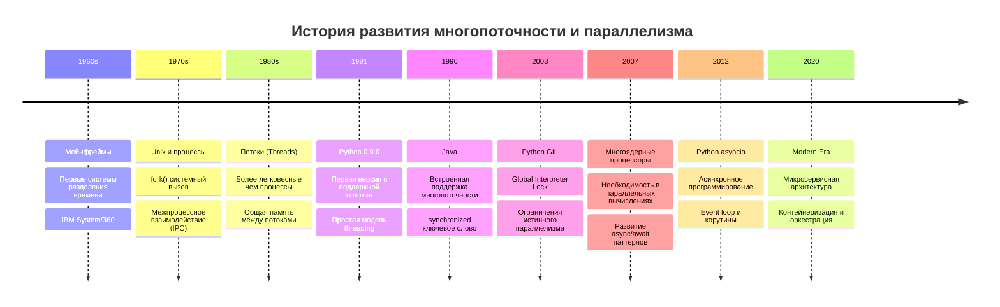
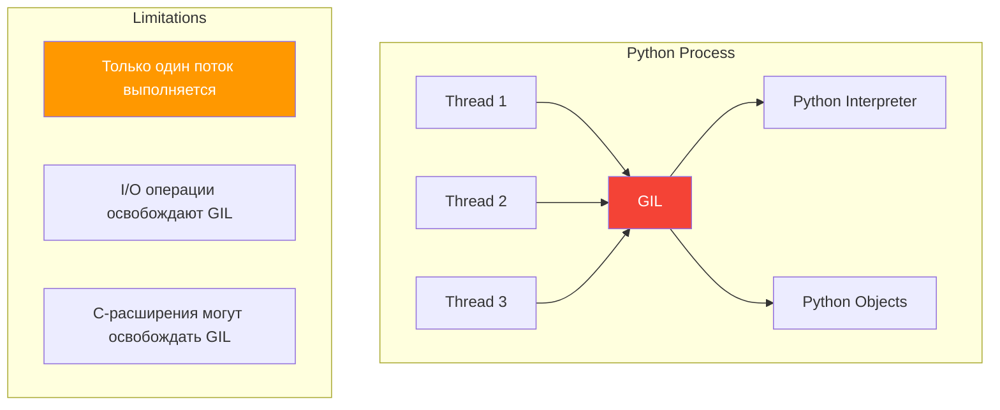
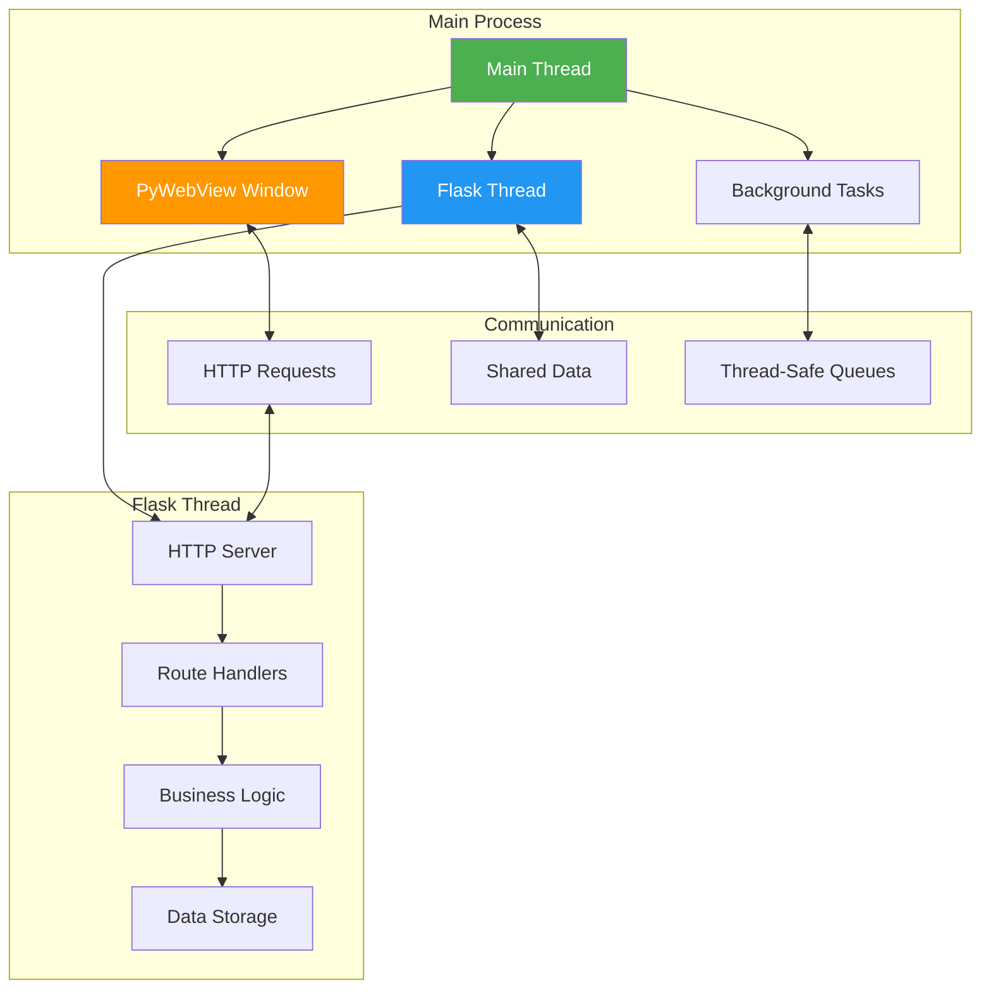
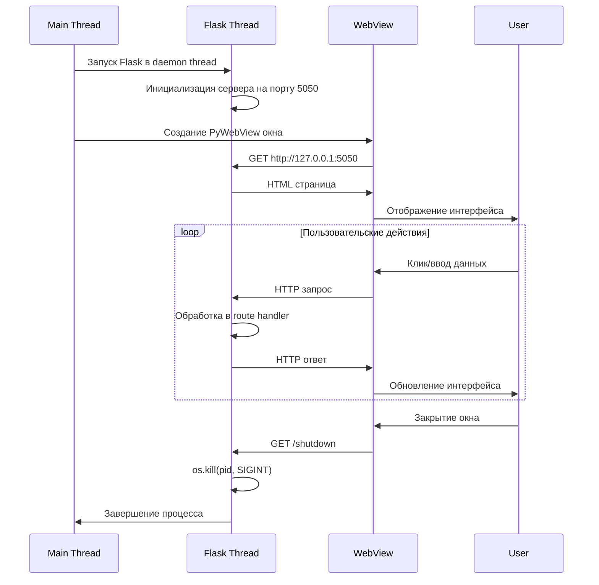

# Урок 5: Многопоточность и Архитектура Приложения

## 🎯 Цели урока

К концу этого урока вы будете понимать:
- Историю развития многопоточности в программировании
- Принципы работы потоков в Python
- Архитектуру гибридных приложений (PyWebView + Flask)
- Синхронизацию потоков и обмен данными
- Паттерны проектирования многопоточных приложений

## 📚 Историческая справка

### Эволюция многопоточности



### Global Interpreter Lock (GIL) в Python

**GIL** - это мьютекс, который защищает доступ к объектам Python, предотвращая выполнение нескольких потоков Python одновременно:



**Почему GIL существует:**
- Упрощает управление памятью
- Предотвращает гонки данных в интерпретаторе
- Облегчает интеграцию с C-библиотеками

**Обходные пути:**
- Использование `multiprocessing` для CPU-интенсивных задач
- `threading` для I/O операций
- `asyncio` для высококонкурентных приложений

## 🏗️ Архитектура многопоточного приложения

### Модель VPN Server Manager



### Жизненный цикл потоков



## 💻 Реализация многопоточности в Python

### Базовые концепции threading

```python
import threading
import time
import queue
from datetime import datetime

class ThreadExample:
    """Демонстрация различных способов работы с потоками."""
    
    def __init__(self):
        self.data = {}
        self.lock = threading.Lock()
        self.condition = threading.Condition()
        self.queue = queue.Queue()
    
    def simple_thread_function(self, name, duration):
        """Простая функция для выполнения в потоке."""
        print(f"Поток {name} начал работу в {datetime.now()}")
        time.sleep(duration)
        print(f"Поток {name} завершил работу в {datetime.now()}")
    
    def thread_with_lock(self, name, value):
        """Поток с использованием блокировки."""
        with self.lock:  # Автоматическое получение и освобождение блокировки
            print(f"Поток {name} получил блокировку")
            self.data[name] = value
            time.sleep(1)  # Симуляция работы
            print(f"Поток {name} освободил блокировку")
    
    def producer(self, name, count):
        """Производитель данных для очереди."""
        for i in range(count):
            item = f"{name}_item_{i}"
            self.queue.put(item)
            print(f"Производитель {name} добавил: {item}")
            time.sleep(0.5)
    
    def consumer(self, name):
        """Потребитель данных из очереди."""
        while True:
            try:
                item = self.queue.get(timeout=2)
                print(f"Потребитель {name} получил: {item}")
                time.sleep(1)  # Симуляция обработки
                self.queue.task_done()
            except queue.Empty:
                print(f"Потребитель {name} завершает работу")
                break
    
    def run_examples(self):
        """Запускает примеры работы с потоками."""
        print("=== Пример 1: Простые потоки ===")
        threads = []
        for i in range(3):
            t = threading.Thread(
                target=self.simple_thread_function,
                args=(f"Thread-{i}", i + 1)
            )
            threads.append(t)
            t.start()
        
        # Ожидаем завершения всех потоков
        for t in threads:
            t.join()
        
        print("\n=== Пример 2: Потоки с блокировкой ===")
        lock_threads = []
        for i in range(3):
            t = threading.Thread(
                target=self.thread_with_lock,
                args=(f"LockThread-{i}", i * 10)
            )
            lock_threads.append(t)
            t.start()
        
        for t in lock_threads:
            t.join()
        
        print(f"Итоговые данные: {self.data}")
        
        print("\n=== Пример 3: Producer-Consumer ===")
        # Запускаем производителей
        producer_threads = []
        for i in range(2):
            t = threading.Thread(
                target=self.producer,
                args=(f"Producer-{i}", 3)
            )
            producer_threads.append(t)
            t.start()
        
        # Запускаем потребителей
        consumer_threads = []
        for i in range(2):
            t = threading.Thread(target=self.consumer, args=(f"Consumer-{i}",))
            consumer_threads.append(t)
            t.start()
        
        # Ждем завершения производителей
        for t in producer_threads:
            t.join()
        
        # Ждем обработки всех элементов
        self.queue.join()

# Запуск примера
if __name__ == "__main__":
    example = ThreadExample()
    example.run_examples()
```

### Daemon потоки

```python
import threading
import time
import atexit

class DaemonThreadExample:
    """Демонстрация работы с daemon потоками."""
    
    def __init__(self):
        self.running = True
        self.daemon_thread = None
    
    def background_task(self):
        """Фоновая задача, выполняющаяся в daemon потоке."""
        counter = 0
        while self.running:
            print(f"Daemon поток работает: {counter}")
            counter += 1
            time.sleep(1)
        print("Daemon поток завершен")
    
    def start_daemon(self):
        """Запускает daemon поток."""
        self.daemon_thread = threading.Thread(target=self.background_task)
        self.daemon_thread.daemon = True  # Делаем поток daemon
        self.daemon_thread.start()
        
        # Регистрируем функцию очистки
        atexit.register(self.cleanup)
    
    def cleanup(self):
        """Корректное завершение работы."""
        print("Завершение работы приложения...")
        self.running = False
        if self.daemon_thread and self.daemon_thread.is_alive():
            self.daemon_thread.join(timeout=2)
    
    def main_work(self):
        """Основная работа приложения."""
        for i in range(5):
            print(f"Основной поток: шаг {i}")
            time.sleep(2)
        print("Основная работа завершена")

# Пример использования
example = DaemonThreadExample()
example.start_daemon()
example.main_work()
# Daemon поток автоматически завершится при выходе из основного потока
```

## 🌐 Flask в многопоточной среде

### Настройка Flask для многопоточности

```python
import threading
import time
from flask import Flask, request, jsonify
import queue
import logging

class ThreadSafeFlaskApp:
    """Flask приложение с поддержкой многопоточности."""
    
    def __init__(self):
        self.app = Flask(__name__)
        self.app.config['SECRET_KEY'] = 'your-secret-key'
        
        # Thread-safe структуры данных
        self.task_queue = queue.Queue()
        self.results = {}
        self.results_lock = threading.Lock()
        
        # Настройка логирования
        logging.basicConfig(level=logging.INFO)
        
        self.setup_routes()
        self.start_background_worker()
    
    def setup_routes(self):
        """Настройка маршрутов Flask."""
        
        @self.app.route('/')
        def index():
            return '''
            <h1>Многопоточное Flask приложение</h1>
            <button onclick="startTask()">Запустить задачу</button>
            <div id="result"></div>
            <script>
            function startTask() {
                fetch('/start_task', {method: 'POST'})
                    .then(response => response.json())
                    .then(data => {
                        document.getElementById('result').innerHTML = 
                            `Задача ${data.task_id} запущена`;
                        checkStatus(data.task_id);
                    });
            }
            
            function checkStatus(taskId) {
                fetch(`/task_status/${taskId}`)
                    .then(response => response.json())
                    .then(data => {
                        if (data.status === 'completed') {
                            document.getElementById('result').innerHTML = 
                                `Результат: ${data.result}`;
                        } else {
                            setTimeout(() => checkStatus(taskId), 1000);
                        }
                    });
            }
            </script>
            '''
        
        @self.app.route('/start_task', methods=['POST'])
        def start_task():
            """Запускает долгую задачу в фоновом режиме."""
            import uuid
            task_id = str(uuid.uuid4())
            
            # Добавляем задачу в очередь
            self.task_queue.put({
                'id': task_id,
                'type': 'long_calculation',
                'params': {'duration': 5}
            })
            
            return jsonify({'task_id': task_id, 'status': 'started'})
        
        @self.app.route('/task_status/<task_id>')
        def task_status(task_id):
            """Проверяет статус задачи."""
            with self.results_lock:
                if task_id in self.results:
                    return jsonify({
                        'status': 'completed',
                        'result': self.results[task_id]
                    })
                else:
                    return jsonify({'status': 'pending'})
        
        @self.app.route('/health')
        def health():
            """Проверка здоровья приложения."""
            return jsonify({
                'status': 'healthy',
                'queue_size': self.task_queue.qsize(),
                'completed_tasks': len(self.results),
                'thread_count': threading.active_count()
            })
    
    def background_worker(self):
        """Фоновый обработчик задач."""
        while True:
            try:
                task = self.task_queue.get(timeout=1)
                self.app.logger.info(f"Обработка задачи: {task['id']}")
                
                # Симуляция долгой работы
                duration = task['params'].get('duration', 1)
                time.sleep(duration)
                
                # Сохраняем результат
                result = f"Задача {task['id']} выполнена за {duration} секунд"
                with self.results_lock:
                    self.results[task['id']] = result
                
                self.task_queue.task_done()
                self.app.logger.info(f"Задача {task['id']} завершена")
                
            except queue.Empty:
                continue
            except Exception as e:
                self.app.logger.error(f"Ошибка в фоновой задаче: {e}")
    
    def start_background_worker(self):
        """Запускает фоновый worker."""
        worker_thread = threading.Thread(target=self.background_worker)
        worker_thread.daemon = True
        worker_thread.start()
    
    def run(self, host='127.0.0.1', port=5000, debug=False):
        """Запускает Flask сервер."""
        # Важно: threaded=True для поддержки множественных запросов
        self.app.run(host=host, port=port, debug=debug, threaded=True)

# Использование
if __name__ == "__main__":
    app = ThreadSafeFlaskApp()
    app.run(debug=True)
```

## 🖥️ PyWebView и многопоточность

### Интеграция PyWebView с Flask

```python
import threading
import webview
import requests
import time
import signal
import os
from flask import Flask

class HybridApplication:
    """Гибридное приложение: PyWebView + Flask."""
    
    def __init__(self):
        self.flask_app = Flask(__name__)
        self.flask_thread = None
        self.server_ready = threading.Event()
        self.shutdown_requested = threading.Event()
        
        self.setup_flask_routes()
    
    def setup_flask_routes(self):
        """Настройка маршрутов Flask."""
        
        @self.flask_app.route('/')
        def index():
            return '''
            <!DOCTYPE html>
            <html>
            <head>
                <title>Hybrid App</title>
                <style>
                    body { font-family: Arial, sans-serif; margin: 40px; }
                    .status { padding: 10px; margin: 10px 0; border-radius: 5px; }
                    .success { background-color: #d4edda; color: #155724; }
                    .info { background-color: #d1ecf1; color: #0c5460; }
                </style>
            </head>
            <body>
                <h1>🚀 Гибридное приложение</h1>
                <div class="status success">
                    ✅ Flask сервер работает в фоновом потоке
                </div>
                <div class="status info">
                    ℹ️ PyWebView отображает веб-интерфейс в нативном окне
                </div>
                
                <h2>Информация о потоках</h2>
                <div id="thread-info"></div>
                
                <button onclick="updateThreadInfo()">Обновить информацию</button>
                <button onclick="performLongTask()">Запустить долгую задачу</button>
                
                <script>
                function updateThreadInfo() {
                    fetch('/thread_info')
                        .then(response => response.json())
                        .then(data => {
                            document.getElementById('thread-info').innerHTML = 
                                `<p>Активных потоков: ${data.thread_count}</p>
                                 <p>Основной поток: ${data.main_thread}</p>
                                 <p>Текущий поток: ${data.current_thread}</p>`;
                        });
                }
                
                function performLongTask() {
                    fetch('/long_task', {method: 'POST'})
                        .then(response => response.json())
                        .then(data => alert(data.message));
                }
                
                // Обновляем информацию при загрузке
                updateThreadInfo();
                </script>
            </body>
            </html>
            '''
        
        @self.flask_app.route('/thread_info')
        def thread_info():
            """Информация о потоках."""
            return {
                'thread_count': threading.active_count(),
                'main_thread': threading.main_thread().name,
                'current_thread': threading.current_thread().name,
                'daemon_threads': [
                    t.name for t in threading.enumerate() if t.daemon
                ]
            }
        
        @self.flask_app.route('/long_task', methods=['POST'])
        def long_task():
            """Долгая задача, не блокирующая интерфейс."""
            def background_work():
                time.sleep(3)  # Симуляция работы
                print("Фоновая задача завершена")
            
            # Запускаем в отдельном потоке
            task_thread = threading.Thread(target=background_work)
            task_thread.daemon = True
            task_thread.start()
            
            return {'message': 'Задача запущена в фоновом режиме'}
        
        @self.flask_app.route('/shutdown', methods=['POST'])
        def shutdown():
            """Корректное завершение работы."""
            print("Получен запрос на завершение работы")
            self.shutdown_requested.set()
            
            # Отправляем сигнал для завершения
            os.kill(os.getpid(), signal.SIGTERM)
            return {'status': 'shutting down'}
    
    def run_flask(self):
        """Запускает Flask сервер."""
        try:
            print("Запуск Flask сервера...")
            self.server_ready.set()  # Сигнализируем о готовности
            self.flask_app.run(
                host='127.0.0.1',
                port=5050,
                debug=False,
                use_reloader=False,
                threaded=True
            )
        except Exception as e:
            print(f"Ошибка Flask сервера: {e}")
    
    def wait_for_server(self, timeout=10):
        """Ждет запуска Flask сервера."""
        for _ in range(timeout * 10):
            try:
                response = requests.get('http://127.0.0.1:5050/', timeout=1)
                if response.status_code == 200:
                    return True
            except requests.exceptions.RequestException:
                pass
            time.sleep(0.1)
        return False
    
    def on_window_closing(self):
        """Обработчик закрытия окна."""
        print("Окно закрывается...")
        try:
            # Отправляем запрос на завершение
            requests.post('http://127.0.0.1:5050/shutdown', timeout=1)
        except requests.exceptions.RequestException:
            pass  # Сервер уже недоступен
    
    def run(self):
        """Запускает гибридное приложение."""
        # Запускаем Flask в daemon потоке
        self.flask_thread = threading.Thread(target=self.run_flask)
        self.flask_thread.daemon = True
        self.flask_thread.start()
        
        # Ждем готовности сервера
        if not self.wait_for_server():
            print("❌ Не удалось запустить Flask сервер")
            return
        
        print("✅ Flask сервер запущен")
        
        # Создаем окно PyWebView
        window = webview.create_window(
            'Hybrid Application',
            'http://127.0.0.1:5050',
            width=800,
            height=600,
            resizable=True
        )
        
        # Регистрируем обработчик закрытия
        window.events.closing += self.on_window_closing
        
        print("🚀 Запуск PyWebView...")
        
        # Запускаем GUI (блокирующий вызов)
        webview.start(debug=False)
        
        print("👋 Приложение завершено")

# Пример использования
if __name__ == "__main__":
    app = HybridApplication()
    app.run()
```

## 🔄 Синхронизация и обмен данными

### Thread-safe структуры данных

```python
import threading
import queue
import time
from collections import deque
from dataclasses import dataclass
from typing import Dict, List, Any

@dataclass
class ServerData:
    """Структура данных сервера."""
    id: str
    name: str
    ip: str
    status: str
    last_check: float

class ThreadSafeDataManager:
    """Потокобезопасный менеджер данных."""
    
    def __init__(self):
        # Блокировка для защиты критических секций
        self._lock = threading.RLock()  # Реентерабельная блокировка
        
        # Основные данные
        self._servers: Dict[str, ServerData] = {}
        
        # Очереди для обмена данными между потоками
        self.update_queue = queue.Queue()
        self.notification_queue = queue.Queue()
        
        # События для координации потоков
        self.shutdown_event = threading.Event()
        self.data_updated = threading.Event()
        
        # Счетчики и статистика
        self._stats = {
            'total_updates': 0,
            'last_update': None
        }
    
    def add_server(self, server: ServerData) -> bool:
        """Добавляет сервер в потокобезопасном режиме."""
        with self._lock:
            if server.id in self._servers:
                return False
            
            self._servers[server.id] = server
            self._stats['total_updates'] += 1
            self._stats['last_update'] = time.time()
            
            # Уведомляем о изменении
            self.data_updated.set()
            self.notification_queue.put(('server_added', server.id))
            
            return True
    
    def update_server(self, server_id: str, **kwargs) -> bool:
        """Обновляет данные сервера."""
        with self._lock:
            if server_id not in self._servers:
                return False
            
            server = self._servers[server_id]
            for key, value in kwargs.items():
                if hasattr(server, key):
                    setattr(server, key, value)
            
            self._stats['total_updates'] += 1
            self._stats['last_update'] = time.time()
            
            # Уведомляем о изменении
            self.data_updated.set()
            self.notification_queue.put(('server_updated', server_id))
            
            return True
    
    def get_server(self, server_id: str) -> ServerData:
        """Получает данные сервера."""
        with self._lock:
            return self._servers.get(server_id)
    
    def get_all_servers(self) -> List[ServerData]:
        """Получает все серверы."""
        with self._lock:
            return list(self._servers.values())
    
    def remove_server(self, server_id: str) -> bool:
        """Удаляет сервер."""
        with self._lock:
            if server_id not in self._servers:
                return False
            
            del self._servers[server_id]
            self._stats['total_updates'] += 1
            self._stats['last_update'] = time.time()
            
            # Уведомляем о изменении
            self.data_updated.set()
            self.notification_queue.put(('server_removed', server_id))
            
            return True
    
    def get_stats(self) -> Dict[str, Any]:
        """Получает статистику."""
        with self._lock:
            return {
                'server_count': len(self._servers),
                'total_updates': self._stats['total_updates'],
                'last_update': self._stats['last_update']
            }

class DataUpdateWorker:
    """Фоновый worker для обработки обновлений данных."""
    
    def __init__(self, data_manager: ThreadSafeDataManager):
        self.data_manager = data_manager
        self.running = True
        self.worker_thread = None
    
    def start(self):
        """Запускает worker поток."""
        self.worker_thread = threading.Thread(target=self._work_loop)
        self.worker_thread.daemon = True
        self.worker_thread.start()
    
    def stop(self):
        """Останавливает worker поток."""
        self.running = False
        if self.worker_thread:
            self.worker_thread.join(timeout=5)
    
    def _work_loop(self):
        """Основной цикл worker'a."""
        print("🔄 Data update worker запущен")
        
        while self.running:
            try:
                # Ждем уведомления об обновлении или таймаут
                if self.data_manager.data_updated.wait(timeout=1):
                    self._process_updates()
                    self.data_manager.data_updated.clear()
                
            except Exception as e:
                print(f"❌ Ошибка в data worker: {e}")
                time.sleep(1)
        
        print("🛑 Data update worker остановлен")
    
    def _process_updates(self):
        """Обрабатывает обновления данных."""
        # Обрабатываем все уведомления в очереди
        notifications = []
        while not self.data_manager.notification_queue.empty():
            try:
                notification = self.data_manager.notification_queue.get_nowait()
                notifications.append(notification)
            except queue.Empty:
                break
        
        if notifications:
            print(f"📊 Обработано обновлений: {len(notifications)}")
            
            # Здесь можно добавить логику для:
            # - Сохранения в файл
            # - Отправки уведомлений
            # - Обновления кэша
            # - Синхронизации с внешними системами

# Пример использования
def example_usage():
    """Пример использования потокобезопасного менеджера данных."""
    
    # Создаем менеджер данных
    data_manager = ThreadSafeDataManager()
    
    # Запускаем worker
    worker = DataUpdateWorker(data_manager)
    worker.start()
    
    def producer_thread(name: str, count: int):
        """Поток-производитель данных."""
        for i in range(count):
            server = ServerData(
                id=f"{name}_{i}",
                name=f"Server {name} {i}",
                ip=f"192.168.1.{i + 10}",
                status="active",
                last_check=time.time()
            )
            data_manager.add_server(server)
            time.sleep(0.1)
        
        print(f"✅ Производитель {name} завершен")
    
    def consumer_thread(name: str):
        """Поток-потребитель данных."""
        for _ in range(10):
            servers = data_manager.get_all_servers()
            stats = data_manager.get_stats()
            print(f"📊 {name}: серверов={stats['server_count']}, "
                  f"обновлений={stats['total_updates']}")
            time.sleep(0.5)
        
        print(f"✅ Потребитель {name} завершен")
    
    # Запускаем производителей
    producers = []
    for i in range(2):
        t = threading.Thread(target=producer_thread, args=(f"Producer-{i}", 5))
        producers.append(t)
        t.start()
    
    # Запускаем потребителей
    consumers = []
    for i in range(2):
        t = threading.Thread(target=consumer_thread, args=(f"Consumer-{i}",))
        consumers.append(t)
        t.start()
    
    # Ждем завершения всех потоков
    for t in producers + consumers:
        t.join()
    
    # Останавливаем worker
    worker.stop()
    
    print("🏁 Пример завершен")

if __name__ == "__main__":
    example_usage()
```

## 📊 Мониторинг и отладка многопоточных приложений

### Система мониторинга потоков

```python
import threading
import time
import psutil
import json
from datetime import datetime, timedelta
from dataclasses import dataclass, asdict
from typing import Dict, List

@dataclass
class ThreadInfo:
    """Информация о потоке."""
    name: str
    ident: int
    daemon: bool
    alive: bool
    cpu_percent: float
    memory_mb: float
    created_at: str
    last_seen: str

class ThreadMonitor:
    """Монитор для отслеживания состояния потоков."""
    
    def __init__(self, update_interval: float = 1.0):
        self.update_interval = update_interval
        self.running = False
        self.monitor_thread = None
        
        # История метрик
        self.thread_history: Dict[int, List[ThreadInfo]] = {}
        self.system_metrics = []
        
        # Блокировка для thread-safe доступа
        self.lock = threading.Lock()
    
    def start_monitoring(self):
        """Запускает мониторинг."""
        if self.running:
            return
        
        self.running = True
        self.monitor_thread = threading.Thread(target=self._monitor_loop)
        self.monitor_thread.daemon = True
        self.monitor_thread.start()
        print("🔍 Мониторинг потоков запущен")
    
    def stop_monitoring(self):
        """Останавливает мониторинг."""
        self.running = False
        if self.monitor_thread:
            self.monitor_thread.join(timeout=2)
        print("🛑 Мониторинг потоков остановлен")
    
    def _monitor_loop(self):
        """Основной цикл мониторинга."""
        while self.running:
            try:
                self._collect_metrics()
                time.sleep(self.update_interval)
            except Exception as e:
                print(f"❌ Ошибка мониторинга: {e}")
                time.sleep(self.update_interval)
    
    def _collect_metrics(self):
        """Собирает метрики потоков и системы."""
        current_time = datetime.now().isoformat()
        
        # Получаем информацию о процессе
        process = psutil.Process()
        
        with self.lock:
            # Собираем информацию о потоках
            active_threads = threading.enumerate()
            
            for thread in active_threads:
                try:
                    thread_info = ThreadInfo(
                        name=thread.name,
                        ident=thread.ident if thread.ident else 0,
                        daemon=thread.daemon,
                        alive=thread.is_alive(),
                        cpu_percent=0.0,  # Сложно получить per-thread CPU
                        memory_mb=process.memory_info().rss / 1024 / 1024,
                        created_at=getattr(thread, '_created_at', current_time),
                        last_seen=current_time
                    )
                    
                    # Сохраняем в историю
                    if thread.ident not in self.thread_history:
                        self.thread_history[thread.ident] = []
                        thread._created_at = current_time
                    
                    self.thread_history[thread.ident].append(thread_info)
                    
                    # Ограничиваем размер истории
                    if len(self.thread_history[thread.ident]) > 100:
                        self.thread_history[thread.ident] = \
                            self.thread_history[thread.ident][-50:]
                
                except Exception as e:
                    print(f"Ошибка сбора метрик потока {thread.name}: {e}")
            
            # Собираем системные метрики
            system_info = {
                'timestamp': current_time,
                'cpu_percent': psutil.cpu_percent(),
                'memory_percent': psutil.virtual_memory().percent,
                'thread_count': len(active_threads),
                'process_cpu': process.cpu_percent(),
                'process_memory_mb': process.memory_info().rss / 1024 / 1024
            }
            
            self.system_metrics.append(system_info)
            
            # Ограничиваем размер истории системных метрик
            if len(self.system_metrics) > 1000:
                self.system_metrics = self.system_metrics[-500:]
    
    def get_current_threads(self) -> List[ThreadInfo]:
        """Возвращает информацию о текущих потоках."""
        with self.lock:
            current_threads = []
            for thread_id, history in self.thread_history.items():
                if history:
                    latest = history[-1]
                    # Проверяем, что поток еще активен
                    if any(t.ident == thread_id for t in threading.enumerate()):
                        current_threads.append(latest)
            return current_threads
    
    def get_system_metrics(self, last_n: int = 60) -> List[Dict]:
        """Возвращает системные метрики."""
        with self.lock:
            return self.system_metrics[-last_n:]
    
    def generate_report(self) -> str:
        """Генерирует отчет о состоянии потоков."""
        current_threads = self.get_current_threads()
        system_metrics = self.get_system_metrics(1)
        
        report = "📊 ОТЧЕТ О СОСТОЯНИИ ПОТОКОВ\n"
        report += "=" * 50 + "\n\n"
        
        if system_metrics:
            metrics = system_metrics[0]
            report += f"🖥️ Системные метрики:\n"
            report += f"  CPU: {metrics['cpu_percent']:.1f}%\n"
            report += f"  Memory: {metrics['memory_percent']:.1f}%\n"
            report += f"  Process CPU: {metrics['process_cpu']:.1f}%\n"
            report += f"  Process Memory: {metrics['process_memory_mb']:.1f} MB\n\n"
        
        report += f"🧵 Активные потоки ({len(current_threads)}):\n"
        for thread in current_threads:
            status = "🟢" if thread.alive else "🔴"
            daemon_mark = "👻" if thread.daemon else "👤"
            report += f"  {status} {daemon_mark} {thread.name} "
            report += f"(ID: {thread.ident})\n"
        
        return report
    
    def save_metrics(self, filename: str):
        """Сохраняет метрики в файл."""
        with self.lock:
            data = {
                'timestamp': datetime.now().isoformat(),
                'threads': {
                    str(tid): [asdict(info) for info in history]
                    for tid, history in self.thread_history.items()
                },
                'system_metrics': self.system_metrics
            }
            
            with open(filename, 'w', encoding='utf-8') as f:
                json.dump(data, f, indent=2, ensure_ascii=False)

# Пример использования мониторинга
def monitoring_example():
    """Пример использования мониторинга потоков."""
    
    # Создаем и запускаем монитор
    monitor = ThreadMonitor(update_interval=0.5)
    monitor.start_monitoring()
    
    def worker_function(name: str, duration: int):
        """Рабочая функция для потока."""
        for i in range(duration):
            print(f"Worker {name}: шаг {i}")
            time.sleep(1)
        print(f"Worker {name} завершен")
    
    # Запускаем несколько рабочих потоков
    workers = []
    for i in range(3):
        t = threading.Thread(
            target=worker_function,
            args=(f"Worker-{i}", 5),
            name=f"WorkerThread-{i}"
        )
        workers.append(t)
        t.start()
    
    # Мониторим выполнение
    for _ in range(10):
        print(monitor.generate_report())
        time.sleep(2)
    
    # Ждем завершения потоков
    for t in workers:
        t.join()
    
    # Сохраняем метрики и останавливаем мониторинг
    monitor.save_metrics('thread_metrics.json')
    monitor.stop_monitoring()

if __name__ == "__main__":
    monitoring_example()
```

## 🚀 Практические упражнения

### Упражнение 1: Базовая многопоточность

Создайте приложение с:
1. Главным потоком UI
2. Фоновым потоком для вычислений
3. Обменом данными через очередь

### Упражнение 2: Producer-Consumer

Реализуйте:
1. Несколько производителей данных
2. Несколько потребителей
3. Thread-safe очередь

### Упражнение 3: Гибридное приложение

Создайте минимальную версию:
1. Flask сервер в отдельном потоке
2. PyWebView окно
3. Корректное завершение работы

## 📊 Диаграмма архитектуры VPN Server Manager

```mermaid
graph TB
    subgraph "Main Process"
        A[Main Thread] --> B[Application Initialization]
        B --> C[Flask Thread Start]
        B --> D[PyWebView Window]
        
        subgraph "Flask Thread (Daemon)"
            E[HTTP Server :5050]
            F[Route Handlers]
            G[Business Logic]
            H[Data Storage]
            I[Background Tasks]
        end
        
        subgraph "PyWebView Thread"
            J[Browser Engine]
            K[HTML Rendering]
            L[JavaScript Execution]
            M[Event Handling]
        end
    end
    
    subgraph "Communication"
        N[HTTP Requests]
        O[WebSocket (optional)]
        P[Shared Memory]
        Q[File System]
    end
    
    C --> E
    E --> F
    F --> G
    G --> H
    G --> I
    
    D --> J
    J --> K
    K --> L
    L --> M
    
    M <--> N
    N <--> E
    G <--> P
    H <--> Q
    
    style A fill:#4caf50,color:white
    style E fill:#2196f3,color:white
    style J fill:#ff9800,color:white
```

## 🌟 Лучшие практики многопоточности

### 1. Проектирование потоков

```python
# ✅ Хорошо - четкое разделение ответственности
def ui_thread():
    """Только UI логика"""
    pass

def data_processing_thread():
    """Только обработка данных"""
    pass

def network_thread():
    """Только сетевые операции"""
    pass

# ❌ Плохо - смешанная ответственность
def mixed_thread():
    """UI + данные + сеть в одном потоке"""
    pass
```

### 2. Синхронизация

```python
# ✅ Хорошо - использование контекстных менеджеров
with self.lock:
    shared_data.update(new_value)

# ❌ Плохо - ручное управление блокировками
self.lock.acquire()
try:
    shared_data.update(new_value)
finally:
    self.lock.release()
```

### 3. Обработка ошибок

```python
# ✅ Хорошо - обработка исключений в потоках
def worker_thread():
    try:
        # Основная работа
        process_data()
    except Exception as e:
        logger.error(f"Ошибка в потоке: {e}")
        # Уведомление главного потока об ошибке
        error_queue.put(e)

# ❌ Плохо - необработанные исключения
def worker_thread():
    process_data()  # Может вызвать исключение
```

## 📚 Дополнительные материалы

### Полезные ссылки
- [Threading Documentation](https://docs.python.org/3/library/threading.html)
- [Multiprocessing vs Threading](https://docs.python.org/3/library/multiprocessing.html)
- [PyWebView Documentation](https://pywebview.flowrl.com/)

### Альтернативы и расширения
- **asyncio** - асинхронное программирование
- **multiprocessing** - истинный параллелизм
- **concurrent.futures** - высокоуровневые абстракции
- **celery** - распределенная очередь задач

## 🎯 Контрольные вопросы

1. Что такое GIL и как он влияет на многопоточность в Python?
2. В чем разница между daemon и non-daemon потоками?
3. Когда использовать threading, а когда multiprocessing?
4. Как обеспечить thread-safety в Python приложении?
5. Какие проблемы могут возникнуть в многопоточных приложениях?

## 🚀 Следующий урок

В следующем уроке мы изучим **управление конфигурацией и данными**, научимся создавать гибкие системы настроек и обеспечивать миграцию данных между версиями приложения.

---

*Этот урок является частью курса "VPN Server Manager: Архитектура и принципы разработки"*
