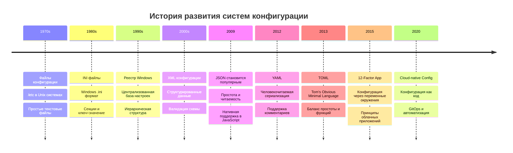
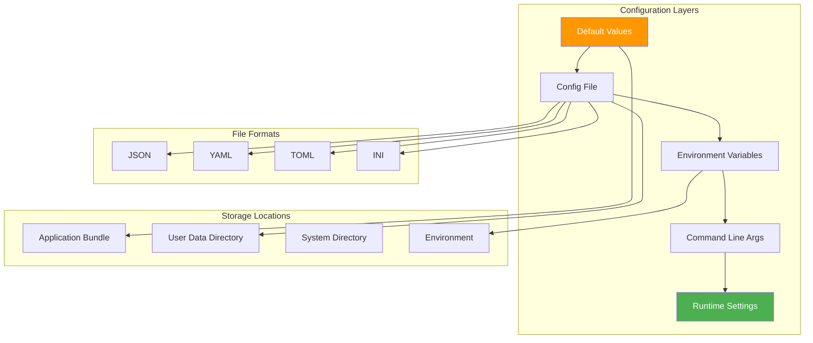
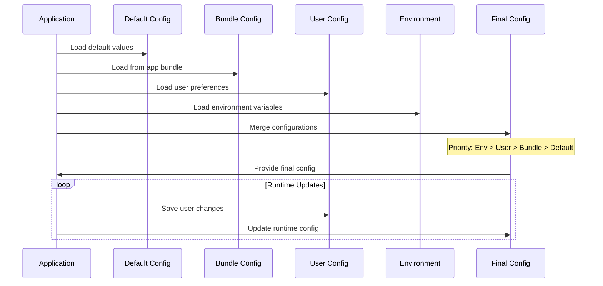
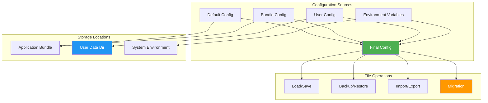

# Урок 6: Управление Конфигурацией и Данными

## 🎯 Цели урока

К концу этого урока вы будете понимать:
- Принципы управления конфигурацией в приложениях
- Стратегии хранения и миграции данных
- Кроссплатформенное управление файлами и путями
- Версионирование конфигураций и обратная совместимость
- Паттерны для работы с пользовательскими настройками

## 📚 Историческая справка

### Эволюция систем конфигурации



### Принципы 12-Factor App

**12-Factor App** определяет лучшие практики для создания современных приложений:

1. **Codebase** - одна кодовая база, много развертываний
2. **Dependencies** - явно объявленные зависимости
3. **Config** - конфигурация в переменных окружения
4. **Backing services** - внешние сервисы как ресурсы
5. **Build, release, run** - строгое разделение этапов
6. **Processes** - приложение как один или несколько процессов
7. **Port binding** - экспорт сервисов через порты
8. **Concurrency** - масштабирование через модель процессов
9. **Disposability** - быстрый запуск и корректное завершение
10. **Dev/prod parity** - среды максимально похожи
11. **Logs** - логи как потоки событий
12. **Admin processes** - административные задачи как разовые процессы

## 🏗️ Архитектура системы конфигурации

### Многоуровневая система настроек



### Жизненный цикл конфигурации



## 💻 Реализация системы конфигурации

### Базовый менеджер конфигурации

```python
import os
import json
import sys
import shutil
from pathlib import Path
from typing import Dict, Any, Optional, Union
from dataclasses import dataclass, asdict
from datetime import datetime
import logging

@dataclass
class AppInfo:
    """Информация о приложении."""
    name: str
    version: str
    developer: str
    last_updated: str
    build_date: str

@dataclass
class ServiceUrls:
    """URL-адреса внешних сервисов."""
    ip_check_api: str
    update_check_url: str
    support_url: str

class ConfigurationManager:
    """Менеджер конфигурации приложения."""
    
    def __init__(self, app_name: str = "VPNServerManager"):
        self.app_name = app_name
        self.logger = logging.getLogger(__name__)
        
        # Определяем пути
        self.app_data_dir = self._get_app_data_dir()
        self.config_file = self.app_data_dir / 'config.json'
        self.backup_dir = self.app_data_dir / 'backups'
        
        # Конфигурации по уровням
        self.default_config = self._get_default_config()
        self.bundle_config = self._load_bundle_config()
        self.user_config = self._load_user_config()
        self.env_config = self._load_env_config()
        
        # Финальная конфигурация
        self.final_config = self._merge_configs()
        
        # Создаем необходимые директории
        self._ensure_directories()
    
    def _get_app_data_dir(self) -> Path:
        """Определяет директорию для данных приложения."""
        is_frozen = getattr(sys, 'frozen', False)
        
        if is_frozen:
            # Собранное приложение
            if sys.platform == 'darwin':  # macOS
                return Path.home() / 'Library' / 'Application Support' / self.app_name
            elif sys.platform == 'win32':  # Windows
                appdata = os.environ.get('APPDATA', str(Path.home()))
                return Path(appdata) / self.app_name
            else:  # Linux
                return Path.home() / '.local' / 'share' / self.app_name
        else:
            # Режим разработки
            return Path.cwd()
    
    def _get_default_config(self) -> Dict[str, Any]:
        """Возвращает конфигурацию по умолчанию."""
        return {
            'app_info': {
                'name': self.app_name,
                'version': '1.0.0',
                'developer': 'Unknown',
                'last_updated': datetime.now().isoformat(),
                'build_date': datetime.now().isoformat()
            },
            'service_urls': {
                'ip_check_api': 'https://ipinfo.io/{ip}/json',
                'update_check_url': 'https://api.github.com/repos/user/repo/releases/latest',
                'support_url': 'https://example.com/support'
            },
            'ui_settings': {
                'theme': 'light',
                'scale': 100,
                'language': 'ru',
                'auto_start': False
            },
            'security': {
                'auto_lock_timeout': 300,
                'require_password': False,
                'encrypt_exports': True
            },
            'advanced': {
                'log_level': 'INFO',
                'debug_mode': False,
                'performance_monitoring': False
            }
        }
    
    def _load_bundle_config(self) -> Optional[Dict[str, Any]]:
        """Загружает конфигурацию из бандла приложения."""
        is_frozen = getattr(sys, 'frozen', False)
        
        if is_frozen:
            try:
                # В собранном приложении конфиг находится в ресурсах
                bundle_path = Path(sys._MEIPASS) / 'config.json'
                if bundle_path.exists():
                    return self._load_json_file(bundle_path)
            except Exception as e:
                self.logger.warning(f"Не удалось загрузить bundle config: {e}")
        else:
            # В режиме разработки ищем в корне проекта
            bundle_path = Path.cwd() / 'config.json'
            if bundle_path.exists():
                return self._load_json_file(bundle_path)
        
        return None
    
    def _load_user_config(self) -> Optional[Dict[str, Any]]:
        """Загружает пользовательскую конфигурацию."""
        if self.config_file.exists():
            return self._load_json_file(self.config_file)
        return None
    
    def _load_env_config(self) -> Dict[str, Any]:
        """Загружает конфигурацию из переменных окружения."""
        env_config = {}
        
        # Маппинг переменных окружения на конфигурацию
        env_mappings = {
            'VPN_MANAGER_THEME': ('ui_settings', 'theme'),
            'VPN_MANAGER_DEBUG': ('advanced', 'debug_mode'),
            'VPN_MANAGER_LOG_LEVEL': ('advanced', 'log_level'),
            'VPN_MANAGER_SCALE': ('ui_settings', 'scale'),
        }
        
        for env_var, (section, key) in env_mappings.items():
            value = os.environ.get(env_var)
            if value is not None:
                if section not in env_config:
                    env_config[section] = {}
                
                # Преобразуем типы
                if key in ['debug_mode', 'auto_start', 'encrypt_exports']:
                    env_config[section][key] = value.lower() in ('true', '1', 'yes')
                elif key in ['scale', 'auto_lock_timeout']:
                    try:
                        env_config[section][key] = int(value)
                    except ValueError:
                        self.logger.warning(f"Некорректное значение {env_var}: {value}")
                else:
                    env_config[section][key] = value
        
        return env_config
    
    def _load_json_file(self, file_path: Path) -> Optional[Dict[str, Any]]:
        """Безопасно загружает JSON файл."""
        try:
            with open(file_path, 'r', encoding='utf-8') as f:
                return json.load(f)
        except (json.JSONDecodeError, IOError) as e:
            self.logger.error(f"Ошибка загрузки {file_path}: {e}")
            return None
    
    def _merge_configs(self) -> Dict[str, Any]:
        """Объединяет конфигурации с приоритетом."""
        # Базовая конфигурация
        config = self.default_config.copy()
        
        # Применяем конфигурации по приоритету
        configs_to_merge = [
            self.bundle_config,
            self.user_config,
            self.env_config
        ]
        
        for cfg in configs_to_merge:
            if cfg:
                config = self._deep_merge(config, cfg)
        
        return config
    
    def _deep_merge(self, base: Dict[str, Any], override: Dict[str, Any]) -> Dict[str, Any]:
        """Глубоко объединяет словари."""
        result = base.copy()
        
        for key, value in override.items():
            if key in result and isinstance(result[key], dict) and isinstance(value, dict):
                result[key] = self._deep_merge(result[key], value)
            else:
                result[key] = value
        
        return result
    
    def _ensure_directories(self):
        """Создает необходимые директории."""
        directories = [
            self.app_data_dir,
            self.backup_dir,
            self.app_data_dir / 'data',
            self.app_data_dir / 'uploads',
            self.app_data_dir / 'logs'
        ]
        
        for directory in directories:
            directory.mkdir(parents=True, exist_ok=True)
    
    def get(self, key_path: str, default: Any = None) -> Any:
        """
        Получает значение по пути ключа.
        
        Args:
            key_path: Путь к ключу через точку (например, 'app_info.version')
            default: Значение по умолчанию
            
        Returns:
            Значение конфигурации
        """
        keys = key_path.split('.')
        value = self.final_config
        
        for key in keys:
            if isinstance(value, dict) and key in value:
                value = value[key]
            else:
                return default
        
        return value
    
    def set(self, key_path: str, value: Any, save: bool = True):
        """
        Устанавливает значение по пути ключа.
        
        Args:
            key_path: Путь к ключу через точку
            value: Новое значение
            save: Сохранить изменения в файл
        """
        keys = key_path.split('.')
        target = self.final_config
        
        # Навигируем до предпоследнего ключа
        for key in keys[:-1]:
            if key not in target:
                target[key] = {}
            target = target[key]
        
        # Устанавливаем значение
        target[keys[-1]] = value
        
        if save:
            self.save_user_config()
    
    def save_user_config(self):
        """Сохраняет пользовательскую конфигурацию."""
        try:
            # Создаем резервную копию если файл существует
            if self.config_file.exists():
                self._create_backup()
            
            # Фильтруем только пользовательские настройки
            user_settings = self._extract_user_settings()
            
            # Сохраняем с метаданными
            config_data = {
                'metadata': {
                    'version': '1.0',
                    'created_at': datetime.now().isoformat(),
                    'app_version': self.get('app_info.version', '1.0.0')
                },
                'settings': user_settings
            }
            
            with open(self.config_file, 'w', encoding='utf-8') as f:
                json.dump(config_data, f, indent=2, ensure_ascii=False)
            
            # Устанавливаем права доступа (только для владельца)
            if os.name != 'nt':
                os.chmod(self.config_file, 0o600)
            
            self.logger.info(f"Конфигурация сохранена: {self.config_file}")
            
        except Exception as e:
            self.logger.error(f"Ошибка сохранения конфигурации: {e}")
            raise
    
    def _extract_user_settings(self) -> Dict[str, Any]:
        """Извлекает только пользовательские настройки."""
        # Исключаем системные секции, которые не должны изменяться пользователем
        system_sections = {'app_info'}
        
        user_settings = {}
        for section, values in self.final_config.items():
            if section not in system_sections:
                user_settings[section] = values
        
        return user_settings
    
    def _create_backup(self):
        """Создает резервную копию конфигурации."""
        timestamp = datetime.now().strftime('%Y%m%d_%H%M%S')
        backup_file = self.backup_dir / f'config_backup_{timestamp}.json'
        
        try:
            shutil.copy2(self.config_file, backup_file)
            
            # Ограничиваем количество резервных копий
            self._cleanup_old_backups(max_backups=10)
            
        except Exception as e:
            self.logger.warning(f"Не удалось создать резервную копию: {e}")
    
    def _cleanup_old_backups(self, max_backups: int):
        """Удаляет старые резервные копии."""
        backup_files = list(self.backup_dir.glob('config_backup_*.json'))
        backup_files.sort(key=lambda x: x.stat().st_mtime, reverse=True)
        
        for old_backup in backup_files[max_backups:]:
            try:
                old_backup.unlink()
            except Exception as e:
                self.logger.warning(f"Не удалось удалить старую резервную копию {old_backup}: {e}")
    
    def migrate_config(self, from_version: str, to_version: str):
        """Выполняет миграцию конфигурации между версиями."""
        migrations = {
            ('1.0.0', '1.1.0'): self._migrate_1_0_to_1_1,
            ('1.1.0', '1.2.0'): self._migrate_1_1_to_1_2,
        }
        
        migration_key = (from_version, to_version)
        if migration_key in migrations:
            self.logger.info(f"Выполняется миграция конфигурации {from_version} -> {to_version}")
            migrations[migration_key]()
            self.save_user_config()
        else:
            self.logger.warning(f"Миграция {from_version} -> {to_version} не найдена")
    
    def _migrate_1_0_to_1_1(self):
        """Миграция с версии 1.0.0 на 1.1.0."""
        # Добавляем новые настройки безопасности
        if 'security' not in self.final_config:
            self.final_config['security'] = self.default_config['security'].copy()
        
        # Переименовываем старые ключи
        if 'auto_connect' in self.final_config.get('ui_settings', {}):
            old_value = self.final_config['ui_settings'].pop('auto_connect')
            self.final_config['ui_settings']['auto_start'] = old_value
    
    def _migrate_1_1_to_1_2(self):
        """Миграция с версии 1.1.0 на 1.2.0."""
        # Добавляем настройки мониторинга
        if 'advanced' not in self.final_config:
            self.final_config['advanced'] = self.default_config['advanced'].copy()
    
    def export_config(self, file_path: Path, include_sensitive: bool = False):
        """Экспортирует конфигурацию в файл."""
        export_data = {
            'metadata': {
                'exported_at': datetime.now().isoformat(),
                'app_version': self.get('app_info.version'),
                'export_version': '1.0'
            },
            'config': self._extract_user_settings()
        }
        
        # Исключаем чувствительные данные если не запрошено
        if not include_sensitive:
            export_data['config'] = self._remove_sensitive_data(export_data['config'])
        
        with open(file_path, 'w', encoding='utf-8') as f:
            json.dump(export_data, f, indent=2, ensure_ascii=False)
    
    def import_config(self, file_path: Path, merge: bool = True):
        """Импортирует конфигурацию из файла."""
        with open(file_path, 'r', encoding='utf-8') as f:
            import_data = json.load(f)
        
        imported_config = import_data.get('config', {})
        
        if merge:
            # Объединяем с существующей конфигурацией
            self.final_config = self._deep_merge(self.final_config, imported_config)
        else:
            # Полная замена пользовательских настроек
            for section, values in imported_config.items():
                self.final_config[section] = values
        
        self.save_user_config()
    
    def _remove_sensitive_data(self, config: Dict[str, Any]) -> Dict[str, Any]:
        """Удаляет чувствительные данные из конфигурации."""
        sensitive_keys = {'password', 'token', 'api_key', 'secret'}
        
        def clean_dict(d):
            if isinstance(d, dict):
                return {
                    k: clean_dict(v) if k.lower() not in sensitive_keys else '***'
                    for k, v in d.items()
                }
            return d
        
        return clean_dict(config)
    
    def reset_to_defaults(self, section: Optional[str] = None):
        """Сбрасывает конфигурацию к значениям по умолчанию."""
        if section:
            if section in self.default_config:
                self.final_config[section] = self.default_config[section].copy()
        else:
            self.final_config = self.default_config.copy()
        
        self.save_user_config()
    
    def validate_config(self) -> Dict[str, Any]:
        """Валидирует конфигурацию и возвращает отчет."""
        issues = []
        
        # Проверяем обязательные секции
        required_sections = ['app_info', 'service_urls', 'ui_settings']
        for section in required_sections:
            if section not in self.final_config:
                issues.append(f"Отсутствует обязательная секция: {section}")
        
        # Проверяем типы данных
        type_checks = {
            ('ui_settings', 'scale'): int,
            ('ui_settings', 'auto_start'): bool,
            ('security', 'auto_lock_timeout'): int,
            ('advanced', 'debug_mode'): bool,
        }
        
        for (section, key), expected_type in type_checks.items():
            value = self.get(f"{section}.{key}")
            if value is not None and not isinstance(value, expected_type):
                issues.append(f"Неверный тип для {section}.{key}: ожидается {expected_type.__name__}")
        
        # Проверяем диапазоны значений
        range_checks = {
            ('ui_settings', 'scale'): (50, 200),
            ('security', 'auto_lock_timeout'): (0, 3600),
        }
        
        for (section, key), (min_val, max_val) in range_checks.items():
            value = self.get(f"{section}.{key}")
            if value is not None and not (min_val <= value <= max_val):
                issues.append(f"Значение {section}.{key} вне допустимого диапазона: {min_val}-{max_val}")
        
        return {
            'valid': len(issues) == 0,
            'issues': issues,
            'checked_at': datetime.now().isoformat()
        }

# Глобальный экземпляр менеджера конфигурации
config_manager = ConfigurationManager()

# Функции для обратной совместимости
def get_config(key_path: str, default: Any = None) -> Any:
    """Получает значение конфигурации."""
    return config_manager.get(key_path, default)

def set_config(key_path: str, value: Any, save: bool = True):
    """Устанавливает значение конфигурации."""
    config_manager.set(key_path, value, save)

def save_config():
    """Сохраняет конфигурацию."""
    config_manager.save_user_config()
```

## 📊 Миграция данных

### Система версионирования и миграций

```python
import json
import shutil
from pathlib import Path
from typing import Dict, List, Callable, Any
from dataclasses import dataclass
from datetime import datetime
import logging

@dataclass
class MigrationInfo:
    """Информация о миграции."""
    from_version: str
    to_version: str
    description: str
    migration_func: Callable[[Dict[str, Any]], Dict[str, Any]]
    rollback_func: Optional[Callable[[Dict[str, Any]], Dict[str, Any]]] = None

class DataMigrationManager:
    """Менеджер миграций данных."""
    
    def __init__(self, data_dir: Path):
        self.data_dir = data_dir
        self.migration_log_file = data_dir / 'migration_log.json'
        self.logger = logging.getLogger(__name__)
        
        # Регистрируем миграции
        self.migrations: List[MigrationInfo] = []
        self._register_migrations()
        
        # История миграций
        self.migration_history = self._load_migration_history()
    
    def _register_migrations(self):
        """Регистрирует все доступные миграции."""
        
        # Миграция 1.0.0 -> 1.1.0: Добавление поля last_check для серверов
        self.migrations.append(MigrationInfo(
            from_version="1.0.0",
            to_version="1.1.0",
            description="Добавление поля last_check для серверов",
            migration_func=self._migrate_add_last_check,
            rollback_func=self._rollback_remove_last_check
        ))
        
        # Миграция 1.1.0 -> 1.2.0: Изменение структуры провайдеров
        self.migrations.append(MigrationInfo(
            from_version="1.1.0",
            to_version="1.2.0",
            description="Реструктуризация информации о провайдерах",
            migration_func=self._migrate_provider_structure,
            rollback_func=self._rollback_provider_structure
        ))
        
        # Миграция 1.2.0 -> 1.3.0: Добавление системы тегов
        self.migrations.append(MigrationInfo(
            from_version="1.2.0",
            to_version="1.3.0",
            description="Добавление системы тегов для серверов",
            migration_func=self._migrate_add_tags,
            rollback_func=self._rollback_remove_tags
        ))
    
    def _migrate_add_last_check(self, data: Dict[str, Any]) -> Dict[str, Any]:
        """Добавляет поле last_check для всех серверов."""
        if isinstance(data, list):
            for server in data:
                if isinstance(server, dict) and 'last_check' not in server:
                    server['last_check'] = None
        return data
    
    def _rollback_remove_last_check(self, data: Dict[str, Any]) -> Dict[str, Any]:
        """Удаляет поле last_check."""
        if isinstance(data, list):
            for server in data:
                if isinstance(server, dict) and 'last_check' in server:
                    del server['last_check']
        return data
    
    def _migrate_provider_structure(self, data: Dict[str, Any]) -> Dict[str, Any]:
        """Реструктурирует информацию о провайдерах."""
        if isinstance(data, list):
            for server in data:
                if isinstance(server, dict) and 'provider' in server:
                    provider = server['provider']
                    if isinstance(provider, str):
                        # Преобразуем строку в объект
                        server['provider'] = {
                            'name': provider,
                            'type': 'vps',
                            'region': 'unknown'
                        }
        return data
    
    def _rollback_provider_structure(self, data: Dict[str, Any]) -> Dict[str, Any]:
        """Откатывает структуру провайдеров."""
        if isinstance(data, list):
            for server in data:
                if isinstance(server, dict) and 'provider' in server:
                    provider = server['provider']
                    if isinstance(provider, dict) and 'name' in provider:
                        # Преобразуем объект обратно в строку
                        server['provider'] = provider['name']
        return data
    
    def _migrate_add_tags(self, data: Dict[str, Any]) -> Dict[str, Any]:
        """Добавляет систему тегов."""
        if isinstance(data, list):
            for server in data:
                if isinstance(server, dict) and 'tags' not in server:
                    # Автоматически назначаем теги на основе данных
                    tags = []
                    
                    if server.get('provider'):
                        if isinstance(server['provider'], dict):
                            provider_name = server['provider'].get('name', '').lower()
                        else:
                            provider_name = str(server['provider']).lower()
                        
                        if 'aws' in provider_name:
                            tags.append('cloud')
                        elif 'digitalocean' in provider_name:
                            tags.append('cloud')
                        elif 'hetzner' in provider_name:
                            tags.append('dedicated')
                    
                    if server.get('ip', '').startswith('192.168.'):
                        tags.append('local')
                    else:
                        tags.append('remote')
                    
                    server['tags'] = tags
        return data
    
    def _rollback_remove_tags(self, data: Dict[str, Any]) -> Dict[str, Any]:
        """Удаляет систему тегов."""
        if isinstance(data, list):
            for server in data:
                if isinstance(server, dict) and 'tags' in server:
                    del server['tags']
        return data
    
    def _load_migration_history(self) -> List[Dict[str, Any]]:
        """Загружает историю миграций."""
        if self.migration_log_file.exists():
            try:
                with open(self.migration_log_file, 'r', encoding='utf-8') as f:
                    return json.load(f)
            except (json.JSONDecodeError, IOError) as e:
                self.logger.error(f"Ошибка загрузки истории миграций: {e}")
        return []
    
    def _save_migration_history(self):
        """Сохраняет историю миграций."""
        try:
            with open(self.migration_log_file, 'w', encoding='utf-8') as f:
                json.dump(self.migration_history, f, indent=2, ensure_ascii=False)
        except IOError as e:
            self.logger.error(f"Ошибка сохранения истории миграций: {e}")
    
    def get_current_version(self, data_file: Path) -> str:
        """Определяет текущую версию данных."""
        if not data_file.exists():
            return "1.0.0"  # Новый файл
        
        # Ищем последнюю миграцию для этого файла
        file_migrations = [
            m for m in self.migration_history
            if m.get('file_path') == str(data_file)
        ]
        
        if file_migrations:
            # Возвращаем версию последней успешной миграции
            latest = max(file_migrations, key=lambda x: x.get('timestamp', ''))
            return latest.get('to_version', '1.0.0')
        
        # Анализируем структуру данных для определения версии
        try:
            with open(data_file, 'r', encoding='utf-8') as f:
                content = f.read().strip()
            
            if not content:
                return "1.0.0"
            
            # Если файл зашифрован, не можем определить версию
            if not content.startswith('[') and not content.startswith('{'):
                return "1.0.0"  # Предполагаем старую версию
            
            data = json.loads(content)
            
            # Анализируем структуру для определения версии
            if isinstance(data, list) and data:
                server = data[0]
                if 'tags' in server:
                    return "1.3.0"
                elif isinstance(server.get('provider'), dict):
                    return "1.2.0"
                elif 'last_check' in server:
                    return "1.1.0"
                else:
                    return "1.0.0"
            
            return "1.0.0"
            
        except Exception as e:
            self.logger.warning(f"Не удалось определить версию {data_file}: {e}")
            return "1.0.0"
    
    def migrate_data(self, data_file: Path, target_version: str) -> bool:
        """
        Выполняет миграцию данных до целевой версии.
        
        Args:
            data_file: Путь к файлу данных
            target_version: Целевая версия
            
        Returns:
            True если миграция успешна
        """
        try:
            current_version = self.get_current_version(data_file)
            
            if current_version == target_version:
                self.logger.info(f"Файл {data_file} уже имеет версию {target_version}")
                return True
            
            self.logger.info(f"Миграция {data_file}: {current_version} -> {target_version}")
            
            # Создаем резервную копию
            backup_file = self._create_backup(data_file)
            
            # Загружаем данные
            data = self._load_data_file(data_file)
            if data is None:
                return False
            
            # Находим путь миграций
            migration_path = self._find_migration_path(current_version, target_version)
            if not migration_path:
                self.logger.error(f"Не найден путь миграции {current_version} -> {target_version}")
                return False
            
            # Выполняем миграции по порядку
            for migration in migration_path:
                self.logger.info(f"Применяется миграция: {migration.description}")
                
                try:
                    data = migration.migration_func(data)
                    
                    # Записываем в лог
                    self.migration_history.append({
                        'file_path': str(data_file),
                        'from_version': migration.from_version,
                        'to_version': migration.to_version,
                        'timestamp': datetime.now().isoformat(),
                        'description': migration.description,
                        'backup_file': str(backup_file)
                    })
                    
                except Exception as e:
                    self.logger.error(f"Ошибка миграции {migration.from_version} -> {migration.to_version}: {e}")
                    self._restore_backup(data_file, backup_file)
                    return False
            
            # Сохраняем мигрированные данные
            self._save_data_file(data_file, data)
            self._save_migration_history()
            
            self.logger.info(f"Миграция завершена успешно: {current_version} -> {target_version}")
            return True
            
        except Exception as e:
            self.logger.error(f"Ошибка миграции: {e}")
            return False
    
    def _find_migration_path(self, from_version: str, to_version: str) -> List[MigrationInfo]:
        """Находит путь миграций между версиями."""
        if from_version == to_version:
            return []
        
        # Простая реализация для линейного пути версий
        # В более сложных случаях можно использовать алгоритм поиска в графе
        path = []
        current = from_version
        
        while current != to_version:
            next_migration = None
            for migration in self.migrations:
                if migration.from_version == current:
                    next_migration = migration
                    break
            
            if next_migration is None:
                return []  # Путь не найден
            
            path.append(next_migration)
            current = next_migration.to_version
        
        return path
    
    def _create_backup(self, data_file: Path) -> Path:
        """Создает резервную копию файла данных."""
        timestamp = datetime.now().strftime('%Y%m%d_%H%M%S')
        backup_file = data_file.parent / f"{data_file.stem}_backup_{timestamp}{data_file.suffix}"
        
        shutil.copy2(data_file, backup_file)
        return backup_file
    
    def _restore_backup(self, data_file: Path, backup_file: Path):
        """Восстанавливает данные из резервной копии."""
        if backup_file.exists():
            shutil.copy2(backup_file, data_file)
            self.logger.info(f"Данные восстановлены из резервной копии: {backup_file}")
    
    def _load_data_file(self, data_file: Path) -> Any:
        """Загружает файл данных."""
        try:
            with open(data_file, 'r', encoding='utf-8') as f:
                content = f.read().strip()
            
            if not content:
                return []
            
            return json.loads(content)
            
        except Exception as e:
            self.logger.error(f"Ошибка загрузки данных из {data_file}: {e}")
            return None
    
    def _save_data_file(self, data_file: Path, data: Any):
        """Сохраняет файл данных."""
        with open(data_file, 'w', encoding='utf-8') as f:
            json.dump(data, f, indent=2, ensure_ascii=False)
    
    def rollback_migration(self, data_file: Path, to_version: str) -> bool:
        """
        Откатывает миграцию до указанной версии.
        
        Args:
            data_file: Путь к файлу данных
            to_version: Версия для отката
            
        Returns:
            True если откат успешен
        """
        try:
            current_version = self.get_current_version(data_file)
            
            if current_version == to_version:
                self.logger.info(f"Файл {data_file} уже имеет версию {to_version}")
                return True
            
            # Находим миграции для отката (в обратном порядке)
            file_migrations = [
                m for m in self.migration_history
                if m.get('file_path') == str(data_file)
            ]
            
            file_migrations.sort(key=lambda x: x.get('timestamp', ''), reverse=True)
            
            # Создаем резервную копию
            backup_file = self._create_backup(data_file)
            
            # Загружаем данные
            data = self._load_data_file(data_file)
            if data is None:
                return False
            
            # Выполняем откат
            for migration_record in file_migrations:
                if migration_record.get('to_version') == to_version:
                    break
                
                # Находим соответствующую миграцию
                migration = next(
                    (m for m in self.migrations 
                     if m.from_version == migration_record.get('from_version') 
                     and m.to_version == migration_record.get('to_version')),
                    None
                )
                
                if migration and migration.rollback_func:
                    self.logger.info(f"Откат миграции: {migration.description}")
                    data = migration.rollback_func(data)
                else:
                    self.logger.warning(f"Откат недоступен для миграции {migration_record}")
            
            # Сохраняем данные
            self._save_data_file(data_file, data)
            
            # Обновляем историю миграций
            self.migration_history = [
                m for m in self.migration_history
                if not (m.get('file_path') == str(data_file) 
                       and m.get('to_version') > to_version)
            ]
            self._save_migration_history()
            
            self.logger.info(f"Откат завершен: {current_version} -> {to_version}")
            return True
            
        except Exception as e:
            self.logger.error(f"Ошибка отката: {e}")
            return False

# Пример использования
def example_migration():
    """Пример использования системы миграций."""
    data_dir = Path('./data')
    migration_manager = DataMigrationManager(data_dir)
    
    # Файл с данными серверов
    servers_file = data_dir / 'servers.json'
    
    # Проверяем текущую версию
    current_version = migration_manager.get_current_version(servers_file)
    print(f"Текущая версия данных: {current_version}")
    
    # Выполняем миграцию до последней версии
    target_version = "1.3.0"
    success = migration_manager.migrate_data(servers_file, target_version)
    
    if success:
        print(f"Миграция до версии {target_version} успешна")
    else:
        print("Ошибка миграции")

if __name__ == "__main__":
    example_migration()
```

## 🚀 Практические упражнения

### Упражнение 1: Система настроек

Создайте систему настроек:
1. Конфигурация по умолчанию
2. Пользовательские настройки
3. Переменные окружения

### Упражнение 2: Миграция данных

Реализуйте:
1. Версионирование структуры данных
2. Автоматическую миграцию
3. Откат изменений

### Упражнение 3: Кроссплатформенность

Добавьте поддержку:
1. Разных ОС (Windows, macOS, Linux)
2. Портативного режима
3. Сетевого хранения конфигурации

## 📊 Диаграмма системы конфигурации проекта



## 🌟 Лучшие практики

### 1. Принципы конфигурации

```python
# ✅ Хорошо - многоуровневая конфигурация
config = merge_configs([
    default_config,
    user_config,
    env_config,
    runtime_config
])

# ❌ Плохо - жестко заданные значения
SERVER_URL = "https://api.example.com"
TIMEOUT = 30
```

### 2. Валидация конфигурации

```python
# ✅ Хорошо - валидация типов и диапазонов
def validate_scale(value):
    if not isinstance(value, int):
        raise ValueError("Scale must be integer")
    if not 50 <= value <= 200:
        raise ValueError("Scale must be between 50-200")
    return value

# ❌ Плохо - отсутствие валидации
scale = config.get('scale', 100)  # Может быть любым значением
```

### 3. Безопасность конфигурации

```python
# ✅ Хорошо - чувствительные данные отдельно
api_key = os.environ.get('API_KEY')
config = load_config('config.json')

# ❌ Плохо - секреты в конфигурации
config = {
    'api_key': 'secret123',  # Попадет в Git
    'database_password': 'password'
}
```

## 📚 Дополнительные материалы

### Полезные ссылки
- [The Twelve-Factor App](https://12factor.net/)
- [Python configparser](https://docs.python.org/3/library/configparser.html)
- [TOML Format Specification](https://toml.io/)

### Альтернативные форматы
- **YAML** - человекочитаемый, поддержка комментариев
- **TOML** - простой и читаемый
- **Python files** - максимальная гибкость
- **Environment variables** - 12-factor approach

## 🎯 Контрольные вопросы

1. Какие уровни конфигурации должны быть в приложении?
2. Как обеспечить обратную совместимость при изменении структуры данных?
3. Где хранить конфигурацию в разных операционных системах?
4. Как безопасно хранить чувствительные настройки?
5. Когда использовать миграции данных?

## 🚀 Следующий урок

В следующем уроке мы изучим **PyWebView и создание нативного GUI**, научимся создавать кроссплатформенные десктопные приложения с веб-интерфейсом.

---

*Этот урок является частью курса "VPN Server Manager: Архитектура и принципы разработки"*
