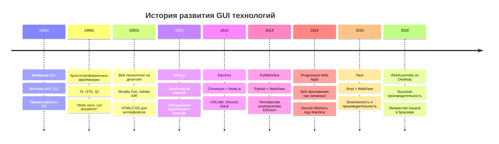
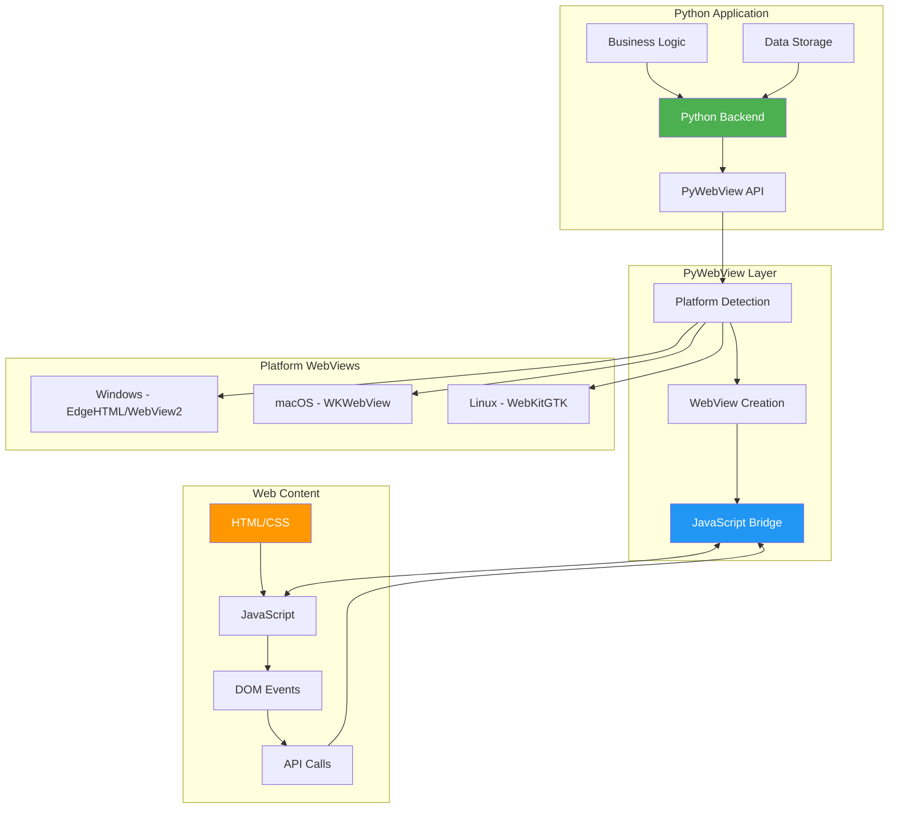
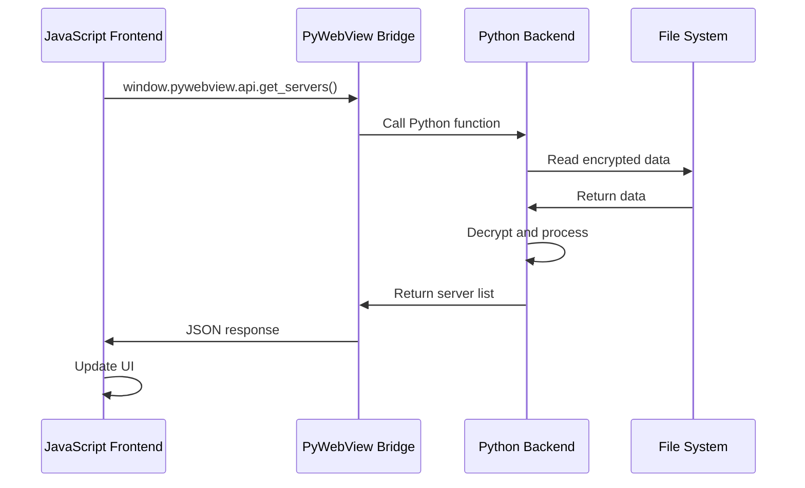
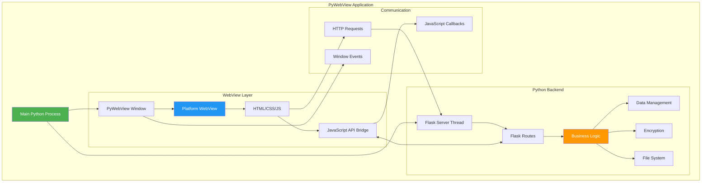

# Урок 7: PyWebView и Создание Нативного GUI

## 🎯 Цели урока

К концу этого урока вы будете понимать:
- Историю развития гибридных десктопных приложений
- Принципы работы PyWebView и веб-движков
- Создание кроссплатформенных GUI приложений
- Взаимодействие между JavaScript и Python
- Упаковка и распространение готовых приложений

## 📚 Историческая справка

### Эволюция десктопных GUI фреймворков



### Сравнение подходов к GUI

| Подход | Преимущества | Недостатки | Примеры |
|--------|-------------|------------|---------|
| **Нативный** | Максимальная производительность, интеграция с ОС | Разная кодовая база для каждой ОС | WinUI, Cocoa, GTK |
| **Кроссплатформенный** | Единая кодовая база | Компромиссы в UX | Qt, Tkinter, wxPython |
| **Веб-технологии** | Быстрая разработка, богатый UI | Потребление ресурсов | Electron, Tauri |
| **Гибридный** | Баланс производительности и простоты | Ограничения веб-движка | PyWebView, CEF |

## �� PyWebView: Концепции и архитектура

### Принцип работы PyWebView



### Архитектура коммуникации



## 💻 Создание PyWebView приложения

### Базовая структура приложения

```python
import webview
import threading
import time
import sys
from pathlib import Path

class DesktopAPI:
    """API для взаимодействия между JavaScript и Python."""
    
    def __init__(self):
        self.data = {"message": "Привет из Python!"}
    
    def get_message(self):
        """Получает сообщение."""
        return self.data["message"]
    
    def set_message(self, message):
        """Устанавливает новое сообщение."""
        self.data["message"] = message
        return {"status": "success", "message": f"Сообщение обновлено: {message}"}
    
    def get_system_info(self):
        """Возвращает информацию о системе."""
        import platform
        import psutil
        
        return {
            "platform": platform.system(),
            "platform_version": platform.version(),
            "python_version": sys.version,
            "cpu_count": psutil.cpu_count(),
            "memory_gb": round(psutil.virtual_memory().total / (1024**3), 2),
            "current_directory": str(Path.cwd())
        }
    
    def open_file_dialog(self):
        """Открывает диалог выбора файла."""
        file_types = ('Image Files (*.png;*.jpg)', 'All files (*.*)')
        result = webview.windows[0].create_file_dialog(
            webview.OPEN_DIALOG,
            directory='',
            allow_multiple=False,
            file_types=file_types
        )
        return result[0] if result else None
    
    def save_file_dialog(self):
        """Открывает диалог сохранения файла."""
        result = webview.windows[0].create_file_dialog(
            webview.SAVE_DIALOG,
            directory='',
            save_filename='config.json'
        )
        return result
    
    def show_notification(self, title, message):
        """Показывает системное уведомление."""
        try:
            import plyer
            plyer.notification.notify(
                title=title,
                message=message,
                timeout=5
            )
            return {"status": "success"}
        except ImportError:
            return {"status": "error", "message": "plyer не установлен"}
    
    def minimize_window(self):
        """Сворачивает окно."""
        webview.windows[0].minimize()
        return {"status": "minimized"}
    
    def toggle_fullscreen(self):
        """Переключает полноэкранный режим."""
        webview.windows[0].toggle_fullscreen()
        return {"status": "toggled"}

def create_html_content():
    """Создает HTML содержимое для приложения."""
    return '''
    <!DOCTYPE html>
    <html lang="ru">
    <head>
        <meta charset="UTF-8">
        <meta name="viewport" content="width=device-width, initial-scale=1.0">
        <title>PyWebView Demo</title>
        <style>
            * {
                margin: 0;
                padding: 0;
                box-sizing: border-box;
            }
            
            body {
                font-family: -apple-system, BlinkMacSystemFont, 'Segoe UI', Roboto, sans-serif;
                background: linear-gradient(135deg, #667eea 0%, #764ba2 100%);
                color: #333;
                min-height: 100vh;
                padding: 20px;
            }
            
            .container {
                max-width: 800px;
                margin: 0 auto;
                background: white;
                border-radius: 10px;
                padding: 30px;
                box-shadow: 0 10px 30px rgba(0,0,0,0.2);
            }
            
            h1 {
                color: #4a5568;
                margin-bottom: 30px;
                text-align: center;
            }
            
            .section {
                margin-bottom: 30px;
                padding: 20px;
                border-radius: 8px;
                background: #f7fafc;
                border-left: 4px solid #4299e1;
            }
            
            .button {
                background: linear-gradient(45deg, #4299e1, #667eea);
                color: white;
                border: none;
                padding: 12px 24px;
                border-radius: 6px;
                cursor: pointer;
                font-size: 14px;
                margin: 5px;
                transition: transform 0.2s, box-shadow 0.2s;
            }
            
            .button:hover {
                transform: translateY(-2px);
                box-shadow: 0 5px 15px rgba(0,0,0,0.2);
            }
            
            .input-group {
                margin: 15px 0;
            }
            
            .input-group label {
                display: block;
                margin-bottom: 5px;
                font-weight: 600;
                color: #4a5568;
            }
            
            .input-group input {
                width: 100%;
                padding: 10px;
                border: 2px solid #e2e8f0;
                border-radius: 6px;
                font-size: 14px;
                transition: border-color 0.2s;
            }
            
            .input-group input:focus {
                outline: none;
                border-color: #4299e1;
            }
            
            .result {
                background: #edf2f7;
                padding: 15px;
                border-radius: 6px;
                margin-top: 15px;
                border-left: 4px solid #38a169;
                font-family: monospace;
                white-space: pre-wrap;
                max-height: 200px;
                overflow-y: auto;
            }
            
            .window-controls {
                position: fixed;
                top: 10px;
                right: 10px;
                z-index: 1000;
            }
            
            .window-controls button {
                background: rgba(0,0,0,0.1);
                border: none;
                padding: 8px 12px;
                margin: 0 2px;
                border-radius: 4px;
                cursor: pointer;
                backdrop-filter: blur(10px);
            }
            
            .system-info {
                display: grid;
                grid-template-columns: repeat(auto-fit, minmax(250px, 1fr));
                gap: 15px;
                margin-top: 20px;
            }
            
            .info-card {
                background: white;
                padding: 15px;
                border-radius: 8px;
                border: 1px solid #e2e8f0;
            }
            
            .info-card h4 {
                color: #4a5568;
                margin-bottom: 10px;
            }
            
            .loading {
                display: inline-block;
                width: 20px;
                height: 20px;
                border: 3px solid #f3f3f3;
                border-top: 3px solid #4299e1;
                border-radius: 50%;
                animation: spin 1s linear infinite;
            }
            
            @keyframes spin {
                0% { transform: rotate(0deg); }
                100% { transform: rotate(360deg); }
            }
        </style>
    </head>
    <body>
        <div class="window-controls">
            <button onclick="minimizeWindow()" title="Свернуть">−</button>
            <button onclick="toggleFullscreen()" title="Полный экран">□</button>
        </div>
        
        <div class="container">
            <h1>🐍 PyWebView Демо Приложение</h1>
            
            <!-- Секция сообщений -->
            <div class="section">
                <h3>📝 Управление сообщениями</h3>
                <p>Демонстрация двустороннего взаимодействия Python ↔ JavaScript</p>
                
                <div class="input-group">
                    <label for="messageInput">Введите сообщение:</label>
                    <input type="text" id="messageInput" placeholder="Ваше сообщение...">
                </div>
                
                <button class="button" onclick="getMessage()">📨 Получить сообщение</button>
                <button class="button" onclick="setMessage()">💾 Сохранить сообщение</button>
                
                <div id="messageResult" class="result" style="display: none;"></div>
            </div>
            
            <!-- Секция системной информации -->
            <div class="section">
                <h3>💻 Системная информация</h3>
                <p>Получение данных о системе через Python API</p>
                
                <button class="button" onclick="getSystemInfo()">🔍 Получить информацию</button>
                
                <div id="systemInfo" class="system-info"></div>
            </div>
            
            <!-- Секция файловых диалогов -->
            <div class="section">
                <h3>📁 Файловые диалоги</h3>
                <p>Нативные диалоги операционной системы</p>
                
                <button class="button" onclick="openFileDialog()">📂 Открыть файл</button>
                <button class="button" onclick="saveFileDialog()">�� Сохранить файл</button>
                
                <div id="fileResult" class="result" style="display: none;"></div>
            </div>
            
            <!-- Секция уведомлений -->
            <div class="section">
                <h3>🔔 Системные уведомления</h3>
                <p>Отправка нативных уведомлений ОС</p>
                
                <div class="input-group">
                    <label for="notificationTitle">Заголовок:</label>
                    <input type="text" id="notificationTitle" placeholder="Заголовок уведомления">
                </div>
                
                <div class="input-group">
                    <label for="notificationMessage">Сообщение:</label>
                    <input type="text" id="notificationMessage" placeholder="Текст уведомления">
                </div>
                
                <button class="button" onclick="showNotification()">🔔 Показать уведомление</button>
            </div>
        </div>
        
        <script>
            // Проверяем доступность PyWebView API
            function checkAPI() {
                if (typeof window.pywebview === 'undefined') {
                    console.error('PyWebView API недоступен');
                    return false;
                }
                return true;
            }
            
            // Показать/скрыть результат
            function showResult(elementId, content, isError = false) {
                const element = document.getElementById(elementId);
                element.style.display = 'block';
                element.textContent = typeof content === 'object' 
                    ? JSON.stringify(content, null, 2) 
                    : content;
                element.style.borderLeftColor = isError ? '#e53e3e' : '#38a169';
            }
            
            // Показать индикатор загрузки
            function showLoading(elementId) {
                const element = document.getElementById(elementId);
                element.style.display = 'block';
                element.innerHTML = '<span class="loading"></span> Загрузка...';
            }
            
            // Получить сообщение из Python
            async function getMessage() {
                if (!checkAPI()) return;
                
                showLoading('messageResult');
                
                try {
                    const result = await window.pywebview.api.get_message();
                    showResult('messageResult', `Сообщение: ${result}`);
                } catch (error) {
                    showResult('messageResult', `Ошибка: ${error}`, true);
                }
            }
            
            // Отправить сообщение в Python
            async function setMessage() {
                if (!checkAPI()) return;
                
                const messageInput = document.getElementById('messageInput');
                const message = messageInput.value.trim();
                
                if (!message) {
                    showResult('messageResult', 'Введите сообщение!', true);
                    return;
                }
                
                showLoading('messageResult');
                
                try {
                    const result = await window.pywebview.api.set_message(message);
                    showResult('messageResult', result);
                    messageInput.value = '';
                } catch (error) {
                    showResult('messageResult', `Ошибка: ${error}`, true);
                }
            }
            
            // Получить системную информацию
            async function getSystemInfo() {
                if (!checkAPI()) return;
                
                const container = document.getElementById('systemInfo');
                container.innerHTML = '<span class="loading"></span> Получение информации...';
                
                try {
                    const info = await window.pywebview.api.get_system_info();
                    
                    container.innerHTML = `
                        <div class="info-card">
                            <h4>🖥️ Платформа</h4>
                            <p>${info.platform} ${info.platform_version}</p>
                        </div>
                        <div class="info-card">
                            <h4>🐍 Python</h4>
                            <p>${info.python_version}</p>
                        </div>
                        <div class="info-card">
                            <h4>⚡ Процессор</h4>
                            <p>${info.cpu_count} ядер</p>
                        </div>
                        <div class="info-card">
                            <h4>🧠 Память</h4>
                            <p>${info.memory_gb} ГБ</p>
                        </div>
                        <div class="info-card">
                            <h4>📂 Директория</h4>
                            <p>${info.current_directory}</p>
                        </div>
                    `;
                } catch (error) {
                    container.innerHTML = `<div class="result">Ошибка: ${error}</div>`;
                }
            }
            
            // Открыть файловый диалог
            async function openFileDialog() {
                if (!checkAPI()) return;
                
                showLoading('fileResult');
                
                try {
                    const result = await window.pywebview.api.open_file_dialog();
                    showResult('fileResult', result ? `Выбран файл: ${result}` : 'Файл не выбран');
                } catch (error) {
                    showResult('fileResult', `Ошибка: ${error}`, true);
                }
            }
            
            // Сохранить файл
            async function saveFileDialog() {
                if (!checkAPI()) return;
                
                showLoading('fileResult');
                
                try {
                    const result = await window.pywebview.api.save_file_dialog();
                    showResult('fileResult', result ? `Файл будет сохранен: ${result}` : 'Сохранение отменено');
                } catch (error) {
                    showResult('fileResult', `Ошибка: ${error}`, true);
                }
            }
            
            // Показать уведомление
            async function showNotification() {
                if (!checkAPI()) return;
                
                const title = document.getElementById('notificationTitle').value.trim();
                const message = document.getElementById('notificationMessage').value.trim();
                
                if (!title || !message) {
                    alert('Заполните заголовок и сообщение!');
                    return;
                }
                
                try {
                    const result = await window.pywebview.api.show_notification(title, message);
                    if (result.status === 'success') {
                        alert('Уведомление отправлено!');
                    } else {
                        alert(`Ошибка: ${result.message}`);
                    }
                } catch (error) {
                    alert(`Ошибка: ${error}`);
                }
            }
            
            // Управление окном
            async function minimizeWindow() {
                if (!checkAPI()) return;
                await window.pywebview.api.minimize_window();
            }
            
            async function toggleFullscreen() {
                if (!checkAPI()) return;
                await window.pywebview.api.toggle_fullscreen();
            }
            
            // Инициализация при загрузке страницы
            document.addEventListener('DOMContentLoaded', function() {
                console.log('PyWebView Demo загружено');
                
                // Проверяем доступность API
                if (checkAPI()) {
                    console.log('PyWebView API доступен');
                } else {
                    console.warn('PyWebView API недоступен - работаем в режиме браузера');
                }
            });
        </script>
    </body>
    </html>
    '''

def create_pywebview_app():
    """Создает и запускает PyWebView приложение."""
    
    # Создаем API объект
    api = DesktopAPI()
    
    # Получаем HTML содержимое
    html_content = create_html_content()
    
    # Создаем окно
    window = webview.create_window(
        title='PyWebView Demo Application',
        html=html_content,
        js_api=api,
        width=1000,
        height=700,
        min_size=(600, 400),
        resizable=True,
        shadow=True,
        on_top=False,
        text_select=True
    )
    
    # Обработчики событий окна
    def on_window_loaded():
        print("✅ Окно загружено")
    
    def on_window_closing():
        print("👋 Окно закрывается")
        return True  # Разрешаем закрытие
    
    # Регистрируем обработчики
    window.events.loaded += on_window_loaded
    window.events.closing += on_window_closing
    
    # Запускаем приложение
    print("🚀 Запуск PyWebView приложения...")
    webview.start(debug=False)  # debug=True для отладки
    print("🏁 Приложение завершено")

if __name__ == "__main__":
    create_pywebview_app()
```

## 🔗 Продвинутое взаимодействие JS ↔ Python

### Система событий и обратных вызовов

```python
import webview
import threading
import time
import json
from typing import Dict, Any, Callable, List
from dataclasses import dataclass, asdict
from datetime import datetime

@dataclass
class EventData:
    """Структура данных события."""
    event_type: str
    data: Dict[str, Any]
    timestamp: str
    sender: str

class EventSystem:
    """Система событий для связи JavaScript и Python."""
    
    def __init__(self):
        self.listeners: Dict[str, List[Callable]] = {}
        self.window = None
    
    def set_window(self, window):
        """Устанавливает ссылку на окно PyWebView."""
        self.window = window
    
    def on(self, event_type: str, callback: Callable):
        """Регистрирует обработчик события."""
        if event_type not in self.listeners:
            self.listeners[event_type] = []
        self.listeners[event_type].append(callback)
    
    def emit(self, event_type: str, data: Dict[str, Any] = None, sender: str = "python"):
        """Отправляет событие."""
        event = EventData(
            event_type=event_type,
            data=data or {},
            timestamp=datetime.now().isoformat(),
            sender=sender
        )
        
        # Вызываем Python обработчики
        if event_type in self.listeners:
            for callback in self.listeners[event_type]:
                try:
                    callback(event)
                except Exception as e:
                    print(f"Ошибка в обработчике события {event_type}: {e}")
        
        # Отправляем в JavaScript
        if self.window:
            self.window.evaluate_js(f"""
                if (window.eventSystem) {{
                    window.eventSystem.handleEvent({json.dumps(asdict(event))});
                }}
            """)
    
    def emit_to_js(self, event_type: str, data: Dict[str, Any] = None):
        """Отправляет событие только в JavaScript."""
        if self.window:
            event_data = {
                'event_type': event_type,
                'data': data or {},
                'timestamp': datetime.now().isoformat(),
                'sender': 'python'
            }
            self.window.evaluate_js(f"""
                if (window.eventSystem) {{
                    window.eventSystem.handleEvent({json.dumps(event_data)});
                }}
            """)

class AdvancedDesktopAPI:
    """Продвинутый API с поддержкой событий и real-time обновлений."""
    
    def __init__(self):
        self.event_system = EventSystem()
        self.servers = []
        self.monitoring_active = False
        self.monitor_thread = None
        
        # Регистрируем обработчики событий
        self.event_system.on('server_added', self._on_server_added)
        self.event_system.on('monitoring_started', self._on_monitoring_started)
    
    def set_window(self, window):
        """Устанавливает ссылку на окно."""
        self.event_system.set_window(window)
    
    def _on_server_added(self, event: EventData):
        """Обработчик добавления сервера."""
        print(f"Сервер добавлен: {event.data}")
        # Здесь можно добавить логику сохранения, валидации и т.д.
    
    def _on_monitoring_started(self, event: EventData):
        """Обработчик начала мониторинга."""
        print("Мониторинг серверов начат")
    
    def add_server(self, server_data: Dict[str, Any]) -> Dict[str, Any]:
        """Добавляет новый сервер."""
        server = {
            'id': len(self.servers) + 1,
            'name': server_data.get('name', 'Новый сервер'),
            'ip': server_data.get('ip', '0.0.0.0'),
            'status': 'unknown',
            'added_at': datetime.now().isoformat()
        }
        
        self.servers.append(server)
        
        # Отправляем событие
        self.event_system.emit('server_added', {'server': server})
        
        return {'status': 'success', 'server': server}
    
    def get_servers(self) -> List[Dict[str, Any]]:
        """Возвращает список серверов."""
        return self.servers
    
    def start_monitoring(self) -> Dict[str, Any]:
        """Запускает мониторинг серверов."""
        if self.monitoring_active:
            return {'status': 'already_running'}
        
        self.monitoring_active = True
        self.monitor_thread = threading.Thread(target=self._monitor_servers)
        self.monitor_thread.daemon = True
        self.monitor_thread.start()
        
        self.event_system.emit('monitoring_started', {})
        
        return {'status': 'started'}
    
    def stop_monitoring(self) -> Dict[str, Any]:
        """Останавливает мониторинг серверов."""
        self.monitoring_active = False
        
        self.event_system.emit('monitoring_stopped', {})
        
        return {'status': 'stopped'}
    
    def _monitor_servers(self):
        """Фоновый мониторинг серверов."""
        while self.monitoring_active:
            for server in self.servers:
                # Симуляция проверки состояния сервера
                import random
                old_status = server['status']
                server['status'] = random.choice(['online', 'offline', 'warning'])
                
                if old_status != server['status']:
                    # Отправляем событие об изменении статуса
                    self.event_system.emit_to_js('server_status_changed', {
                        'server_id': server['id'],
                        'old_status': old_status,
                        'new_status': server['status']
                    })
            
            time.sleep(2)  # Проверяем каждые 2 секунды
    
    def send_progress_update(self, operation: str, progress: int, message: str = ""):
        """Отправляет обновление прогресса выполнения операции."""
        self.event_system.emit_to_js('progress_update', {
            'operation': operation,
            'progress': progress,
            'message': message
        })
    
    def simulate_long_operation(self) -> Dict[str, Any]:
        """Симулирует долгую операцию с обновлениями прогресса."""
        def run_operation():
            for i in range(0, 101, 10):
                self.send_progress_update(
                    operation='backup',
                    progress=i,
                    message=f'Создание резервной копии... {i}%'
                )
                time.sleep(0.5)
            
            self.event_system.emit_to_js('operation_completed', {
                'operation': 'backup',
                'result': 'success'
            })
        
        thread = threading.Thread(target=run_operation)
        thread.daemon = True
        thread.start()
        
        return {'status': 'started', 'operation': 'backup'}

def create_advanced_html():
    """Создает HTML с продвинутой функциональностью."""
    return '''
    <!DOCTYPE html>
    <html lang="ru">
    <head>
        <meta charset="UTF-8">
        <meta name="viewport" content="width=device-width, initial-scale=1.0">
        <title>Advanced PyWebView Demo</title>
        <style>
            /* Базовые стили */
            * { margin: 0; padding: 0; box-sizing: border-box; }
            
            body {
                font-family: -apple-system, BlinkMacSystemFont, 'Segoe UI', Roboto, sans-serif;
                background: #f5f5f5;
                color: #333;
                line-height: 1.6;
            }
            
            .app-container {
                display: grid;
                grid-template-columns: 250px 1fr;
                height: 100vh;
            }
            
            .sidebar {
                background: #2d3748;
                color: white;
                padding: 20px;
                overflow-y: auto;
            }
            
            .main-content {
                padding: 20px;
                overflow-y: auto;
            }
            
            .server-card {
                background: white;
                border-radius: 8px;
                padding: 15px;
                margin-bottom: 15px;
                border-left: 4px solid #4299e1;
                box-shadow: 0 2px 4px rgba(0,0,0,0.1);
                transition: transform 0.2s;
            }
            
            .server-card:hover {
                transform: translateY(-2px);
            }
            
            .status-indicator {
                display: inline-block;
                width: 10px;
                height: 10px;
                border-radius: 50%;
                margin-right: 8px;
            }
            
            .status-online { background: #48bb78; }
            .status-offline { background: #f56565; }
            .status-warning { background: #ed8936; }
            .status-unknown { background: #a0aec0; }
            
            .progress-bar {
                width: 100%;
                height: 20px;
                background: #e2e8f0;
                border-radius: 10px;
                overflow: hidden;
                margin: 10px 0;
            }
            
            .progress-fill {
                height: 100%;
                background: linear-gradient(45deg, #4299e1, #667eea);
                transition: width 0.3s ease;
                border-radius: 10px;
            }
            
            .button {
                background: #4299e1;
                color: white;
                border: none;
                padding: 10px 20px;
                border-radius: 6px;
                cursor: pointer;
                margin: 5px;
                transition: background 0.2s;
            }
            
            .button:hover {
                background: #3182ce;
            }
            
            .button:disabled {
                background: #a0aec0;
                cursor: not-allowed;
            }
            
            .event-log {
                background: #1a202c;
                color: #e2e8f0;
                padding: 15px;
                border-radius: 8px;
                height: 200px;
                overflow-y: auto;
                font-family: monospace;
                font-size: 12px;
                margin-top: 20px;
            }
            
            .form-group {
                margin-bottom: 15px;
            }
            
            .form-group label {
                display: block;
                margin-bottom: 5px;
                font-weight: 600;
            }
            
            .form-group input {
                width: 100%;
                padding: 8px 12px;
                border: 2px solid #e2e8f0;
                border-radius: 6px;
                font-size: 14px;
            }
            
            .form-group input:focus {
                outline: none;
                border-color: #4299e1;
            }
        </style>
    </head>
    <body>
        <div class="app-container">
            <div class="sidebar">
                <h2>🎛️ Управление</h2>
                
                <div style="margin: 20px 0;">
                    <h3>Серверы</h3>
                    <button class="button" onclick="loadServers()">📊 Загрузить</button>
                    <button class="button" onclick="addServerForm()">➕ Добавить</button>
                </div>
                
                <div style="margin: 20px 0;">
                    <h3>Мониторинг</h3>
                    <button class="button" id="monitorBtn" onclick="toggleMonitoring()">
                        ▶️ Начать
                    </button>
                </div>
                
                <div style="margin: 20px 0;">
                    <h3>Операции</h3>
                    <button class="button" onclick="startLongOperation()">
                        🔄 Backup
                    </button>
                </div>
                
                <!-- Форма добавления сервера -->
                <div id="addServerForm" style="display: none; margin-top: 20px;">
                    <h3>Новый сервер</h3>
                    <div class="form-group">
                        <label>Название:</label>
                        <input type="text" id="serverName" placeholder="Мой сервер">
                    </div>
                    <div class="form-group">
                        <label>IP адрес:</label>
                        <input type="text" id="serverIP" placeholder="192.168.1.100">
                    </div>
                    <button class="button" onclick="addServer()">💾 Сохранить</button>
                    <button class="button" onclick="cancelAddServer()">❌ Отмена</button>
                </div>
            </div>
            
            <div class="main-content">
                <h1>🖥️ Мониторинг серверов</h1>
                
                <!-- Прогресс бар -->
                <div id="progressContainer" style="display: none;">
                    <h3 id="progressTitle">Выполнение операции...</h3>
                    <div class="progress-bar">
                        <div class="progress-fill" id="progressFill" style="width: 0%;"></div>
                    </div>
                    <p id="progressMessage">Инициализация...</p>
                </div>
                
                <!-- Список серверов -->
                <div id="serversList">
                    <p>Нажмите "Загрузить" для отображения серверов</p>
                </div>
                
                <!-- Лог событий -->
                <h3>📋 События</h3>
                <div id="eventLog" class="event-log">
                    <div>Ожидание событий...</div>
                </div>
            </div>
        </div>
        
        <script>
            // Система событий
            class EventSystem {
                constructor() {
                    this.listeners = {};
                }
                
                on(eventType, callback) {
                    if (!this.listeners[eventType]) {
                        this.listeners[eventType] = [];
                    }
                    this.listeners[eventType].push(callback);
                }
                
                emit(eventType, data) {
                    if (this.listeners[eventType]) {
                        this.listeners[eventType].forEach(callback => {
                            try {
                                callback(data);
                            } catch (error) {
                                console.error(`Ошибка в обработчике ${eventType}:`, error);
                            }
                        });
                    }
                }
                
                handleEvent(event) {
                    this.logEvent(event);
                    this.emit(event.event_type, event);
                }
                
                logEvent(event) {
                    const log = document.getElementById('eventLog');
                    const time = new Date(event.timestamp).toLocaleTimeString();
                    const entry = document.createElement('div');
                    entry.innerHTML = `[${time}] ${event.sender}: ${event.event_type} - ${JSON.stringify(event.data)}`;
                    log.appendChild(entry);
                    log.scrollTop = log.scrollHeight;
                }
            }
            
            // Глобальная система событий
            window.eventSystem = new EventSystem();
            
            // Состояние приложения
            let isMonitoring = false;
            
            // Регистрируем обработчики событий
            window.eventSystem.on('server_status_changed', function(event) {
                updateServerStatus(event.data.server_id, event.data.new_status);
            });
            
            window.eventSystem.on('progress_update', function(event) {
                updateProgress(event.data.progress, event.data.message);
            });
            
            window.eventSystem.on('operation_completed', function(event) {
                hideProgress();
                alert(`Операция ${event.data.operation} завершена!`);
            });
            
            // Функции UI
            async function loadServers() {
                try {
                    const servers = await window.pywebview.api.get_servers();
                    displayServers(servers);
                } catch (error) {
                    console.error('Ошибка загрузки серверов:', error);
                }
            }
            
            function displayServers(servers) {
                const container = document.getElementById('serversList');
                
                if (servers.length === 0) {
                    container.innerHTML = '<p>Серверы не найдены</p>';
                    return;
                }
                
                container.innerHTML = servers.map(server => `
                    <div class="server-card" data-server-id="${server.id}">
                        <h3>
                            <span class="status-indicator status-${server.status}"></span>
                            ${server.name}
                        </h3>
                        <p><strong>IP:</strong> ${server.ip}</p>
                        <p><strong>Статус:</strong> <span class="server-status">${server.status}</span></p>
                        <p><strong>Добавлен:</strong> ${new Date(server.added_at).toLocaleString()}</p>
                    </div>
                `).join('');
            }
            
            function updateServerStatus(serverId, newStatus) {
                const serverCard = document.querySelector(`[data-server-id="${serverId}"]`);
                if (serverCard) {
                    const indicator = serverCard.querySelector('.status-indicator');
                    const statusText = serverCard.querySelector('.server-status');
                    
                    // Обновляем классы индикатора
                    indicator.className = `status-indicator status-${newStatus}`;
                    statusText.textContent = newStatus;
                }
            }
            
            async function toggleMonitoring() {
                const btn = document.getElementById('monitorBtn');
                
                try {
                    if (isMonitoring) {
                        await window.pywebview.api.stop_monitoring();
                        btn.textContent = '▶️ Начать';
                        isMonitoring = false;
                    } else {
                        await window.pywebview.api.start_monitoring();
                        btn.textContent = '⏹️ Остановить';
                        isMonitoring = true;
                    }
                } catch (error) {
                    console.error('Ошибка переключения мониторинга:', error);
                }
            }
            
            function addServerForm() {
                document.getElementById('addServerForm').style.display = 'block';
            }
            
            function cancelAddServer() {
                document.getElementById('addServerForm').style.display = 'none';
                document.getElementById('serverName').value = '';
                document.getElementById('serverIP').value = '';
            }
            
            async function addServer() {
                const name = document.getElementById('serverName').value.trim();
                const ip = document.getElementById('serverIP').value.trim();
                
                if (!name || !ip) {
                    alert('Заполните все поля!');
                    return;
                }
                
                try {
                    const result = await window.pywebview.api.add_server({
                        name: name,
                        ip: ip
                    });
                    
                    if (result.status === 'success') {
                        cancelAddServer();
                        loadServers();
                    }
                } catch (error) {
                    console.error('Ошибка добавления сервера:', error);
                }
            }
            
            async function startLongOperation() {
                try {
                    showProgress('Резервное копирование');
                    await window.pywebview.api.simulate_long_operation();
                } catch (error) {
                    console.error('Ошибка операции:', error);
                    hideProgress();
                }
            }
            
            function showProgress(title) {
                document.getElementById('progressContainer').style.display = 'block';
                document.getElementById('progressTitle').textContent = title;
                document.getElementById('progressFill').style.width = '0%';
                document.getElementById('progressMessage').textContent = 'Инициализация...';
            }
            
            function updateProgress(progress, message) {
                document.getElementById('progressFill').style.width = progress + '%';
                document.getElementById('progressMessage').textContent = message;
            }
            
            function hideProgress() {
                document.getElementById('progressContainer').style.display = 'none';
            }
            
            // Инициализация при загрузке
            document.addEventListener('DOMContentLoaded', function() {
                console.log('Advanced PyWebView Demo загружено');
                loadServers();
            });
        </script>
    </body>
    </html>
    '''

def create_advanced_app():
    """Создает продвинутое PyWebView приложение."""
    
    # Создаем API
    api = AdvancedDesktopAPI()
    
    # Создаем окно
    window = webview.create_window(
        title='Advanced PyWebView Demo',
        html=create_advanced_html(),
        js_api=api,
        width=1200,
        height=800,
        min_size=(800, 600),
        resizable=True
    )
    
    # Устанавливаем ссылку на окно в API
    api.set_window(window)
    
    def on_loaded():
        print("✅ Продвинутое приложение загружено")
    
    window.events.loaded += on_loaded
    
    # Запускаем приложение
    webview.start(debug=True)

if __name__ == "__main__":
    create_advanced_app()
```

## 🚀 Практические упражнения

### Упражнение 1: Базовое PyWebView приложение

Создайте простое приложение:
1. HTML интерфейс с кнопками
2. Python API для обработки
3. Двустороннее взаимодействие

### Упражнение 2: Файловый менеджер

Реализуйте:
1. Просмотр директорий
2. Создание/удаление файлов
3. Нативные диалоги

### Упражнение 3: Real-time мониторинг

Добавьте:
1. Систему событий
2. Обновления в реальном времени
3. Прогресс индикаторы

## 📊 Диаграмма архитектуры VPN Server Manager



## 🌟 Лучшие практики PyWebView

### 1. Структура API

```python
# ✅ Хорошо - логическое группирование методов
class ServerAPI:
    def get_servers(self): pass
    def add_server(self, data): pass
    def delete_server(self, id): pass

class FileAPI:
    def open_file(self): pass
    def save_file(self, content): pass

# ❌ Плохо - все в одном классе
class API:
    def get_servers(self): pass
    def open_file(self): pass
    def calculate_pi(self): pass  # Нелогично
```

### 2. Обработка ошибок

```python
# ✅ Хорошо - структурированные ответы
def api_method(self):
    try:
        result = do_something()
        return {'status': 'success', 'data': result}
    except Exception as e:
        return {'status': 'error', 'message': str(e)}

# ❌ Плохо - исключения в JavaScript
def api_method(self):
    return do_something()  # Может вызвать исключение
```

### 3. Безопасность

```python
# ✅ Хорошо - валидация входных данных
def add_server(self, data):
    if not isinstance(data, dict):
        return {'error': 'Invalid data format'}
    
    name = data.get('name', '').strip()
    if not name or len(name) > 100:
        return {'error': 'Invalid name'}

# ❌ Плохо - прямое использование данных
def add_server(self, data):
    server = Server(data['name'], data['ip'])  # Небезопасно
```

## 📚 Дополнительные материалы

### Полезные ссылки
- [PyWebView Documentation](https://pywebview.flowrl.com/)
- [WebView API Standards](https://developer.mozilla.org/en-US/docs/Web/API/WebView)
- [Electron Alternatives](https://github.com/sudhakar3697/awesome-electron-alternatives)

### Альтернативы PyWebView
- **Electron** - Node.js + Chromium
- **Tauri** - Rust + WebView
- **Flutter** - Dart, нативная производительность
- **Qt for Python** - Традиционный GUI

## 🎯 Контрольные вопросы

1. В чем преимущества гибридных приложений перед нативными?
2. Как обеспечить безопасность взаимодействия JS ↔ Python?
3. Какие ограничения накладывает использование WebView?
4. Как отладить проблемы в PyWebView приложении?
5. Когда стоит выбрать PyWebView вместо Electron?

## 🚀 Следующий урок

В следующем уроке мы изучим **интеграцию с внешними API и продвинутые функции**, научимся работать с сетевыми запросами, обрабатывать ошибки и создавать отзывчивые пользовательские интерфейсы.

---

*Этот урок является частью курса "VPN Server Manager: Архитектура и принципы разработки"*
