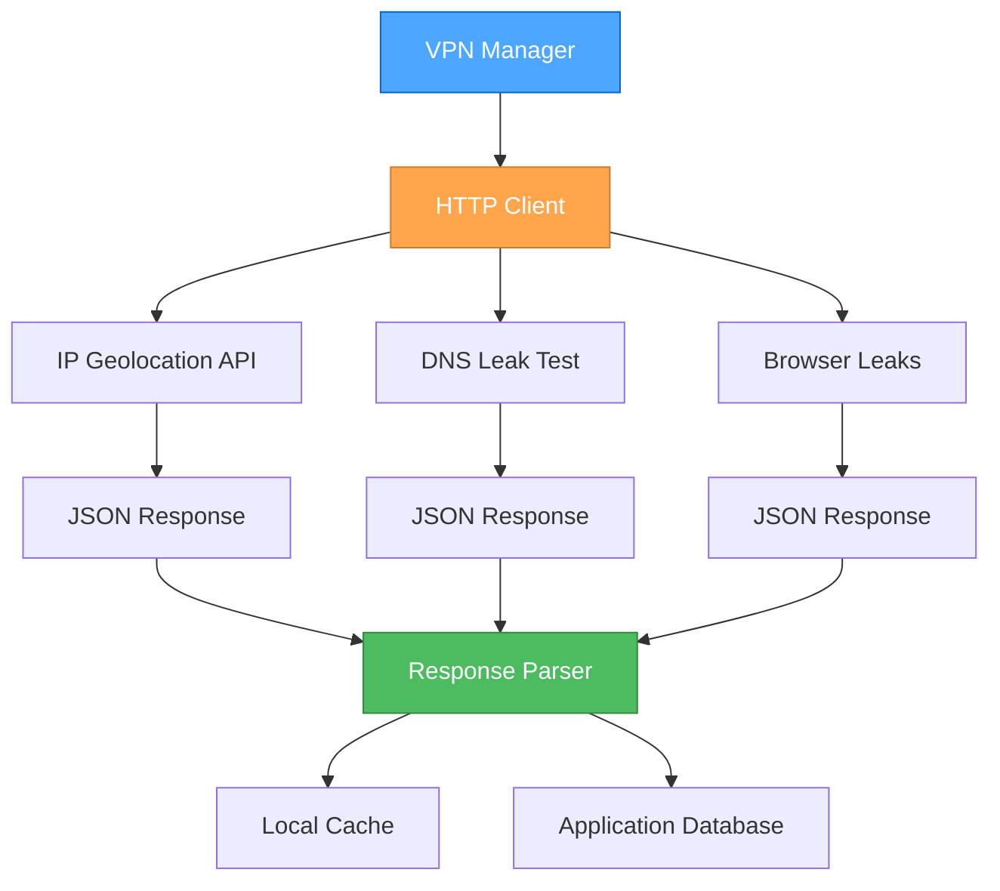
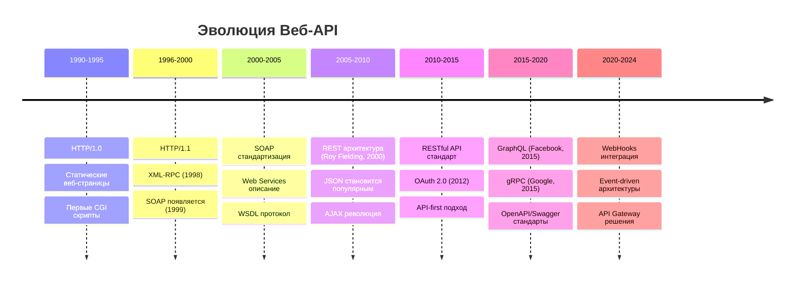
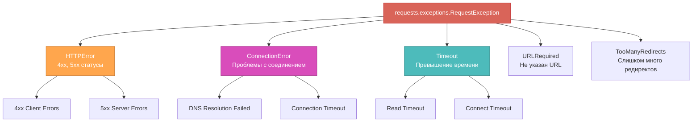

# Урок 8: Интеграция с Внешними API и Продвинутые Функции

## Содержание
- [Введение в API интеграцию](#введение)
- [История развития веб-API](#история)
- [HTTP протокол и REST](#http-протокол)
- [Библиотека Requests](#requests)
- [Практическая реализация в VPN Manager](#практическая-реализация)
- [Обработка ошибок и таймаутов](#обработка-ошибок)
- [Асинхронные операции](#асинхронные-операции)
- [Безопасность API](#безопасность)
- [Производительность и кэширование](#производительность)
- [Мониторинг и логирование](#мониторинг)

---

## Введение

Интеграция с внешними API является критически важной частью современных приложений. VPN Server Manager использует внешние сервисы для получения геолокации серверов, проверки IP-адресов и других функций. Этот урок покажет, как правильно интегрировать внешние API в ваше приложение.

### Основные Концепции



---

## История Развития Веб-API

### Временная Линия



### Ключевые Вехи

**1998 - XML-RPC**: Первый протокол для удаленного вызова процедур через HTTP
**2000 - REST**: Roy Fielding определяет архитектурный стиль REST в своей диссертации
**2006 - JSON**: Douglas Crockford стандартизирует JSON как альтернативу XML
**2012 - OAuth 2.0**: Стандарт авторизации для безопасного доступа к API

---

## HTTP Протокол и REST

### HTTP Methods в Контексте API

```mermaid
graph LR
    subgraph "HTTP Methods"
    GET[GET<br>Получение данных]
    POST[POST<br>Создание ресурса]
    PUT[PUT<br>Полное обновление]
    PATCH[PATCH<br>Частичное обновление]
    DELETE[DELETE<br>Удаление ресурса]
    end
    
    subgraph "REST Resource"
    Resource[/api/servers/{id}]
    end
    
    GET --> Resource
    POST --> Resource
    PUT --> Resource
    PATCH --> Resource
    DELETE --> Resource
    
    style GET fill:#4dbb5f,stroke:#36873f,color:white
    style POST fill:#ffa64d,stroke:#cc7a30,color:white
    style PUT fill:#d94dbb,stroke:#a3378a,color:white
    style PATCH fill:#4dbbbb,stroke:#368787,color:white
    style DELETE fill:#d96459,stroke:#c53030,color:white
```

### Принципы REST

1. **Stateless**: Каждый запрос содержит всю необходимую информацию
2. **Client-Server**: Разделение ответственности между клиентом и сервером
3. **Cacheable**: Ответы могут быть закэшированы
4. **Uniform Interface**: Единообразный интерфейс для всех ресурсов
5. **Layered System**: Архитектура может содержать промежуточные слои
6. **Code on Demand** (опционально): Сервер может отправлять исполняемый код

---

## Библиотека Requests

### Основы Работы с Requests

Requests - это элегантная и простая HTTP-библиотека для Python, созданная Kenneth Reitz в 2011 году.

```python
import requests
from typing import Dict, Optional, Any
import time
from functools import wraps

# Базовый класс для работы с API
class APIClient:
    def __init__(self, base_url: str, timeout: int = 5):
        self.base_url = base_url
        self.timeout = timeout
        self.session = requests.Session()
        
        # Устанавливаем общие заголовки
        self.session.headers.update({
            'User-Agent': 'VPN-Manager/3.2.0',
            'Accept': 'application/json',
            'Content-Type': 'application/json'
        })
    
    def get(self, endpoint: str, params: Optional[Dict] = None) -> Dict[str, Any]:
        """Выполняет GET запрос к API."""
        url = f"{self.base_url}/{endpoint.lstrip('/')}"
        
        try:
            response = self.session.get(
                url, 
                params=params, 
                timeout=self.timeout
            )
            response.raise_for_status()
            return response.json()
            
        except requests.exceptions.Timeout:
            raise APIError("Превышено время ожидания ответа")
        except requests.exceptions.ConnectionError:
            raise APIError("Ошибка соединения с сервером")
        except requests.exceptions.HTTPError as e:
            raise APIError(f"HTTP ошибка: {e.response.status_code}")
        except requests.exceptions.RequestException as e:
            raise APIError(f"Ошибка запроса: {str(e)}")

class APIError(Exception):
    """Исключение для ошибок API."""
    pass
```

### Продвинутые Техники

```python
# Декоратор для повторных попыток
def retry_on_failure(max_attempts: int = 3, delay: float = 1.0):
    def decorator(func):
        @wraps(func)
        def wrapper(*args, **kwargs):
            last_exception = None
            
            for attempt in range(max_attempts):
                try:
                    return func(*args, **kwargs)
                except (requests.exceptions.Timeout, 
                        requests.exceptions.ConnectionError) as e:
                    last_exception = e
                    if attempt < max_attempts - 1:
                        time.sleep(delay * (2 ** attempt))  # Exponential backoff
                    continue
                except Exception as e:
                    # Не повторяем для других типов ошибок
                    raise e
            
            raise last_exception
        return wrapper
    return decorator

# Пример использования декоратора
class GeolocationAPI(APIClient):
    def __init__(self):
        super().__init__("https://ipinfo.io", timeout=5)
    
    @retry_on_failure(max_attempts=3, delay=1.0)
    def get_location(self, ip_address: str) -> Dict[str, Any]:
        """Получает геолокацию по IP адресу."""
        return self.get(f"/{ip_address}/json")
```

---

## Практическая Реализация в VPN Manager

### Конфигурация API Сервисов

В VPN Manager API URLs конфигурируются в `config.json`:

```json
{
  "service_urls": {
    "ip_check_api": "https://ipinfo.io/{ip}/json",
    "general_ip_test": "https://browserleaks.com/ip",
    "general_dns_test": "https://dnsleaktest.com/"
  }
}
```

### Геолокация по IP Адресу

```python
# Из app.py - функция обновления геолокации
def update_server_geolocation(server: Dict[str, Any]) -> None:
    """Обновляет геолокацию сервера по его IP адресу."""
    try:
        # Получаем URL из конфигурации
        ip_check_url = app.config.get('service_urls', {}).get(
            'ip_check_api', 
            'https://ipinfo.io/{ip}/json'
        ).format(ip=server['ip_address'])
        
        # Выполняем запрос с таймаутом
        response = requests.get(ip_check_url, timeout=5)
        
        if response.status_code == 200:
            geolocation_data = response.json()
            server['geolocation'] = {
                'country': geolocation_data.get('country', 'Unknown'),
                'region': geolocation_data.get('region', 'Unknown'),
                'city': geolocation_data.get('city', 'Unknown'),
                'timezone': geolocation_data.get('timezone', 'Unknown'),
                'org': geolocation_data.get('org', 'Unknown'),
                'location': geolocation_data.get('loc', '0,0')
            }
        else:
            print(f"API returned status code: {response.status_code}")
            
    except requests.exceptions.RequestException as e:
        print(f"Error fetching geolocation: {e}")
        # Устанавливаем значения по умолчанию при ошибке
        if 'geolocation' not in server:
            server['geolocation'] = {
                'country': 'Unknown',
                'region': 'Unknown', 
                'city': 'Unknown',
                'timezone': 'Unknown',
                'org': 'Unknown',
                'location': '0,0'
            }
```

### Проверка IP Адреса

```python
# AJAX endpoint для проверки IP
@app.route('/api/check_ip/<path:ip_address>')
def check_ip(ip_address):
    """Проверяет IP адрес и возвращает информацию о нем."""
    try:
        # Валидация IP адреса
        import ipaddress
        ipaddress.ip_address(ip_address)
        
        # Получение геолокации
        ip_check_url = app.config.get('service_urls', {}).get(
            'ip_check_api', 
            'https://ipinfo.io/{ip}/json'
        ).format(ip=ip_address)
        
        response = requests.get(ip_check_url, timeout=5)
        
        if response.status_code == 200:
            data = response.json()
            return jsonify({
                'status': 'success',
                'ip': ip_address,
                'country': data.get('country', 'Unknown'),
                'city': data.get('city', 'Unknown'),
                'region': data.get('region', 'Unknown'),
                'timezone': data.get('timezone', 'Unknown'),
                'org': data.get('org', 'Unknown'),
                'location': data.get('loc', '0,0').split(',')
            })
        else:
            return jsonify({
                'status': 'error',
                'message': f'API returned {response.status_code}'
            }), 500
            
    except ValueError:
        return jsonify({
            'status': 'error',
            'message': 'Invalid IP address format'
        }), 400
    except requests.exceptions.RequestException as e:
        return jsonify({
            'status': 'error',
            'message': f'Network error: {str(e)}'
        }), 500
```

---

## Обработка Ошибок и Таймаутов

### Иерархия Исключений Requests



### Практическая Обработка Ошибок

```python
class RobustAPIClient:
    def __init__(self, base_url: str, max_retries: int = 3):
        self.base_url = base_url
        self.max_retries = max_retries
        self.session = requests.Session()
        
        # Настройка адаптера с повторными попытками
        from requests.adapters import HTTPAdapter
        from urllib3.util.retry import Retry
        
        retry_strategy = Retry(
            total=max_retries,
            status_forcelist=[429, 500, 502, 503, 504],
            method_whitelist=["HEAD", "GET", "OPTIONS"],
            backoff_factor=1
        )
        
        adapter = HTTPAdapter(max_retries=retry_strategy)
        self.session.mount("http://", adapter)
        self.session.mount("https://", adapter)
    
    def safe_request(self, method: str, url: str, **kwargs) -> Optional[Dict]:
        """Безопасное выполнение HTTP запроса с обработкой всех ошибок."""
        try:
            response = self.session.request(
                method=method,
                url=url,
                timeout=kwargs.get('timeout', 10),
                **{k: v for k, v in kwargs.items() if k != 'timeout'}
            )
            
            response.raise_for_status()
            
            # Проверяем тип контента
            content_type = response.headers.get('content-type', '')
            if 'application/json' in content_type:
                return response.json()
            else:
                return {'content': response.text, 'status_code': response.status_code}
                
        except requests.exceptions.Timeout:
            print(f"Timeout error for {url}")
            return None
        except requests.exceptions.ConnectionError:
            print(f"Connection error for {url}")
            return None
        except requests.exceptions.HTTPError as e:
            print(f"HTTP error {e.response.status_code} for {url}")
            return None
        except requests.exceptions.RequestException as e:
            print(f"Request error for {url}: {e}")
            return None
        except ValueError as e:
            print(f"JSON decode error for {url}: {e}")
            return None
```

### Прогрессивные Таймауты

```python
class ProgressiveTimeoutClient:
    def __init__(self, base_url: str):
        self.base_url = base_url
        self.timeout_levels = [3, 10, 30]  # Прогрессивные таймауты
        
    def request_with_progressive_timeout(self, endpoint: str) -> Optional[Dict]:
        """Выполняет запрос с прогрессивно увеличивающимися таймаутами."""
        for attempt, timeout in enumerate(self.timeout_levels):
            try:
                print(f"Attempt {attempt + 1} with timeout {timeout}s")
                
                response = requests.get(
                    f"{self.base_url}/{endpoint}",
                    timeout=timeout
                )
                
                if response.status_code == 200:
                    return response.json()
                    
            except requests.exceptions.Timeout:
                if attempt == len(self.timeout_levels) - 1:
                    print("All timeout attempts failed")
                    return None
                continue
            except requests.exceptions.RequestException as e:
                print(f"Request failed: {e}")
                return None
                
        return None
```

---

## Асинхронные Операции

### Threading для Неблокирующих API Запросов

```python
import threading
from queue import Queue
from typing import Callable, Any

class AsyncAPIManager:
    def __init__(self, max_workers: int = 5):
        self.max_workers = max_workers
        self.work_queue = Queue()
        self.result_callbacks = {}
        self.workers = []
        self.running = False
    
    def start(self):
        """Запускает рабочие потоки."""
        self.running = True
        for i in range(self.max_workers):
            worker = threading.Thread(
                target=self._worker_loop,
                name=f"APIWorker-{i}"
            )
            worker.daemon = True
            worker.start()
            self.workers.append(worker)
    
    def stop(self):
        """Останавливает рабочие потоки."""
        self.running = False
        # Добавляем sentinel values для остановки потоков
        for _ in self.workers:
            self.work_queue.put(None)
    
    def _worker_loop(self):
        """Основной цикл рабочего потока."""
        while self.running:
            task = self.work_queue.get()
            if task is None:  # Sentinel value для остановки
                break
                
            task_id, func, args, kwargs = task
            try:
                result = func(*args, **kwargs)
                if task_id in self.result_callbacks:
                    callback = self.result_callbacks[task_id]
                    callback(result, None)
            except Exception as e:
                if task_id in self.result_callbacks:
                    callback = self.result_callbacks[task_id]
                    callback(None, e)
            finally:
                self.work_queue.task_done()
    
    def execute_async(self, 
                     func: Callable, 
                     callback: Callable[[Any, Exception], None],
                     *args, **kwargs) -> str:
        """Выполняет функцию асинхронно и вызывает callback с результатом."""
        import uuid
        task_id = str(uuid.uuid4())
        
        self.result_callbacks[task_id] = callback
        self.work_queue.put((task_id, func, args, kwargs))
        
        return task_id

# Пример использования в VPN Manager
class VPNManager:
    def __init__(self):
        self.api_manager = AsyncAPIManager()
        self.api_manager.start()
    
    def update_all_geolocations_async(self, servers: List[Dict]):
        """Асинхронно обновляет геолокацию для всех серверов."""
        def geolocation_callback(result, error):
            if error:
                print(f"Geolocation update failed: {error}")
            else:
                print(f"Geolocation updated: {result}")
        
        for server in servers:
            self.api_manager.execute_async(
                self._fetch_geolocation,
                geolocation_callback,
                server['ip_address']
            )
    
    def _fetch_geolocation(self, ip_address: str) -> Dict:
        """Получает геолокацию для IP адреса."""
        response = requests.get(
            f"https://ipinfo.io/{ip_address}/json",
            timeout=5
        )
        return response.json()
```

### Интеграция с Flask для Реального Времени

```python
# Real-time updates через WebSockets (если бы использовали)
from flask_socketio import SocketIO, emit

socketio = SocketIO(app, cors_allowed_origins="*")

@app.route('/api/update_all_servers', methods=['POST'])
def update_all_servers():
    """Запускает обновление всех серверов в фоне."""
    servers = load_servers()
    
    def progress_callback(server_id, status, data):
        """Отправляет прогресс обновления через WebSocket."""
        socketio.emit('server_update_progress', {
            'server_id': server_id,
            'status': status,
            'data': data
        })
    
    # Запускаем обновление в отдельном потоке
    thread = threading.Thread(
        target=background_update_servers,
        args=(servers, progress_callback)
    )
    thread.daemon = True
    thread.start()
    
    return jsonify({'status': 'started', 'message': 'Background update initiated'})

def background_update_servers(servers, progress_callback):
    """Обновляет серверы в фоновом режиме."""
    for i, server in enumerate(servers):
        try:
            # Обновление геолокации
            geolocation = fetch_geolocation(server['ip_address'])
            server['geolocation'] = geolocation
            
            progress_callback(
                server['id'], 
                'success', 
                {
                    'progress': (i + 1) / len(servers) * 100,
                    'geolocation': geolocation
                }
            )
        except Exception as e:
            progress_callback(
                server['id'], 
                'error', 
                {'error': str(e)}
            )
    
    # Сохранение всех изменений
    save_servers(servers)
    progress_callback(None, 'completed', {'message': 'All servers updated'})
```

---

## Безопасность API

### Аутентификация и Авторизация

```python
class SecureAPIClient:
    def __init__(self, api_key: str, base_url: str):
        self.api_key = api_key
        self.base_url = base_url
        self.session = requests.Session()
        
        # Настройка заголовков безопасности
        self.session.headers.update({
            'Authorization': f'Bearer {api_key}',
            'User-Agent': 'VPN-Manager/3.2.0',
            'X-Requested-With': 'XMLHttpRequest'
        })
    
    def validate_ssl_certificate(self, verify: bool = True):
        """Включает/отключает проверку SSL сертификатов."""
        self.session.verify = verify
        if not verify:
            import urllib3
            urllib3.disable_warnings(urllib3.exceptions.InsecureRequestWarning)
    
    def set_proxy(self, proxy_url: str):
        """Настраивает прокси для запросов."""
        self.session.proxies = {
            'http': proxy_url,
            'https': proxy_url
        }

# Валидация входящих данных
def validate_api_response(response_data: Dict) -> bool:
    """Валидирует структуру ответа API."""
    required_fields = ['status', 'data']
    
    if not isinstance(response_data, dict):
        return False
    
    for field in required_fields:
        if field not in response_data:
            return False
    
    return True

# Санитизация данных
def sanitize_api_input(data: str) -> str:
    """Очищает входные данные от потенциально опасных символов."""
    import re
    # Удаляем все кроме букв, цифр, точек и дефисов (для IP/доменов)
    return re.sub(r'[^a-zA-Z0-9.\-]', '', data)
```

### Rate Limiting

```python
import time
from collections import defaultdict, deque

class RateLimiter:
    def __init__(self, max_requests: int, time_window: int):
        self.max_requests = max_requests
        self.time_window = time_window
        self.requests = defaultdict(deque)
    
    def allow_request(self, client_id: str) -> bool:
        """Проверяет, можно ли выполнить запрос для данного клиента."""
        now = time.time()
        client_requests = self.requests[client_id]
        
        # Удаляем старые запросы
        while client_requests and client_requests[0] <= now - self.time_window:
            client_requests.popleft()
        
        # Проверяем лимит
        if len(client_requests) >= self.max_requests:
            return False
        
        # Добавляем новый запрос
        client_requests.append(now)
        return True
    
    def time_until_next_request(self, client_id: str) -> float:
        """Возвращает время до следующего разрешенного запроса."""
        client_requests = self.requests[client_id]
        if not client_requests or len(client_requests) < self.max_requests:
            return 0.0
        
        oldest_request = client_requests[0]
        return max(0.0, oldest_request + self.time_window - time.time())

# Использование в API клиенте
class RateLimitedAPIClient:
    def __init__(self, api_key: str):
        self.api_key = api_key
        self.rate_limiter = RateLimiter(max_requests=100, time_window=3600)  # 100 req/hour
    
    def make_request(self, endpoint: str) -> Optional[Dict]:
        """Выполняет запрос с учетом rate limiting."""
        if not self.rate_limiter.allow_request(self.api_key):
            wait_time = self.rate_limiter.time_until_next_request(self.api_key)
            print(f"Rate limit exceeded. Wait {wait_time:.2f} seconds")
            return None
        
        # Выполняем запрос
        return self._execute_request(endpoint)
```

---

## Производительность и Кэширование

### Кэширование Ответов API

```python
import json
import hashlib
from pathlib import Path
from typing import Optional, Dict, Any
from datetime import datetime, timedelta

class APICache:
    def __init__(self, cache_dir: str = "cache", default_ttl: int = 3600):
        self.cache_dir = Path(cache_dir)
        self.cache_dir.mkdir(exist_ok=True)
        self.default_ttl = default_ttl
    
    def _generate_cache_key(self, url: str, params: Dict = None) -> str:
        """Генерирует ключ кэша на основе URL и параметров."""
        cache_data = f"{url}:{json.dumps(params or {}, sort_keys=True)}"
        return hashlib.md5(cache_data.encode()).hexdigest()
    
    def get(self, url: str, params: Dict = None) -> Optional[Dict[str, Any]]:
        """Получает данные из кэша."""
        cache_key = self._generate_cache_key(url, params)
        cache_file = self.cache_dir / f"{cache_key}.json"
        
        if not cache_file.exists():
            return None
        
        try:
            with cache_file.open('r') as f:
                cached_data = json.load(f)
            
            # Проверяем TTL
            cached_time = datetime.fromisoformat(cached_data['timestamp'])
            if datetime.now() - cached_time > timedelta(seconds=cached_data['ttl']):
                cache_file.unlink()  # Удаляем устаревший кэш
                return None
            
            return cached_data['data']
            
        except (json.JSONDecodeError, KeyError, ValueError):
            # Поврежденный кэш
            cache_file.unlink()
            return None
    
    def set(self, url: str, data: Dict[str, Any], params: Dict = None, ttl: int = None) -> None:
        """Сохраняет данные в кэш."""
        cache_key = self._generate_cache_key(url, params)
        cache_file = self.cache_dir / f"{cache_key}.json"
        
        cache_data = {
            'data': data,
            'timestamp': datetime.now().isoformat(),
            'ttl': ttl or self.default_ttl,
            'url': url,
            'params': params
        }
        
        with cache_file.open('w') as f:
            json.dump(cache_data, f, indent=2)
    
    def clear_expired(self) -> int:
        """Очищает устаревшие записи кэша."""
        cleared = 0
        for cache_file in self.cache_dir.glob("*.json"):
            try:
                with cache_file.open('r') as f:
                    cached_data = json.load(f)
                
                cached_time = datetime.fromisoformat(cached_data['timestamp'])
                if datetime.now() - cached_time > timedelta(seconds=cached_data['ttl']):
                    cache_file.unlink()
                    cleared += 1
                    
            except (json.JSONDecodeError, KeyError, ValueError):
                cache_file.unlink()
                cleared += 1
        
        return cleared

# Использование кэша в API клиенте
class CachedGeolocationAPI:
    def __init__(self):
        self.cache = APICache(cache_dir="geolocation_cache", default_ttl=86400)  # 24 часа
        self.session = requests.Session()
    
    def get_geolocation(self, ip_address: str) -> Optional[Dict]:
        """Получает геолокацию с кэшированием."""
        # Проверяем кэш
        cached_result = self.cache.get(f"https://ipinfo.io/{ip_address}/json")
        if cached_result:
            print(f"Cache hit for IP: {ip_address}")
            return cached_result
        
        # Запрашиваем у API
        try:
            response = self.session.get(
                f"https://ipinfo.io/{ip_address}/json",
                timeout=5
            )
            
            if response.status_code == 200:
                data = response.json()
                # Сохраняем в кэш
                self.cache.set(f"https://ipinfo.io/{ip_address}/json", data)
                print(f"Cache miss for IP: {ip_address}, data cached")
                return data
            
        except requests.RequestException as e:
            print(f"API request failed for IP {ip_address}: {e}")
        
        return None
```

### Connection Pooling

```python
from requests.adapters import HTTPAdapter
from urllib3.util.retry import Retry

class OptimizedAPIClient:
    def __init__(self, base_url: str):
        self.base_url = base_url
        self.session = requests.Session()
        
        # Настройка connection pooling
        adapter = HTTPAdapter(
            pool_connections=20,  # Количество connection pools
            pool_maxsize=20,      # Максимум соединений в pool
            max_retries=Retry(
                total=3,
                backoff_factor=0.3,
                status_forcelist=[500, 502, 504]
            )
        )
        
        self.session.mount('http://', adapter)
        self.session.mount('https://', adapter)
        
        # Настройка keep-alive
        self.session.headers.update({
            'Connection': 'keep-alive',
            'Keep-Alive': 'timeout=30, max=100'
        })
```

---

## Мониторинг и Логирование

### Система Мониторинга API

```python
import logging
import time
from dataclasses import dataclass
from typing import List, Dict
from enum import Enum

class APIStatus(Enum):
    SUCCESS = "success"
    ERROR = "error"
    TIMEOUT = "timeout"
    RATE_LIMITED = "rate_limited"

@dataclass
class APIMetric:
    endpoint: str
    method: str
    status: APIStatus
    response_time: float
    timestamp: datetime
    status_code: int = None
    error_message: str = None

class APIMonitor:
    def __init__(self, log_file: str = "api_monitor.log"):
        self.metrics: List[APIMetric] = []
        
        # Настройка логирования
        logging.basicConfig(
            filename=log_file,
            level=logging.INFO,
            format='%(asctime)s - %(levelname)s - %(message)s'
        )
        self.logger = logging.getLogger(__name__)
    
    def record_request(self, 
                      endpoint: str, 
                      method: str, 
                      start_time: float,
                      response: requests.Response = None,
                      error: Exception = None) -> None:
        """Записывает метрику API запроса."""
        response_time = time.time() - start_time
        
        if error:
            if isinstance(error, requests.exceptions.Timeout):
                status = APIStatus.TIMEOUT
            else:
                status = APIStatus.ERROR
            
            metric = APIMetric(
                endpoint=endpoint,
                method=method,
                status=status,
                response_time=response_time,
                timestamp=datetime.now(),
                error_message=str(error)
            )
            
            self.logger.error(f"{method} {endpoint} - {status.value} - {error}")
            
        else:
            status = APIStatus.SUCCESS if response.status_code < 400 else APIStatus.ERROR
            
            metric = APIMetric(
                endpoint=endpoint,
                method=method,
                status=status,
                response_time=response_time,
                timestamp=datetime.now(),
                status_code=response.status_code
            )
            
            self.logger.info(f"{method} {endpoint} - {response.status_code} - {response_time:.3f}s")
        
        self.metrics.append(metric)
    
    def get_statistics(self, hours: int = 24) -> Dict:
        """Возвращает статистику за указанное количество часов."""
        cutoff_time = datetime.now() - timedelta(hours=hours)
        recent_metrics = [m for m in self.metrics if m.timestamp > cutoff_time]
        
        if not recent_metrics:
            return {}
        
        total_requests = len(recent_metrics)
        successful_requests = len([m for m in recent_metrics if m.status == APIStatus.SUCCESS])
        
        avg_response_time = sum(m.response_time for m in recent_metrics) / total_requests
        
        status_counts = {}
        for status in APIStatus:
            status_counts[status.value] = len([m for m in recent_metrics if m.status == status])
        
        return {
            'total_requests': total_requests,
            'success_rate': successful_requests / total_requests * 100,
            'average_response_time': avg_response_time,
            'status_breakdown': status_counts,
            'time_period_hours': hours
        }

# Интеграция с API клиентом
class MonitoredAPIClient:
    def __init__(self, base_url: str):
        self.base_url = base_url
        self.session = requests.Session()
        self.monitor = APIMonitor()
    
    def request(self, method: str, endpoint: str, **kwargs) -> Optional[requests.Response]:
        """Выполняет мониторируемый запрос."""
        url = f"{self.base_url}/{endpoint.lstrip('/')}"
        start_time = time.time()
        
        try:
            response = self.session.request(method, url, **kwargs)
            self.monitor.record_request(endpoint, method, start_time, response=response)
            return response
            
        except Exception as e:
            self.monitor.record_request(endpoint, method, start_time, error=e)
            return None
```

---

## Заключение

Интеграция с внешними API является критически важным навыком современного разработчика. В этом уроке мы рассмотрели:

### Ключевые Принципы
1. **Надежность**: Всегда обрабатывайте ошибки и таймауты
2. **Производительность**: Используйте кэширование и connection pooling
3. **Безопасность**: Валидируйте данные и используйте безопасные методы аутентификации
4. **Мониторинг**: Отслеживайте производительность и доступность API

### Лучшие Практики
- Используйте экспоненциальный backoff для повторных попыток
- Кэшируйте ответы API для улучшения производительности
- Реализуйте rate limiting для защиты от превышения лимитов
- Логируйте все API взаимодействия для отладки
- Используйте асинхронные запросы для неблокирующих операций

### Практические Советы
- Всегда устанавливайте разумные таймауты
- Предусматривайте fallback механизмы для критичных данных
- Используйте конфигурационные файлы для URL API
- Тестируйте поведение при различных типах ошибок
- Документируйте все внешние зависимости

Этот урок показал, как VPN Server Manager использует внешние API для обогащения функциональности приложения, делая его более информативным и полезным для пользователей.
