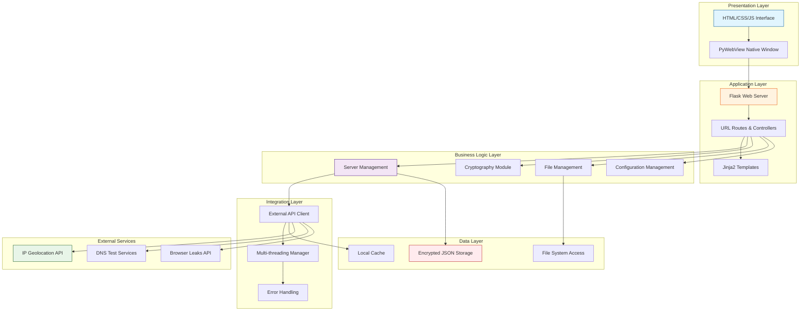
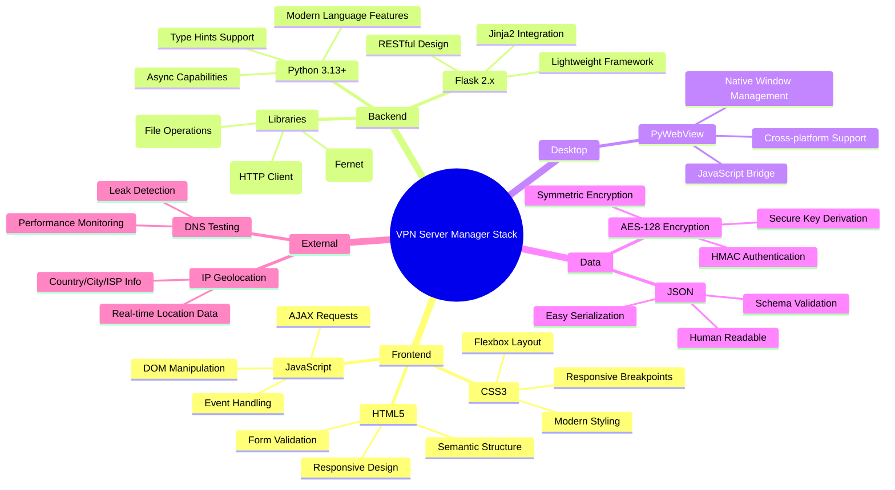
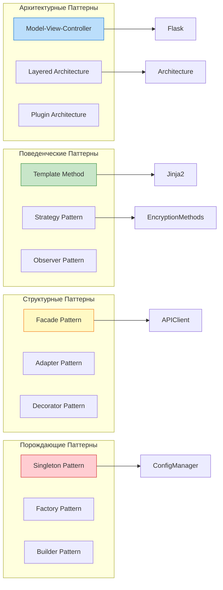
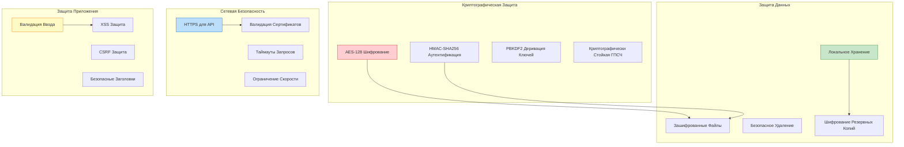
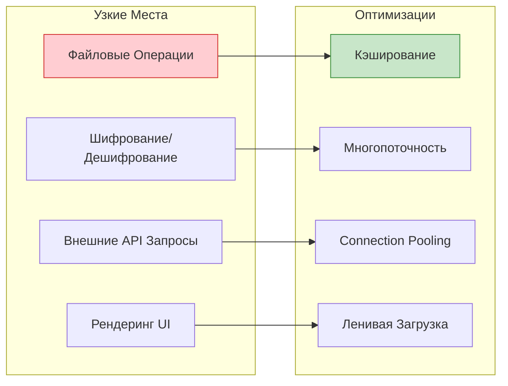
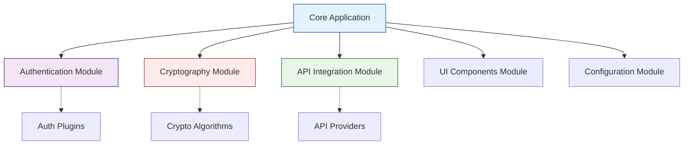
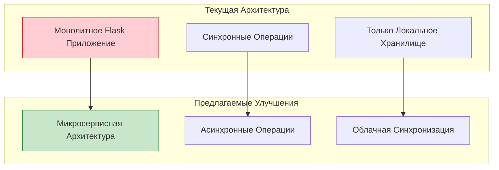
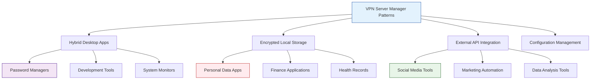
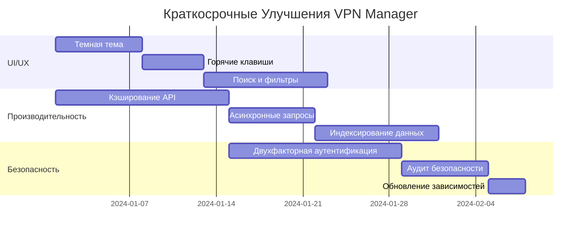

# Заключительная Лекция: Полный Обзор VPN Server Manager и Выводы

## Содержание
- [Архитектурный Обзор Системы](#архитектурный-обзор)
- [Анализ Технологического Стека](#технологический-стек)
- [Паттерны Проектирования](#паттерны-проектирования)
- [Анализ Безопасности](#анализ-безопасности)
- [Производительность и Масштабируемость](#производительность)
- [Сильные Стороны Архитектуры](#сильные-стороны)
- [Области для Улучшения](#улучшения)
- [Альтернативные Подходы](#альтернативы)
- [Применимость в Других Проектах](#применимость)
- [Будущее Развитие](#будущее-развитие)

---

## Архитектурный Обзор Системы

### Общая Архитектура

После изучения всех восьми уроков мы можем сформировать полное представление о архитектуре VPN Server Manager:



### Уникальность Подхода

VPN Server Manager демонстрирует **гибридную архитектуру**, которая сочетает:

1. **Веб-технологии** для UI (HTML/CSS/JavaScript)
2. **Python backend** для бизнес-логики
3. **Нативную оболочку** для desktop experience
4. **Локальное шифрованное хранилище** для данных
5. **Внешние API** для обогащения функциональности

Это позволяет получить преимущества всех подходов:
- **Богатый UI** веб-технологий
- **Мощность Python** для логики
- **Нативное поведение** desktop приложения
- **Безопасность** локального хранения
- **Функциональность** облачных сервисов

---

## Технологический Стек

### Детальный Анализ Компонентов



### Технологические Решения по Урокам

| Урок | Технология | Решаемая Задача | Альтернативы |
|------|------------|----------------|--------------|
| 1 | Flask | Веб-сервер и роутинг | Django, FastAPI, Tornado |
| 2 | Jinja2 | Шаблонизация HTML | Mako, Chameleon, Django Templates |
| 3 | HTML Forms + JS | Пользовательский ввод | React Forms, Vue Forms |
| 4 | Cryptography (Fernet) | Шифрование данных | PyCrypto, NaCl, OpenSSL |
| 5 | Threading | Многопоточность | asyncio, multiprocessing |
| 6 | JSON + PathLib | Конфигурация | YAML, TOML, ConfigParser |
| 7 | PyWebView | Desktop GUI | Electron, tkinter, PyQt |
| 8 | Requests | HTTP клиент | urllib3, httpx, aiohttp |

---

## Паттерны Проектирования

### Использованные Паттерны



### 1. Model-View-Controller (MVC)

**Реализация в проекте:**
```python
# Model - Данные и бизнес-логика
class ServerModel:
    def __init__(self):
        self.servers = []
    
    def load_servers(self):
        # Загрузка и расшифровка данных
        pass
    
    def save_servers(self):
        # Шифрование и сохранение данных
        pass

# View - Шаблоны HTML
# templates/index.html, edit_server.html и т.д.

# Controller - Flask routes
@app.route('/')
def index():
    model = ServerModel()
    servers = model.load_servers()
    return render_template('index.html', servers=servers)
```

### 2. Facade Pattern

**Упрощение API интеграции:**
```python
class ExternalAPIFacade:
    """Фасад для всех внешних API."""
    
    def __init__(self):
        self.geolocation_client = GeolocationAPI()
        self.dns_client = DNSTestAPI()
        self.ip_client = IPTestAPI()
    
    def get_server_info(self, ip_address: str) -> Dict:
        """Получает всю информацию о сервере одним вызовом."""
        return {
            'geolocation': self.geolocation_client.get_location(ip_address),
            'dns_status': self.dns_client.test_dns(ip_address),
            'ip_status': self.ip_client.test_ip(ip_address)
        }
```

### 3. Strategy Pattern

**Различные стратегии шифрования:**
```python
class EncryptionStrategy:
    def encrypt(self, data: str) -> bytes:
        raise NotImplementedError
    
    def decrypt(self, data: bytes) -> str:
        raise NotImplementedError

class FernetEncryption(EncryptionStrategy):
    def __init__(self, key: bytes):
        self.fernet = Fernet(key)
    
    def encrypt(self, data: str) -> bytes:
        return self.fernet.encrypt(data.encode())
    
    def decrypt(self, data: bytes) -> str:
        return self.fernet.decrypt(data).decode()

class DataManager:
    def __init__(self, encryption_strategy: EncryptionStrategy):
        self.encryption = encryption_strategy
```

---

## Анализ Безопасности

### Реализованные Меры Безопасности



### Сильные Стороны Безопасности

1. **Шифрование в Покое**
   - Все чувствительные данные зашифрованы AES-128
   - HMAC защищает от подделки данных
   - Ключи хранятся отдельно от данных

2. **Сетевая Безопасность**
   - HTTPS для всех внешних API
   - Валидация SSL сертификатов
   - Обработка таймаутов

3. **Защита Приложения**
   - Валидация всех пользовательских данных
   - Безопасные имена файлов
   - Предотвращение path traversal атак

### Потенциальные Уязвимости

1. **Управление Ключами**
   - Ключ хранится в `.env` файле
   - Нет ротации ключей
   - Отсутствует аппаратная защита ключей

2. **Сетевые Запросы**
   - Отсутствует certificate pinning
   - Нет защиты от MITM при использовании прокси
   - Логирование может содержать чувствительные данные

---

## Производительность и Масштабируемость

### Анализ Производительности



### Текущие Ограничения

1. **Масштабируемость Данных**
   - Все данные загружаются в память
   - Нет индексации для поиска
   - Линейная сложность операций

2. **Производительность UI**
   - Перерендеринг всего списка при изменениях
   - Отсутствие виртуализации для больших списков
   - Синхронные операции блокируют UI

3. **Сетевые Операции**
   - Последовательные API запросы
   - Отсутствие агрегации запросов
   - Нет оптимистичных обновлений

---

## Сильные Стороны Архитектуры

### 1. Простота и Понятность

```python
# Простой и понятный код
@app.route('/server/<int:server_id>')
def view_server(server_id):
    servers = load_servers()
    server = next((s for s in servers if s['id'] == server_id), None)
    return render_template('view_server.html', server=server)
```

**Преимущества:**
- Низкий порог входа для новых разработчиков
- Легкость отладки и тестирования
- Быстрое прототипирование новых функций

### 2. Модульность



**Преимущества:**
- Независимость модулей
- Возможность замены компонентов
- Легкость тестирования отдельных частей

### 3. Кроссплатформенность

- **Windows**: Поддержка через PyWebView
- **macOS**: Нативная интеграция с WebKit
- **Linux**: Поддержка через GTK WebKit

### 4. Безопасность по Умолчанию

- Все данные зашифрованы
- Минимальные сетевые права
- Локальное хранение данных

---

## Области для Улучшения

### 1. Архитектурные Улучшения



#### Предлагаемые Изменения:

**1. Разделение на Микросервисы**
```python
# Сервис управления серверами
class ServerService:
    def create_server(self, server_data: Dict) -> Server:
        pass
    
    def update_server(self, server_id: int, data: Dict) -> Server:
        pass

# Сервис криптографии
class CryptoService:
    def encrypt_data(self, data: str) -> bytes:
        pass
    
    def decrypt_data(self, encrypted_data: bytes) -> str:
        pass

# Сервис внешних API
class ExternalAPIService:
    async def get_geolocation(self, ip: str) -> Dict:
        pass
```

**2. Асинхронная Архитектура**
```python
import asyncio
import aiohttp
from fastapi import FastAPI

app = FastAPI()

class AsyncVPNManager:
    def __init__(self):
        self.session = aiohttp.ClientSession()
    
    async def update_all_servers(self, servers: List[Dict]) -> List[Dict]:
        """Асинхронное обновление всех серверов."""
        tasks = []
        for server in servers:
            task = self.update_server_async(server)
            tasks.append(task)
        
        results = await asyncio.gather(*tasks, return_exceptions=True)
        return results
    
    async def update_server_async(self, server: Dict) -> Dict:
        """Асинхронное обновление одного сервера."""
        async with self.session.get(
            f"https://ipinfo.io/{server['ip_address']}/json"
        ) as response:
            geolocation = await response.json()
            server['geolocation'] = geolocation
            return server
```

### 2. Производительность

**1. Кэширование на Разных Уровнях**
```python
from functools import lru_cache
import redis

class MultiLevelCache:
    def __init__(self):
        self.redis_client = redis.Redis()
        self.memory_cache = {}
    
    @lru_cache(maxsize=100)
    def get_cached_geolocation(self, ip: str) -> Dict:
        """Кэш в памяти для часто используемых IP."""
        # Сначала проверяем Redis
        cached = self.redis_client.get(f"geo:{ip}")
        if cached:
            return json.loads(cached)
        
        # Затем обращаемся к API
        result = self.fetch_geolocation(ip)
        
        # Сохраняем в Redis на 24 часа
        self.redis_client.setex(
            f"geo:{ip}", 
            86400, 
            json.dumps(result)
        )
        
        return result
```

**2. Индексирование и Поиск**
```python
from whoosh import index
from whoosh.fields import Schema, TEXT, ID, DATETIME

class ServerSearch:
    def __init__(self):
        schema = Schema(
            id=ID(stored=True),
            name=TEXT(stored=True),
            ip_address=TEXT(stored=True),
            country=TEXT(stored=True),
            description=TEXT(stored=True)
        )
        self.ix = index.create_in("search_index", schema)
    
    def index_server(self, server: Dict):
        """Индексирует сервер для поиска."""
        writer = self.ix.writer()
        writer.add_document(
            id=str(server['id']),
            name=server['name'],
            ip_address=server['ip_address'],
            country=server.get('geolocation', {}).get('country', ''),
            description=server.get('description', '')
        )
        writer.commit()
    
    def search_servers(self, query: str) -> List[Dict]:
        """Поиск серверов по запросу."""
        from whoosh.qparser import QueryParser
        
        parser = QueryParser("name", self.ix.schema)
        q = parser.parse(query)
        
        results = []
        with self.ix.searcher() as searcher:
            search_results = searcher.search(q)
            for result in search_results:
                results.append(dict(result))
        
        return results
```

### 3. Пользовательский Опыт

**1. Реактивный UI**
```javascript
// Использование современных веб-технологий
class ServerManager {
    constructor() {
        this.servers = new Proxy([], {
            set: (target, property, value) => {
                target[property] = value;
                this.updateUI();
                return true;
            }
        });
    }
    
    updateUI() {
        // Реактивное обновление интерфейса
        this.renderServerList();
        this.updateStatistics();
    }
    
    async addServer(serverData) {
        // Оптимистичное обновление
        const tempId = Date.now();
        this.servers.push({...serverData, id: tempId, status: 'pending'});
        
        try {
            const response = await fetch('/api/servers', {
                method: 'POST',
                body: JSON.stringify(serverData)
            });
            
            const newServer = await response.json();
            
            // Заменяем временный сервер на реальный
            const index = this.servers.findIndex(s => s.id === tempId);
            this.servers[index] = newServer;
            
        } catch (error) {
            // Откатываем изменения при ошибке
            this.servers = this.servers.filter(s => s.id !== tempId);
            this.showError(error.message);
        }
    }
}
```

**2. Прогрессивное Веб-Приложение (PWA)**
```json
{
  "name": "VPN Server Manager",
  "short_name": "VPN Manager",
  "start_url": "/",
  "display": "standalone",
  "background_color": "#ffffff",
  "theme_color": "#2196f3",
  "icons": [
    {
      "src": "/static/images/icon-192.png",
      "sizes": "192x192",
      "type": "image/png"
    }
  ]
}
```

### 4. Мониторинг и Observability

**1. Централизованное Логирование**
```python
import structlog
import logging.config

LOGGING_CONFIG = {
    'version': 1,
    'disable_existing_loggers': False,
    'formatters': {
        'json': {
            'format': '%(asctime)s %(name)s %(levelname)s %(message)s',
            'class': 'pythonjsonlogger.jsonlogger.JsonFormatter'
        }
    },
    'handlers': {
        'file': {
            'class': 'logging.handlers.RotatingFileHandler',
            'filename': 'app.log',
            'maxBytes': 10485760,  # 10MB
            'backupCount': 5,
            'formatter': 'json'
        }
    },
    'root': {
        'level': 'INFO',
        'handlers': ['file']
    }
}

logging.config.dictConfig(LOGGING_CONFIG)
logger = structlog.get_logger()

class MonitoredVPNManager:
    def __init__(self):
        self.logger = logger.bind(component="vpn_manager")
    
    def add_server(self, server_data: Dict) -> Dict:
        self.logger.info(
            "Adding new server",
            server_name=server_data.get('name'),
            ip_address=server_data.get('ip_address')
        )
        
        try:
            result = self._create_server(server_data)
            self.logger.info(
                "Server added successfully",
                server_id=result['id']
            )
            return result
        except Exception as e:
            self.logger.error(
                "Failed to add server",
                error=str(e),
                server_data=server_data
            )
            raise
```

**2. Метрики и Мониторинг**
```python
from prometheus_client import Counter, Histogram, Gauge, start_http_server

# Метрики приложения
REQUEST_COUNT = Counter('vpn_manager_requests_total', 'Total requests', ['method', 'endpoint'])
REQUEST_DURATION = Histogram('vpn_manager_request_duration_seconds', 'Request duration')
ACTIVE_SERVERS = Gauge('vpn_manager_active_servers', 'Number of active servers')
API_ERRORS = Counter('vpn_manager_api_errors_total', 'Total API errors', ['api_provider'])

def monitor_requests(f):
    """Декоратор для мониторинга Flask маршрутов."""
    @wraps(f)
    def wrapper(*args, **kwargs):
        start_time = time.time()
        
        try:
            result = f(*args, **kwargs)
            REQUEST_COUNT.labels(
                method=request.method,
                endpoint=request.endpoint
            ).inc()
            return result
        finally:
            REQUEST_DURATION.observe(time.time() - start_time)
    
    return wrapper

# Запуск сервера метрик
start_http_server(8000)
```

---

## Альтернативные Подходы

### 1. Electron-based Решение

```javascript
// Альтернатива с Electron
const { app, BrowserWindow, ipcMain } = require('electron');
const path = require('path');

class ElectronVPNManager {
    constructor() {
        this.mainWindow = null;
        this.servers = [];
    }
    
    createWindow() {
        this.mainWindow = new BrowserWindow({
            width: 1200,
            height: 800,
            webPreferences: {
                nodeIntegration: false,
                contextIsolation: true,
                preload: path.join(__dirname, 'preload.js')
            }
        });
        
        this.mainWindow.loadFile('src/index.html');
    }
    
    setupIPC() {
        ipcMain.handle('get-servers', async () => {
            return this.servers;
        });
        
        ipcMain.handle('add-server', async (event, serverData) => {
            const newServer = {
                id: Date.now(),
                ...serverData,
                createdAt: new Date().toISOString()
            };
            this.servers.push(newServer);
            return newServer;
        });
    }
}
```

**Плюсы Electron:**
- Больше возможностей UI (React, Vue, Angular)
- Лучшая интеграция с ОС
- Более богатая экосистема NPM

**Минусы Electron:**
- Больший размер приложения
- Высокое потребление ресурсов
- Сложность отладки

### 2. Native Desktop Приложения

```python
# PyQt альтернатива
from PyQt6.QtWidgets import QApplication, QMainWindow, QVBoxLayout
from PyQt6.QtCore import QThread, pyqtSignal

class ServerUpdateThread(QThread):
    progress_updated = pyqtSignal(int)
    server_updated = pyqtSignal(dict)
    
    def __init__(self, servers):
        super().__init__()
        self.servers = servers
    
    def run(self):
        for i, server in enumerate(self.servers):
            # Обновление сервера
            updated_server = self.update_server(server)
            self.server_updated.emit(updated_server)
            
            # Прогресс
            progress = int((i + 1) / len(self.servers) * 100)
            self.progress_updated.emit(progress)

class VPNManagerWindow(QMainWindow):
    def __init__(self):
        super().__init__()
        self.setupUI()
        self.update_thread = None
    
    def update_all_servers(self):
        if self.update_thread and self.update_thread.isRunning():
            return
        
        self.update_thread = ServerUpdateThread(self.servers)
        self.update_thread.progress_updated.connect(self.update_progress)
        self.update_thread.server_updated.connect(self.update_server_ui)
        self.update_thread.start()
```

### 3. Web-based Решение

```python
# FastAPI + React альтернатива
from fastapi import FastAPI, WebSocket
from fastapi.staticfiles import StaticFiles
import asyncio

app = FastAPI()
app.mount("/static", StaticFiles(directory="static"), name="static")

class WebSocketManager:
    def __init__(self):
        self.active_connections: List[WebSocket] = []
    
    async def connect(self, websocket: WebSocket):
        await websocket.accept()
        self.active_connections.append(websocket)
    
    async def disconnect(self, websocket: WebSocket):
        self.active_connections.remove(websocket)
    
    async def broadcast(self, message: dict):
        for connection in self.active_connections:
            await connection.send_json(message)

manager = WebSocketManager()

@app.websocket("/ws")
async def websocket_endpoint(websocket: WebSocket):
    await manager.connect(websocket)
    try:
        while True:
            data = await websocket.receive_text()
            # Обработка сообщений от клиента
            await manager.broadcast({"message": f"Echo: {data}"})
    except Exception as e:
        await manager.disconnect(websocket)
```

---

## Применимость в Других Проектах

### 1. Паттерны, Применимые в Других Проектах



### 2. Конкретные Примеры Применения

**Password Manager**
```python
class PasswordManager:
    """Менеджер паролей на основе архитектуры VPN Manager."""
    
    def __init__(self):
        self.encryption = FernetEncryption(self.load_master_key())
        self.storage = EncryptedStorage(self.encryption)
        self.api_client = HaveIBeenPwnedAPI()
    
    def check_password_breach(self, password: str) -> bool:
        """Проверяет пароль в базе утечек (аналог проверки IP)."""
        hash_prefix = hashlib.sha1(password.encode()).hexdigest()[:5]
        breaches = self.api_client.check_hash_prefix(hash_prefix)
        return hash_prefix.upper() in breaches
    
    def generate_password(self, length: int = 16) -> str:
        """Генерирует безопасный пароль."""
        import secrets
        import string
        
        alphabet = string.ascii_letters + string.digits + "!@#$%^&*"
        return ''.join(secrets.choice(alphabet) for _ in range(length))
```

**IoT Device Manager**
```python
class IoTDeviceManager:
    """Менеджер IoT устройств с похожей архитектурой."""
    
    def __init__(self):
        self.devices = []
        self.mqtt_client = MQTTClient()
        self.api_integrations = {
            'weather': WeatherAPI(),
            'geolocation': GeolocationAPI(),
            'device_info': DeviceInfoAPI()
        }
    
    def discover_devices(self) -> List[Dict]:
        """Обнаружение устройств в сети (аналог поиска серверов)."""
        import nmap
        
        nm = nmap.PortScanner()
        nm.scan('192.168.1.0/24', '22-443')
        
        devices = []
        for host in nm.all_hosts():
            device_info = self.get_device_info(host)
            devices.append(device_info)
        
        return devices
    
    def update_device_status(self, device: Dict) -> Dict:
        """Обновление статуса устройства (аналог геолокации)."""
        try:
            response = requests.get(f"http://{device['ip']}/status", timeout=5)
            device['status'] = response.json()
            device['last_seen'] = datetime.now().isoformat()
        except requests.RequestException:
            device['status'] = 'offline'
        
        return device
```

### 3. Архитектурные Принципы

**1. Локальное Шифрованное Хранилище**
```python
class SecureLocalStorage:
    """Универсальный класс для безопасного локального хранения."""
    
    def __init__(self, app_name: str, encryption_key: bytes):
        self.app_data_dir = Path.home() / f".{app_name}"
        self.app_data_dir.mkdir(exist_ok=True)
        self.encryption = Fernet(encryption_key)
    
    def save_data(self, filename: str, data: Any) -> None:
        """Сохраняет данные в зашифрованном виде."""
        json_data = json.dumps(data, indent=2)
        encrypted_data = self.encryption.encrypt(json_data.encode())
        
        file_path = self.app_data_dir / f"{filename}.enc"
        file_path.write_bytes(encrypted_data)
    
    def load_data(self, filename: str) -> Any:
        """Загружает и расшифровывает данные."""
        file_path = self.app_data_dir / f"{filename}.enc"
        
        if not file_path.exists():
            return None
        
        encrypted_data = file_path.read_bytes()
        decrypted_data = self.encryption.decrypt(encrypted_data)
        return json.loads(decrypted_data.decode())
```

**2. Модульная API Интеграция**
```python
class APIIntegrationManager:
    """Универсальный менеджер для интеграции с внешними API."""
    
    def __init__(self):
        self.providers = {}
        self.cache = APICache()
        self.rate_limiter = RateLimiter(100, 3600)
    
    def register_provider(self, name: str, provider: 'APIProvider') -> None:
        """Регистрирует нового провайдера API."""
        self.providers[name] = provider
    
    def call_api(self, provider_name: str, method: str, **kwargs) -> Any:
        """Универсальный вызов API с кэшированием и rate limiting."""
        if not self.rate_limiter.allow_request(provider_name):
            raise RateLimitError(f"Rate limit exceeded for {provider_name}")
        
        cache_key = f"{provider_name}:{method}:{kwargs}"
        cached_result = self.cache.get(cache_key)
        
        if cached_result:
            return cached_result
        
        provider = self.providers.get(provider_name)
        if not provider:
            raise ValueError(f"Unknown provider: {provider_name}")
        
        result = provider.call(method, **kwargs)
        self.cache.set(cache_key, result)
        
        return result
```

---

## Будущее Развитие

### 1. Краткосрочные Улучшения (1-3 месяца)



**Конкретные Задачи:**

1. **UI/UX Улучшения**
   ```css
   /* Темная тема */
   [data-theme="dark"] {
     --primary-bg: #1a1a1a;
     --secondary-bg: #2d2d2d;
     --text-color: #ffffff;
     --accent-color: #3f51b5;
   }
   
   /* Анимации переходов */
   .server-card {
     transition: all 0.3s cubic-bezier(0.4, 0, 0.2, 1);
   }
   
   .server-card:hover {
     transform: translateY(-2px);
     box-shadow: 0 4px 20px rgba(0,0,0,0.1);
   }
   ```

2. **Поиск и Фильтрация**
   ```javascript
   class AdvancedSearch {
     constructor() {
       this.filters = {
         country: [],
         status: [],
         dateRange: null
       };
     }
     
     applyFilters(servers) {
       return servers.filter(server => {
         const matchesCountry = this.filters.country.length === 0 || 
           this.filters.country.includes(server.geolocation?.country);
         
         const matchesStatus = this.filters.status.length === 0 ||
           this.filters.status.includes(server.status);
         
         return matchesCountry && matchesStatus;
       });
     }
   }
   ```

### 2. Среднесрочные Цели (3-6 месяцев)

**1. Облачная Синхронизация**
```python
class CloudSyncManager:
    """Менеджер синхронизации с облачными сервисами."""
    
    def __init__(self, provider: str = 'github'):
        self.provider = self.get_provider(provider)
        self.conflict_resolver = ConflictResolver()
    
    async def sync_data(self) -> SyncResult:
        """Синхронизирует данные с облаком."""
        local_data = self.load_local_data()
        remote_data = await self.provider.fetch_data()
        
        # Обнаружение конфликтов
        conflicts = self.detect_conflicts(local_data, remote_data)
        
        if conflicts:
            resolved_data = await self.conflict_resolver.resolve(conflicts)
        else:
            resolved_data = self.merge_data(local_data, remote_data)
        
        # Сохранение результата
        await self.provider.upload_data(resolved_data)
        self.save_local_data(resolved_data)
        
        return SyncResult(
            synced_items=len(resolved_data),
            conflicts_resolved=len(conflicts),
            timestamp=datetime.now()
        )

class GitHubSyncProvider:
    """Синхронизация через GitHub Gist."""
    
    def __init__(self, token: str, gist_id: str):
        self.github = Github(token)
        self.gist_id = gist_id
    
    async def fetch_data(self) -> Dict:
        """Получает данные из GitHub Gist."""
        gist = self.github.get_gist(self.gist_id)
        encrypted_content = gist.files['servers.enc'].content
        
        # Расшифровка данных
        decrypted_data = self.decrypt_content(encrypted_content)
        return json.loads(decrypted_data)
    
    async def upload_data(self, data: Dict) -> None:
        """Загружает данные в GitHub Gist."""
        encrypted_content = self.encrypt_content(json.dumps(data))
        
        gist = self.github.get_gist(self.gist_id)
        gist.edit(files={'servers.enc': InputFileContent(encrypted_content)})
```

**2. Плагинная Архитектура**
```python
class PluginManager:
    """Менеджер плагинов для расширения функциональности."""
    
    def __init__(self):
        self.plugins = {}
        self.hooks = defaultdict(list)
    
    def load_plugin(self, plugin_path: str) -> None:
        """Загружает плагин из файла."""
        spec = importlib.util.spec_from_file_location("plugin", plugin_path)
        plugin_module = importlib.util.module_from_spec(spec)
        spec.loader.exec_module(plugin_module)
        
        plugin_class = getattr(plugin_module, 'Plugin')
        plugin_instance = plugin_class()
        
        self.plugins[plugin_instance.name] = plugin_instance
        self.register_hooks(plugin_instance)
    
    def register_hooks(self, plugin: 'Plugin') -> None:
        """Регистрирует хуки плагина."""
        for hook_name in plugin.hooks:
            self.hooks[hook_name].append(plugin)
    
    def call_hook(self, hook_name: str, *args, **kwargs) -> List[Any]:
        """Вызывает все плагины для указанного хука."""
        results = []
        for plugin in self.hooks.get(hook_name, []):
            result = plugin.handle_hook(hook_name, *args, **kwargs)
            results.append(result)
        return results

# Пример плагина для мониторинга
class ServerMonitoringPlugin:
    name = "server_monitoring"
    hooks = ["server_added", "server_updated", "app_startup"]
    
    def __init__(self):
        self.monitoring_data = {}
    
    def handle_hook(self, hook_name: str, *args, **kwargs):
        if hook_name == "server_added":
            server = args[0]
            self.start_monitoring(server)
        elif hook_name == "server_updated":
            server = args[0]
            self.update_monitoring(server)
        elif hook_name == "app_startup":
            self.initialize_monitoring()
    
    def start_monitoring(self, server: Dict) -> None:
        """Начинает мониторинг сервера."""
        self.monitoring_data[server['id']] = {
            'start_time': datetime.now(),
            'checks': [],
            'alerts': []
        }
```

### 3. Долгосрочное Видение (6-12 месяцев)

**1. Machine Learning Интеграция**
```python
import numpy as np
from sklearn.ensemble import RandomForestClassifier
from sklearn.preprocessing import StandardScaler

class ServerQualityPredictor:
    """Предсказывает качество VPN серверов на основе исторических данных."""
    
    def __init__(self):
        self.model = RandomForestClassifier(n_estimators=100, random_state=42)
        self.scaler = StandardScaler()
        self.is_trained = False
    
    def prepare_features(self, server: Dict) -> np.ndarray:
        """Подготавливает признаки для модели."""
        features = [
            server.get('ping_avg', 0),
            server.get('bandwidth_avg', 0),
            server.get('uptime_percentage', 0),
            server.get('location_score', 0),  # Близость к пользователю
            len(server.get('connection_history', [])),
            server.get('server_load', 0)
        ]
        return np.array(features).reshape(1, -1)
    
    def train(self, servers: List[Dict]) -> None:
        """Обучает модель на исторических данных."""
        X = []
        y = []
        
        for server in servers:
            if 'quality_rating' in server:
                features = self.prepare_features(server)
                X.append(features.flatten())
                y.append(server['quality_rating'])
        
        X = np.array(X)
        y = np.array(y)
        
        X_scaled = self.scaler.fit_transform(X)
        self.model.fit(X_scaled, y)
        self.is_trained = True
    
    def predict_quality(self, server: Dict) -> float:
        """Предсказывает качество сервера."""
        if not self.is_trained:
            return 0.5  # Нейтральная оценка
        
        features = self.prepare_features(server)
        features_scaled = self.scaler.transform(features)
        
        prediction = self.model.predict_proba(features_scaled)[0]
        return float(prediction[1])  # Вероятность высокого качества
    
    def get_feature_importance(self) -> Dict[str, float]:
        """Возвращает важность признаков."""
        if not self.is_trained:
            return {}
        
        feature_names = [
            'ping_avg', 'bandwidth_avg', 'uptime_percentage',
            'location_score', 'connection_history_length', 'server_load'
        ]
        
        importance = self.model.feature_importances_
        return dict(zip(feature_names, importance))

class SmartServerRecommendation:
    """Интеллектуальные рекомендации серверов."""
    
    def __init__(self):
        self.quality_predictor = ServerQualityPredictor()
        self.user_preferences = {}
    
    def learn_user_preferences(self, user_actions: List[Dict]) -> None:
        """Изучает предпочтения пользователя."""
        country_preferences = defaultdict(int)
        time_preferences = defaultdict(int)
        
        for action in user_actions:
            if action['type'] == 'connect':
                country = action['server']['country']
                hour = datetime.fromisoformat(action['timestamp']).hour
                
                country_preferences[country] += 1
                time_preferences[hour] += 1
        
        self.user_preferences = {
            'preferred_countries': dict(country_preferences),
            'preferred_hours': dict(time_preferences)
        }
    
    def recommend_servers(self, servers: List[Dict], limit: int = 5) -> List[Dict]:
        """Рекомендует лучшие серверы для пользователя."""
        scored_servers = []
        
        for server in servers:
            quality_score = self.quality_predictor.predict_quality(server)
            preference_score = self.calculate_preference_score(server)
            location_score = self.calculate_location_score(server)
            
            total_score = (
                quality_score * 0.5 +
                preference_score * 0.3 +
                location_score * 0.2
            )
            
            scored_servers.append({
                'server': server,
                'score': total_score,
                'quality_score': quality_score,
                'preference_score': preference_score,
                'location_score': location_score
            })
        
        # Сортируем по общему счету
        scored_servers.sort(key=lambda x: x['score'], reverse=True)
        
        return scored_servers[:limit]
```

**2. Advanced Analytics Dashboard**
```python
import plotly.graph_objects as go
import plotly.express as px
from dash import Dash, html, dcc, Input, Output

class AnalyticsDashboard:
    """Продвинутая аналитическая панель."""
    
    def __init__(self, vpn_manager):
        self.vpn_manager = vpn_manager
        self.app = Dash(__name__)
        self.setup_layout()
        self.setup_callbacks()
    
    def setup_layout(self):
        """Настраивает макет панели."""
        self.app.layout = html.Div([
            html.H1("VPN Server Manager Analytics"),
            
            dcc.Tabs(id="tabs", value="overview", children=[
                dcc.Tab(label="Overview", value="overview"),
                dcc.Tab(label="Performance", value="performance"),
                dcc.Tab(label="Geography", value="geography"),
                dcc.Tab(label="Predictions", value="predictions")
            ]),
            
            html.Div(id="tab-content")
        ])
    
    def setup_callbacks(self):
        """Настраивает обратные вызовы."""
        @self.app.callback(
            Output("tab-content", "children"),
            Input("tabs", "value")
        )
        def render_tab_content(active_tab):
            if active_tab == "overview":
                return self.render_overview()
            elif active_tab == "performance":
                return self.render_performance()
            elif active_tab == "geography":
                return self.render_geography()
            elif active_tab == "predictions":
                return self.render_predictions()
    
    def render_overview(self):
        """Рендерит обзорную страницу."""
        servers = self.vpn_manager.get_servers()
        
        # Метрики
        total_servers = len(servers)
        active_servers = len([s for s in servers if s.get('status') == 'active'])
        avg_ping = np.mean([s.get('ping', 0) for s in servers if s.get('ping')])
        
        return html.Div([
            html.Div([
                html.H3("Key Metrics"),
                html.Div([
                    html.Div([
                        html.H4(total_servers),
                        html.P("Total Servers")
                    ], className="metric-card"),
                    
                    html.Div([
                        html.H4(active_servers),
                        html.P("Active Servers")
                    ], className="metric-card"),
                    
                    html.Div([
                        html.H4(f"{avg_ping:.1f}ms"),
                        html.P("Average Ping")
                    ], className="metric-card")
                ], className="metrics-row")
            ]),
            
            # График статуса серверов
            dcc.Graph(
                figure=self.create_status_chart(servers)
            ),
            
            # График производительности по времени
            dcc.Graph(
                figure=self.create_performance_timeline(servers)
            )
        ])
    
    def create_status_chart(self, servers):
        """Создает график статуса серверов."""
        status_counts = {}
        for server in servers:
            status = server.get('status', 'unknown')
            status_counts[status] = status_counts.get(status, 0) + 1
        
        fig = go.Figure(data=[
            go.Pie(
                labels=list(status_counts.keys()),
                values=list(status_counts.values()),
                hole=0.4
            )
        ])
        
        fig.update_layout(title="Server Status Distribution")
        return fig
    
    def create_performance_timeline(self, servers):
        """Создает временную линию производительности."""
        # Генерируем данные временной линии
        dates = pd.date_range(start='2024-01-01', end='2024-12-31', freq='D')
        performance_data = []
        
        for date in dates:
            # Симуляция данных производительности
            avg_performance = np.random.normal(0.8, 0.1)
            performance_data.append({
                'date': date,
                'performance': max(0, min(1, avg_performance))
            })
        
        df = pd.DataFrame(performance_data)
        
        fig = px.line(
            df, 
            x='date', 
            y='performance',
            title='Server Performance Over Time'
        )
        
        return fig
```

### 4. Экосистема и Интеграции

```mermaid
graph TB
    VPNManager[VPN Server Manager Core]
    
    subgraph "Mobile Companion"
        AndroidApp[Android App]
        iOSApp[iOS App]
        WebApp[Progressive Web App]
    end
    
    subgraph "Cloud Services"
        SyncService[Sync Service]
        BackupService[Backup Service]
        AnalyticsService[Analytics Service]
    end
    
    subgraph "Integrations"
        IFTTT[IFTTT Integration]
        Slack[Slack Notifications]
        Email[Email Reports]
        API[Public API]
    end
    
    subgraph "Enterprise Features"
        MultiUser[Multi-user Support]
        RBAC[Role-based Access Control]
        Audit[Audit Logging]
        SSO[Single Sign-On]
    end
    
    VPNManager --> AndroidApp
    VPNManager --> iOSApp
    VPNManager --> WebApp
    
    VPNManager --> SyncService
    VPNManager --> BackupService
    VPNManager --> AnalyticsService
    
    VPNManager --> IFTTT
    VPNManager --> Slack
    VPNManager --> Email
    VPNManager --> API
    
    VPNManager --> MultiUser
    VPNManager --> RBAC
    VPNManager --> Audit
    VPNManager --> SSO
    
    style VPNManager fill:#e3f2fd,stroke:#0d47a1
    style AndroidApp fill:#c8e6c9,stroke:#388e3c
    style SyncService fill:#fff9c4,stroke:#f57f17
    style IFTTT fill:#ffcdd2,stroke:#d32f2f
    style MultiUser fill:#f3e5f5,stroke:#7b1fa2
```



---

## Заключение

### Итоговая Оценка Проекта

VPN Server Manager представляет собой **отличный образец современной архитектуры** гибридного desktop приложения. Проект демонстрирует:

#### Сильные Стороны

1. **Архитектурная Элегантность**
   - Чистое разделение ответственности
   - Модульная структура
   - Понятные интерфейсы между компонентами

2. **Технологическая Зрелость**
   - Использование проверенных технологий
   - Современные подходы к безопасности
   - Эффективные паттерны интеграции

3. **Практическая Применимость**
   - Решает реальную задачу
   - Удобный пользовательский интерфейс
   - Надежное хранение данных

#### Области Роста

1. **Масштабируемость**
   - Ограничения при большом количестве серверов
   - Необходимость индексирования данных
   - Потребность в кэшировании

2. **Современность UI**
   - Возможности для реактивного интерфейса
   - Необходимость прогрессивных веб-технологий
   - Улучшение пользовательского опыта

3. **Расширяемость**
   - Потребность в плагинной архитектуре
   - Необходимость API для интеграций
   - Возможности для автоматизации

### Ключевые Уроки

#### Для Начинающих Разработчиков

1. **Начинайте с Простого**
   - VPN Manager показывает, как создать полезное приложение с базовыми технологиями
   - Не пытайтесь использовать все новейшие технологии сразу
   - Сосредоточьтесь на решении конкретной проблемы

2. **Безопасность с Самого Начала**
   - Проект демонстрирует правильное использование шифрования
   - Безопасность должна быть встроена в архитектуру, а не добавлена позже
   - Локальное хранение может быть безопаснее облачного

3. **Итеративное Развитие**
   - Приложение можно расширять постепенно
   - Каждая новая функция строится на предыдущих
   - Рефакторинг помогает поддерживать качество кода

#### Для Опытных Разработчиков

1. **Гибридные Подходы Эффективны**
   - Комбинирование веб-технологий и desktop-платформ
   - Баланс между простотой и функциональностью
   - Использование сильных сторон разных технологий

2. **Архитектура Важнее Технологий**
   - Правильная архитектура позволяет легко заменять компоненты
   - Модульность облегчает тестирование и сопровождение
   - Четкие интерфейсы упрощают командную работу

3. **Пользовательский Опыт Критичен**
   - Техническое совершенство бесполезно без удобства использования
   - Производительность влияет на восприятие качества
   - Детали имеют значение

### Вклад в Развитие Отрасли

VPN Server Manager демонстрирует **жизнеспособность гибридного подхода** к разработке desktop приложений:

1. **Альтернатива Electron**
   - Меньшее потребление ресурсов
   - Лучшая интеграция с Python экосистемой
   - Простота разработки и сопровождения

2. **Паттерн для Безопасных Приложений**
   - Локальное шифрованное хранилище
   - Минимальная поверхность атаки
   - Контроль над данными пользователя

3. **Модель Прогрессивного Улучшения**
   - Начать с MVP (минимально жизнеспособного продукта)
   - Постепенно добавлять функции
   - Поддерживать обратную совместимость

### Рекомендации для Изучения

#### Последовательность Изучения

1. **Базовые Концепции** (Уроки 1-3)
   - Понимание веб-технологий
   - Основы серверной разработки
   - Взаимодействие с пользователем

2. **Безопасность и Надежность** (Уроки 4-5)
   - Криптографические принципы
   - Многопоточное программирование
   - Обработка ошибок

3. **Системная Интеграция** (Уроки 6-8)
   - Управление конфигурацией
   - Desktop интеграция
   - Внешние API

4. **Архитектурное Мышление** (Урок 9)
   - Анализ компромиссов
   - Планирование развития
   - Оценка альтернатив

#### Практические Упражнения

1. **Модификация Существующего Кода**
   - Добавьте новые поля к серверам
   - Реализуйте дополнительные API интеграции
   - Создайте новые страницы интерфейса

2. **Создание Аналогичных Проектов**
   - Password Manager с той же архитектурой
   - Task Manager с шифрованными данными
   - Network Monitor с API интеграциями

3. **Архитектурные Эксперименты**
   - Перепишите на FastAPI + React
   - Создайте мобильную версию
   - Добавьте облачную синхронизацию

### Финальное Слово

VPN Server Manager — это **больше, чем просто приложение**. Это демонстрация того, как правильные архитектурные решения позволяют создавать надежные, безопасные и расширяемые приложения, используя относительно простые технологии.

Проект показывает, что **инновации не всегда требуют новейших технологий**. Иногда самые эффективные решения получаются от **продуманного сочетания проверенных подходов**.

Главный урок этого образовательного курса: **хорошая архитектура и внимание к деталям важнее выбора технологий**. VPN Server Manager может служить фундаментом для изучения современной разработки и источником вдохновения для ваших собственных проектов.

**Удачи в вашем путешествии по миру разработки программного обеспечения!**
